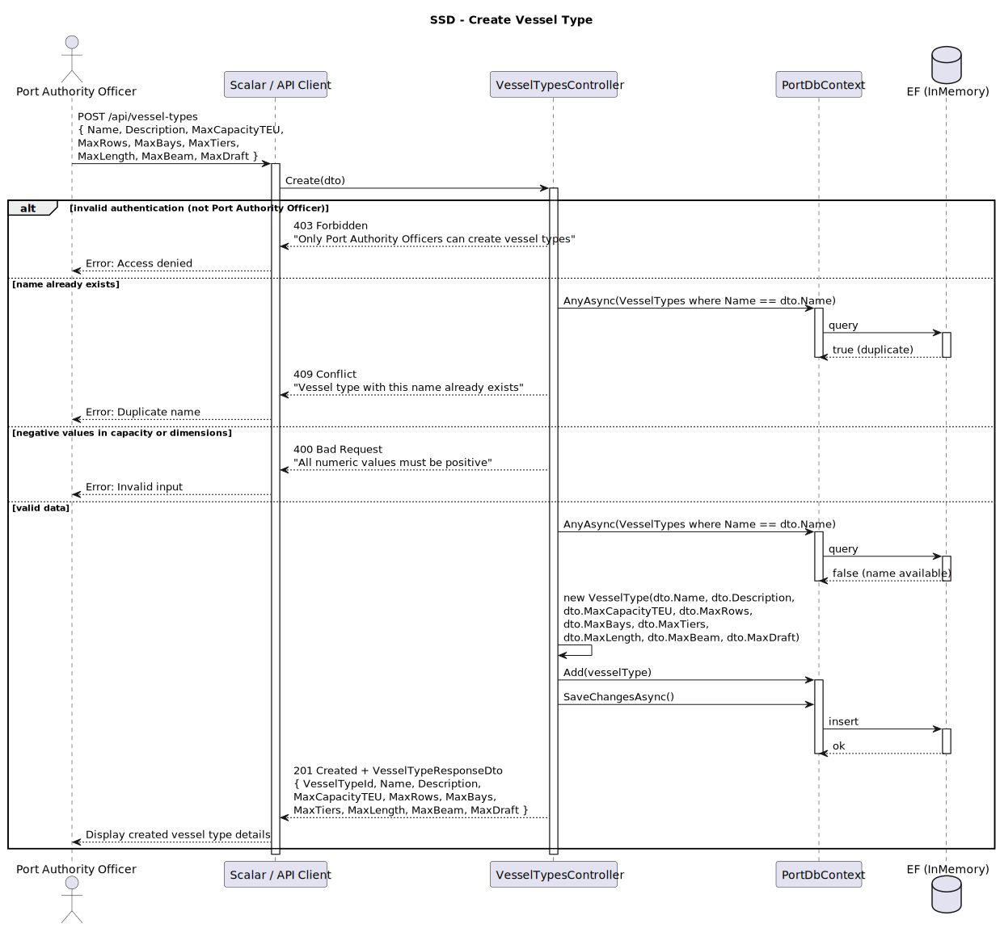
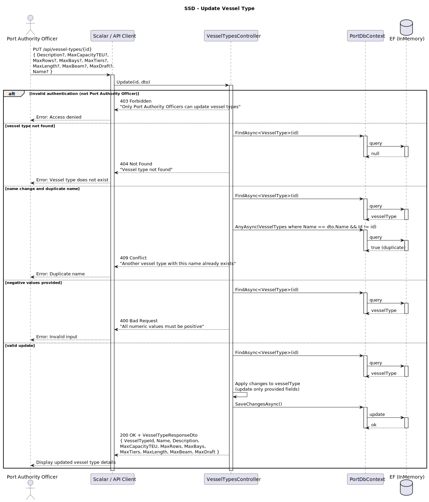
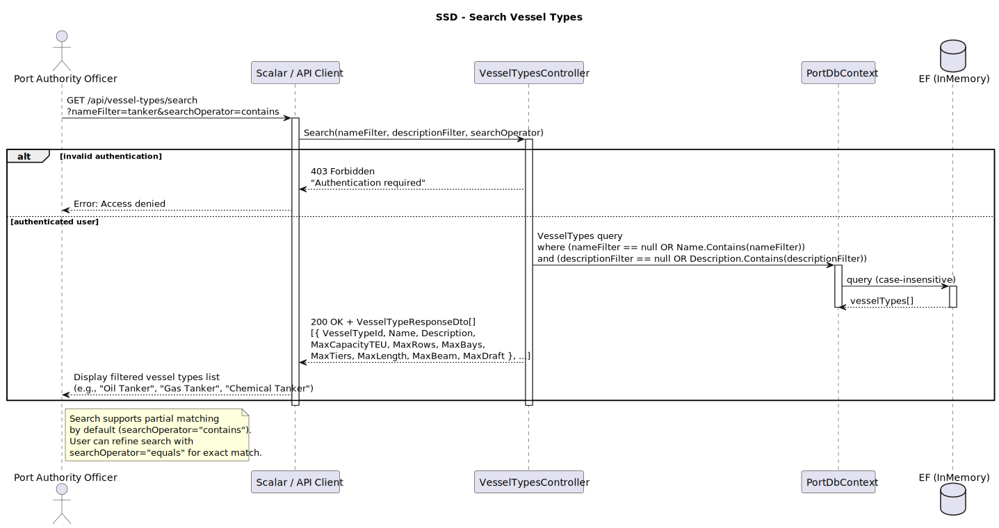
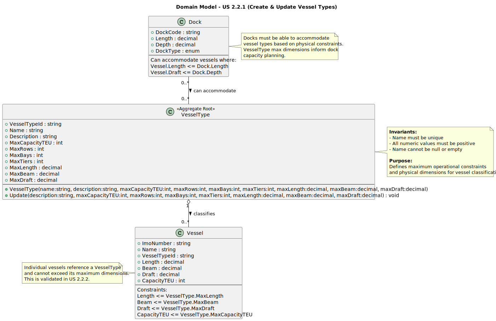
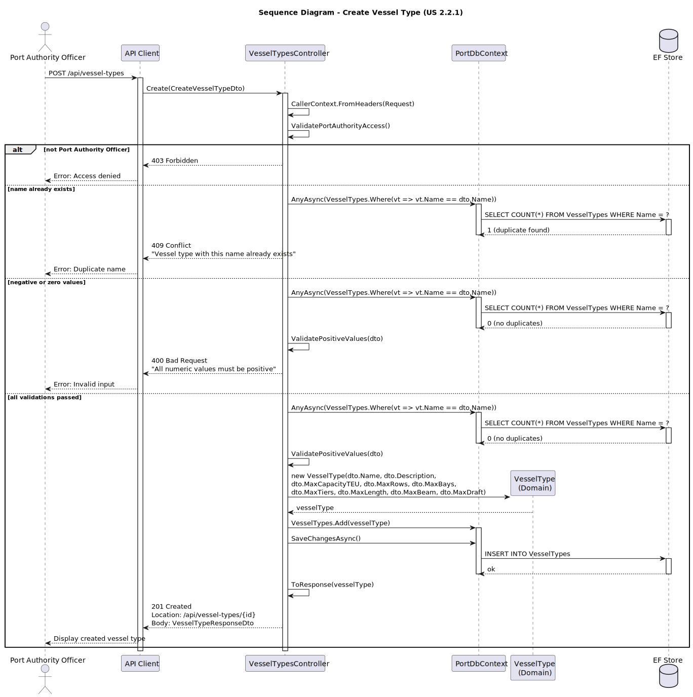
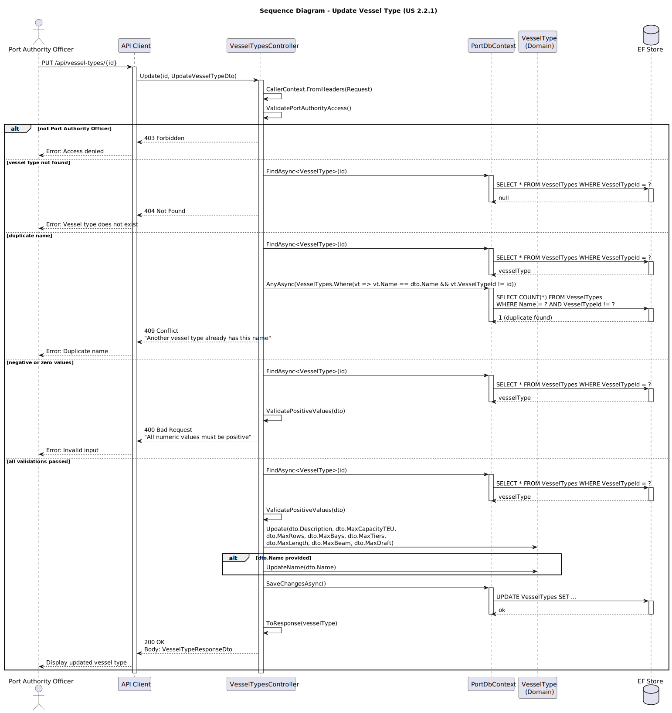
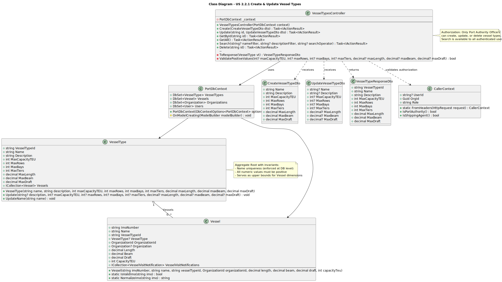

# US 2.2.1 - Create and Update Vessel Types

## 1. Requirements Engineering

### 1.1. User Story Description

*"As a Port Authority Officer, I want to create and update vessel types, so that vessels can be classified consistently and their operational constraints are properly defined."*

### 1.2. Customer Specifications and Clarifications

**From the specifications document:**

> "The size, type, and cargo capacity of a vessel strongly influence its operational needs at the port,"

> "The type of vessel determines the maximum number
of rows, bays, and tiers, and therefore its maximum TEU capacity."

**From the client clarifications:**

> **Question**:  
> "In many user stories there is the need to search and/or filter data. For example, in US 221 one of the acceptance criteria is:
"Vessel types must be searchable and filterable by name and description."
Does this mean that we need to be able to input a, for example, vessel type name "Tanker" and then get "Gas Tanker", "Oil Tanker" if those are vessel types that exist in the system? Or should we need to input BOTH the name AND the description to get some results? And if we need to input only a description then should it only return direct matches (only return the vessel types that perfectly, word for word match the given filtration description) or would the user input a word or two and we would need to show all vessel types containing that word in their description? We don't quite understand how the user wants to use these functions so it would be nice to see an example."
>
>
>  **Answer**:  
> "Your example is perfect.
While searching for text fields, the better approach is returning partial match. E.g. searching by "tanker" returns all records whose description contains such word on a case insensitive case.
However, as a user it would be nice if I could refine the search by setting the kind of operator to be applied (e.g. equals, contains)."


> **Question**:  
> "Can there be more than one vessel type with the same name?"
>
> **Answer**:  
> "No! Names are unique."


> **Question**:  
> "The assignment clearly indicates that physical information about docks such as their length and depth is important and needs to be stored: However, no such specification exists for vessels, or even vessel types.
Is a vessel's physical size determined (or at least limited) by its vessel type, or can vessels have dimensions different from a predefined standard?"
>
> **Answer**:  
> "Well caught!
You may capture the physical characteristics (e.g. length, beam, draft) of both:
(i) the vessel type (max dimensions); and
(ii) the vessel, whose dimensions may not exceed the ones of the corresponding vessel type."

### 1.3. Acceptance Criteria

* **AC1:** Vessel types must include a unique name that serves as the primary identifier.
* **AC2:** Vessel types must include a description for classification details.
* **AC3:** Vessel types must define operational constraints: maximum rows, bays, and tiers for container stacking.
* **AC4:** Vessel types must define maximum TEU capacity calculated from container stacking constraints.
* **AC5:** Vessel types must define maximum physical dimensions: length (LOA), beam (width), and draft (depth).
* **AC6:** Names must be unique - the system must reject attempts to create duplicate vessel type names.
* **AC7:** Vessel types must be searchable and filterable by name and description with partial matching support.
* **AC8:** Search operations should support operator selection (equals, contains) for refined filtering.
* **AC9:** Vessel types must be available for reference when registering vessel records (see US 2.2.2).
* **AC10:** Only Port Authority Officers can create and update vessel types.

### 1.4. Found out Dependencies

* **Authentication/Authorization System** - Port Authority Officer role must be validated.
* **US 2.2.2** - Vessel registration depends on existing vessel types.
* **Database/Persistence Layer** - EF Core DbContext for CRUD operations.

### 1.5 Input and Output Data

**Create Vessel Type:**

* Input Data:
    * Unique name (string, required)
    * Description (string, required)
    * Maximum TEU capacity (integer, required, > 0)
    * Operational constraints:
        * Maximum number of rows (integer, required, > 0)
        * Maximum number of bays (integer, required, > 0)
        * Maximum number of tiers (integer, required, > 0)
    * Maximum physical dimensions:
        * Max length/LOA in meters (decimal, required, > 0)
        * Max beam/width in meters (decimal, required, > 0)
        * Max draft/depth in meters (decimal, required, > 0)

* Headers (Authentication):
    * X-Role: PortAuthorityOfficer
    * X-Org-Id: Port Authority Organization ID

* Output Data:
    * Created vessel type ID
    * All vessel type attributes (name, description, capacity, constraints, dimensions)
    * Success status (201 Created)

**Update Vessel Type:**

* Input Data:
    * Vessel type ID (path parameter)
    * Updated attributes (any combination of description, capacity, constraints, dimensions)
    * Name changes (rare, typically due to input errors)

* Headers (Authentication):
    * X-Role: PortAuthorityOfficer
    * X-Org-Id: Port Authority Organization ID

* Output Data:
    * Updated vessel type with all current attributes
    * Success status (200 OK)

**Search/Filter Vessel Types:**

* Input Data (Query Parameters):
    * Name filter (string, optional)
    * Description filter (string, optional)
    * Search operator (equals | contains, default: contains)

* Output Data:
    * Array of matching vessel types
    * Each includes: ID, name, description, capacity, constraints, dimensions
    * Success status (200 OK)

### 1.6. System Sequence Diagram (SSD)





### 1.7 Other Relevant Remarks

* **Physical Dimension Validation**: The maximum dimensions defined in vessel types serve as upper bounds - individual vessels of this type cannot exceed these limits (validated in US 2.2.2).

* **TEU Calculation**: The maximum TEU capacity should correlate with the container stacking constraints (rows × bays × tiers), though the relationship may not be strictly linear due to operational factors.

* **Name Uniqueness**: Enforced at both database (unique constraint) and application (validation) levels to prevent duplicates.

* **Search Flexibility**: Partial matching with case-insensitive comparison improves usability - searching "tanker" finds "Oil Tanker", "Gas Tanker", "Chemical Tanker", etc.

## 2. OO Analysis

### 2.1. Relevant Domain Model Excerpt



**Key Domain Entities:**

* **VesselType** - Aggregate root representing a vessel classification
  * Properties: VesselTypeId (PK), Name (unique), Description, MaxCapacityTEU, MaxRows, MaxBays, MaxTiers, MaxLength, MaxBeam, MaxDraft
  * Invariants: Name uniqueness, all numeric values must be positive
  * Used by Vessel entity as a reference/foreign key

* **Vessel** - References VesselType
  * Constraint: Vessel dimensions cannot exceed VesselType maximum dimensions
  * Relationship: Many Vessels can belong to one VesselType

### 2.2. Other Remarks

* **Value Object Pattern**: Possibility to use a `PhysicalDimensions` value object to encapsulate length, beam, and draft as a cohesive unit with validation logic.

* **Container Stacking Constraints**: The combination of MaxRows, MaxBays, and MaxTiers defines the 3D container stacking grid for this vessel type, which directly influences port operations and storage planning.

* **Design Consideration**: VesselType should be an Aggregate Root since it has its own lifecycle independent of Vessel entities and enforces its own invariants (especially name uniqueness).

## 3. Design - User Story Realization

### 3.1. Rationale

**Design Decision 1: Name as Unique Identifier**

Vessel type names serve as both a human-readable identifier and a unique constraint:
* **Rationale**: Names like "Container Ship", "Oil Tanker", "Bulk Carrier" are naturally unique in port operations terminology
* **Implementation**: Database unique constraint + application-level validation
* **Benefit**: Prevents duplicate classifications and simplifies referencing

**Design Decision 2: Physical Dimensions as Maximum Bounds**

VesselType stores maximum dimensions (length, beam, draft) rather than exact values:
* **Rationale**: Individual vessels of the same type may vary slightly but cannot exceed type maximums
* **Validation**: Enforced when creating/updating Vessel records (see US 2.2.2)
* **Port Operations**: Port infrastructure can use these maximums for capacity planning

**Design Decision 3: Partial Match Search**

Search operations use case-insensitive partial matching by default:
* **Rationale**: Improves discoverability - searching "tanker" finds all tanker variants
* **Implementation**: SQL LIKE '%search%' with LOWER() for case-insensitivity
* **Enhancement**: Optional operator parameter (equals | contains) for precise searches
* **User Experience**: Reduces frustration when exact name isn't known

**Design Decision 4: Calculated vs Stored TEU Capacity**

TEU capacity is stored explicitly rather than calculated from rows × bays × tiers:
* **Rationale**: Real-world capacity may differ from theoretical maximum due to operational factors
* **Flexibility**: Allows port authority to specify realistic working capacity
* **Validation**: Should still validate that capacity is reasonable given stacking constraints

### Systematization

The realization follows these patterns:

1. **Controller Layer**: Receives HTTP requests, validates authorization, delegates to DbContext
2. **Domain Layer**: VesselType aggregate enforces invariants (name uniqueness, positive values)
3. **Infrastructure Layer**: EF Core persists vessel types with unique constraint on Name
4. **DTO Layer**: CreateVesselTypeDto and UpdateVesselTypeDto for data transfer

## 3.2. Sequence Diagram (SD)




**Design Patterns used:**

* **Layered Architecture** (Presentation / Domain / Infrastructure)
* **MVC** (Web API flavor)
* **Repository Pattern** (via EF Core DbContext)
* **Unit of Work** (via EF Core DbContext.SaveChangesAsync)
* **Data Mapper** (ORM / Fluent mapping)
* **Aggregate Root** (VesselType)
* **Entity** (VesselType as domain entity)
* **Value Object** (Consider PhysicalDimensions VO for length/beam/draft)
* **Dependency Injection** (DbContext injected into controller)
* **DTOs / Request-Response models** (CreateVesselTypeDto, UpdateVesselTypeDto, VesselTypeResponseDto)
* **Query Object Pattern** (Search with filtering criteria)


## 3.3. Class Diagram (CD)



**Key Classes:**

* **VesselTypesController**: API endpoints for CRUD and search operations
* **VesselType**: Domain entity/aggregate root with validation logic
* **CreateVesselTypeDto**: DTO for creation requests
* **UpdateVesselTypeDto**: DTO for update requests
* **VesselTypeResponseDto**: DTO for responses
* **PortDbContext**: EF Core database context
* **CallerContext**: Security context for Port Authority authorization

# 4. Tests

**Test 1 - Create vessel type with valid data**

```csharp
[Fact]
public async Task CreateVesselType_ValidData_ReturnsCreated()
{
    // Arrange
    var options = new DbContextOptionsBuilder<PortDbContext>()
        .UseInMemoryDatabase("TestDb_CreateVesselType")
        .Options;

    using var context = new PortDbContext(options);
    var controller = new VesselTypesController(context);

    var dto = new CreateVesselTypeDto(
        Name: "Container Ship",
        Description: "Large container vessel for international trade",
        MaxCapacityTEU: 20000,
        MaxRows: 24,
        MaxBays: 22,
        MaxTiers: 10,
        MaxLength: 400.0m,
        MaxBeam: 59.0m,
        MaxDraft: 16.0m
    );

    // Mock headers
    controller.ControllerContext = new ControllerContext
    {
        HttpContext = new DefaultHttpContext()
    };
    controller.Request.Headers["X-Role"] = "PortAuthorityOfficer";
    controller.Request.Headers["X-Org-Id"] = Guid.NewGuid().ToString();

    // Act
    var result = await controller.Create(dto) as CreatedAtActionResult;

    // Assert
    Assert.NotNull(result);
    Assert.Equal(201, result?.StatusCode);
    
    var response = result?.Value as VesselTypeResponseDto;
    Assert.NotNull(response);
    Assert.Equal("Container Ship", response?.Name);
    Assert.Equal(20000, response?.MaxCapacityTEU);
}
```

**Test 2 - Reject duplicate vessel type name**

```csharp
[Fact]
public async Task CreateVesselType_DuplicateName_ReturnsConflict()
{
    // Arrange
    var options = new DbContextOptionsBuilder<PortDbContext>()
        .UseInMemoryDatabase("TestDb_DuplicateName")
        .Options;

    using var context = new PortDbContext(options);
    var controller = new VesselTypesController(context);

    // Seed existing vessel type
    var existingType = new VesselType(
        "Oil Tanker", "Crude oil transport", 
        150000, 20, 18, 8,
        350m, 55m, 20m
    );
    context.VesselTypes.Add(existingType);
    await context.SaveChangesAsync();

    var dto = new CreateVesselTypeDto(
        Name: "Oil Tanker", // Duplicate!
        Description: "Different oil tanker",
        MaxCapacityTEU: 100000,
        MaxRows: 15,
        MaxBays: 12,
        MaxTiers: 6,
        MaxLength: 300m,
        MaxBeam: 50m,
        MaxDraft: 18m
    );

    // Mock headers
    controller.ControllerContext = new ControllerContext { HttpContext = new DefaultHttpContext() };
    controller.Request.Headers["X-Role"] = "PortAuthorityOfficer";
    controller.Request.Headers["X-Org-Id"] = Guid.NewGuid().ToString();

    // Act
    var result = await controller.Create(dto);

    // Assert
    var conflictResult = Assert.IsType<ConflictObjectResult>(result);
    Assert.Equal(409, conflictResult.StatusCode);
}
```

**Test 3 - Search vessel types with partial match**

```csharp
[Fact]
public async Task SearchVesselTypes_PartialNameMatch_ReturnsMatchingTypes()
{
    // Arrange
    var options = new DbContextOptionsBuilder<PortDbContext>()
        .UseInMemoryDatabase("TestDb_SearchVesselTypes")
        .Options;

    using var context = new PortDbContext(options);
    var controller = new VesselTypesController(context);

    // Seed multiple vessel types
    context.VesselTypes.AddRange(
        new VesselType("Oil Tanker", "Crude oil", 150000, 20, 18, 8, 350m, 55m, 20m),
        new VesselType("Gas Tanker", "LNG transport", 100000, 18, 16, 7, 300m, 50m, 15m),
        new VesselType("Chemical Tanker", "Chemicals", 80000, 16, 14, 6, 250m, 45m, 12m),
        new VesselType("Container Ship", "Containers", 20000, 24, 22, 10, 400m, 59m, 16m)
    );
    await context.SaveChangesAsync();

    // Mock headers
    controller.ControllerContext = new ControllerContext { HttpContext = new DefaultHttpContext() };
    controller.Request.Headers["X-Role"] = "PortAuthorityOfficer";
    controller.Request.Headers["X-Org-Id"] = Guid.NewGuid().ToString();

    // Act
    var result = await controller.Search(nameFilter: "tanker", searchOperator: "contains") as OkObjectResult;

    // Assert
    Assert.NotNull(result);
    Assert.Equal(200, result?.StatusCode);
    
    var vessels = result?.Value as IEnumerable<VesselTypeResponseDto>;
    Assert.NotNull(vessels);
    Assert.Equal(3, vessels?.Count()); // Oil, Gas, Chemical tankers
    Assert.All(vessels!, v => Assert.Contains("tanker", v.Name.ToLower()));
}
```

**Test 4 - Update vessel type**

```csharp
[Fact]
public async Task UpdateVesselType_ValidChanges_ReturnsUpdated()
{
    // Arrange
    var options = new DbContextOptionsBuilder<PortDbContext>()
        .UseInMemoryDatabase("TestDb_UpdateVesselType")
        .Options;

    using var context = new PortDbContext(options);
    var controller = new VesselTypesController(context);

    // Seed vessel type
    var vesselType = new VesselType(
        "Bulk Carrier", "Dry bulk transport",
        50000, 12, 10, 5,
        200m, 40m, 12m
    );
    context.VesselTypes.Add(vesselType);
    await context.SaveChangesAsync();

    var updateDto = new UpdateVesselTypeDto(
        Description: "Updated: Dry bulk and grain transport",
        MaxCapacityTEU: 55000 // Increased capacity
    );

    // Mock headers
    controller.ControllerContext = new ControllerContext { HttpContext = new DefaultHttpContext() };
    controller.Request.Headers["X-Role"] = "PortAuthorityOfficer";
    controller.Request.Headers["X-Org-Id"] = Guid.NewGuid().ToString();

    // Act
    var result = await controller.Update(vesselType.VesselTypeId, updateDto) as OkObjectResult;

    // Assert
    Assert.NotNull(result);
    Assert.Equal(200, result?.StatusCode);
    
    var response = result?.Value as VesselTypeResponseDto;
    Assert.Equal("Updated: Dry bulk and grain transport", response?.Description);
    Assert.Equal(55000, response?.MaxCapacityTEU);
}
```

**Test 5 - Reject negative capacity**

```csharp
[Fact]
public async Task CreateVesselType_NegativeCapacity_ReturnsBadRequest()
{
    // Arrange
    var options = new DbContextOptionsBuilder<PortDbContext>()
        .UseInMemoryDatabase("TestDb_NegativeCapacity")
        .Options;

    using var context = new PortDbContext(options);
    var controller = new VesselTypesController(context);

    var dto = new CreateVesselTypeDto(
        Name: "Invalid Vessel",
        Description: "Test invalid capacity",
        MaxCapacityTEU: -1000, // Invalid!
        MaxRows: 10,
        MaxBays: 10,
        MaxTiers: 5,
        MaxLength: 200m,
        MaxBeam: 30m,
        MaxDraft: 10m
    );

    // Mock headers
    controller.ControllerContext = new ControllerContext { HttpContext = new DefaultHttpContext() };
    controller.Request.Headers["X-Role"] = "PortAuthorityOfficer";
    controller.Request.Headers["X-Org-Id"] = Guid.NewGuid().ToString();

    // Act
    var result = await controller.Create(dto);

    // Assert
    var badRequestResult = Assert.IsType<BadRequestObjectResult>(result);
    Assert.Equal(400, badRequestResult.StatusCode);
}
```

**Test 6 - Non-Port Authority cannot create vessel type**

```csharp
[Fact]
public async Task CreateVesselType_ShippingAgentRole_ReturnsForbidden()
{
    // Arrange
    var options = new DbContextOptionsBuilder<PortDbContext>()
        .UseInMemoryDatabase("TestDb_WrongRole")
        .Options;

    using var context = new PortDbContext(options);
    var controller = new VesselTypesController(context);

    var dto = new CreateVesselTypeDto(
        Name: "Ferry",
        Description: "Passenger and vehicle ferry",
        MaxCapacityTEU: 1000,
        MaxRows: 8,
        MaxBays: 6,
        MaxTiers: 3,
        MaxLength: 150m,
        MaxBeam: 25m,
        MaxDraft: 6m
    );

    // Mock headers with wrong role
    controller.ControllerContext = new ControllerContext { HttpContext = new DefaultHttpContext() };
    controller.Request.Headers["X-Role"] = "ShippingAgentRep"; // Wrong role!
    controller.Request.Headers["X-Org-Id"] = Guid.NewGuid().ToString();
    controller.Request.Headers["X-User-Id"] = Guid.NewGuid().ToString();

    // Act
    var result = await controller.Create(dto);

    // Assert
    var problemResult = Assert.IsType<ObjectResult>(result);
    Assert.Equal(403, problemResult.StatusCode);
}
```

# 5. Construction (Implementation)

**Key Implementation Files:**

* `Controllers/VesselTypesController.cs` - CRUD and search endpoints
* `Domain/Vessels/VesselType.cs` - Domain entity with validation
* `DTOs/VesselTypes/CreateVesselTypeDto.cs` - Creation request DTO
* `DTOs/VesselTypes/UpdateVesselTypeDto.cs` - Update request DTO
* `DTOs/VesselTypes/VesselTypeResponseDto.cs` - Response DTO
* `Infrastructure/Configurations/VesselTypeConfiguration.cs` - EF Core fluent mapping
* `Application/Security/CallerContext.cs` - Authorization context

**Implementation Highlights:**

1. **Create Endpoint** (`POST /vessel-types`):
   - Validates Port Authority authorization
   - Checks name uniqueness
   - Validates all numeric values > 0
   - Creates VesselType entity
   - Returns 201 Created with VesselTypeResponseDto

2. **Update Endpoint** (`PUT /vessel-types/{id}`):
   - Validates Port Authority authorization
   - Loads existing vessel type
   - Applies partial updates (only provided fields)
   - Validates constraints (positive values, name uniqueness if changed)
   - Returns 200 OK with updated VesselTypeResponseDto

3. **Search Endpoint** (`GET /vessel-types/search`):
   - Query parameters: nameFilter, descriptionFilter, searchOperator
   - Default operator: "contains" (partial match)
   - Case-insensitive search
   - Returns 200 OK with array of matching VesselTypeResponseDto

4. **Get All Endpoint** (`GET /vessel-types`):
   - Returns all vessel types for reference purposes
   - Used by US 2.2.2 when registering vessels

**Validation Rules:**

* Name: Required, unique, max length 100 characters
* Description: Required, max length 500 characters
* MaxCapacityTEU: Required, > 0
* MaxRows, MaxBays, MaxTiers: Required, > 0
* MaxLength, MaxBeam, MaxDraft: Required, > 0, reasonable bounds

# 6. Integration and Demo

**Demo Scenario 1: Create vessel types**

```bash
# Create a container ship type
POST http://localhost:5000/vessel-types
Headers: X-Role: PortAuthorityOfficer, X-Org-Id: {portAuthorityId}
Body:
{
  "name": "Ultra Large Container Vessel (ULCV)",
  "description": "Ultra-large container ship for high-capacity routes",
  "maxCapacityTEU": 24000,
  "maxRows": 26,
  "maxBays": 24,
  "maxTiers": 12,
  "maxLength": 430.0,
  "maxBeam": 63.0,
  "maxDraft": 17.0
}

# Expected: 201 Created with vessel type details

# Create an oil tanker type
POST http://localhost:5000/vessel-types
Headers: X-Role: PortAuthorityOfficer, X-Org-Id: {portAuthorityId}
Body:
{
  "name": "Very Large Crude Carrier (VLCC)",
  "description": "Large crude oil tanker",
  "maxCapacityTEU": 200000,
  "maxRows": 22,
  "maxBays": 20,
  "maxTiers": 9,
  "maxLength": 380.0,
  "maxBeam": 68.0,
  "maxDraft": 22.0
}

# Expected: 201 Created
```

**Demo Scenario 2: Search vessel types**

```bash
# Search for all tanker types
GET http://localhost:5000/vessel-types/search?nameFilter=tanker&searchOperator=contains
Headers: X-Role: PortAuthorityOfficer, X-Org-Id: {portAuthorityId}

# Expected: 200 OK with array of tanker vessel types (VLCC, Oil Tanker, Gas Tanker, etc.)

# Search for exact match
GET http://localhost:5000/vessel-types/search?nameFilter=VLCC&searchOperator=equals
Headers: X-Role: PortAuthorityOfficer, X-Org-Id: {portAuthorityId}

# Expected: 200 OK with single matching vessel type
```

**Demo Scenario 3: Update vessel type**

```bash
# Update description and capacity
PUT http://localhost:5000/vessel-types/{vesselTypeId}
Headers: X-Role: PortAuthorityOfficer, X-Org-Id: {portAuthorityId}
Body:
{
  "description": "Updated: Ultra-large container ship with latest technology",
  "maxCapacityTEU": 25000
}

# Expected: 200 OK with updated vessel type
```

**Demo Scenario 4: Error handling**

```bash
# Attempt to create duplicate name
POST http://localhost:5000/vessel-types
Headers: X-Role: PortAuthorityOfficer, X-Org-Id: {portAuthorityId}
Body:
{
  "name": "VLCC", // Already exists!
  "description": "Duplicate",
  "maxCapacityTEU": 100000,
  ...
}

# Expected: 409 Conflict - Vessel type with this name already exists
```

# 7. Observations

* **Foundation for Vessel Registration**: Vessel types must be created before vessels can be registered (US 2.2.2), establishing the proper data hierarchy.

* **Maximum Dimensions as Constraints**: The physical dimensions stored in vessel types serve as upper bounds that individual vessels cannot exceed, enabling validation during vessel registration.

* **Search Usability**: Partial matching with case-insensitive search significantly improves user experience, especially when exact names aren't known. The operator parameter provides flexibility for precise searches when needed.

* **Name Uniqueness Enforcement**: Duplicate names are prevented at both database level (unique constraint) and application level (validation before insert), ensuring data integrity.

* **TEU Capacity vs Container Grid**: While MaxCapacityTEU should correlate with the container stacking grid (rows × bays × tiers), storing it separately allows for realistic operational capacity that may differ from theoretical maximum.

* **Authorization**: Only Port Authority Officers can create and update vessel types, as these are foundational classifications that affect all port operations. Shipping agents can only read/search vessel types.

* **Future Enhancements**:
  - Audit trail for vessel type changes (who created/modified, when)
  - Versioning for vessel types if specifications change over time
  - Validation rules to ensure MaxCapacityTEU is reasonable given stacking constraints
  - Additional vessel type attributes (e.g., cargo types, propulsion type, fuel type)
  - Soft delete capability to preserve historical vessel type data

