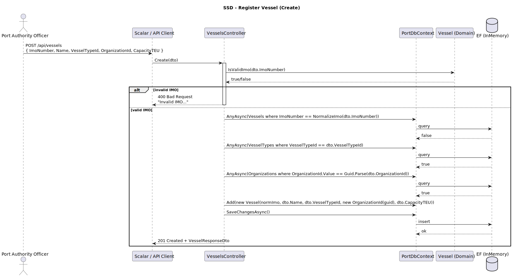
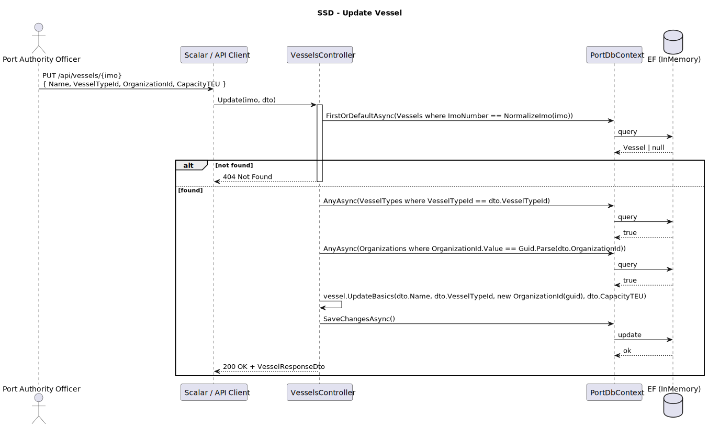
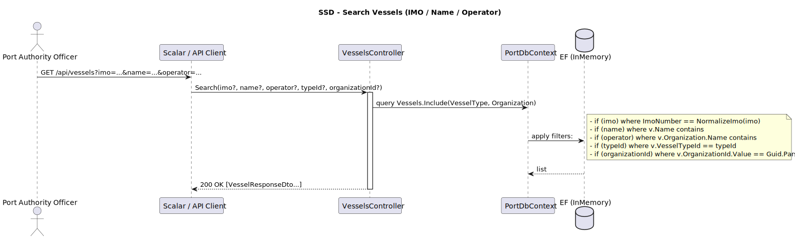
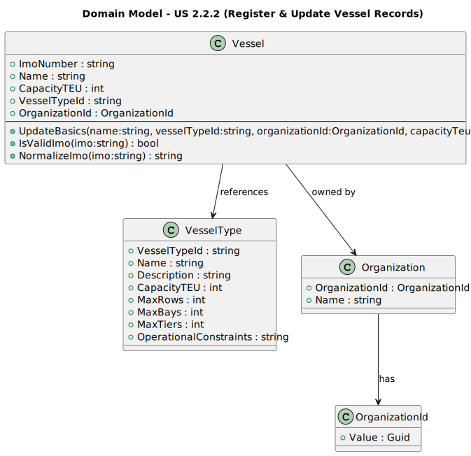
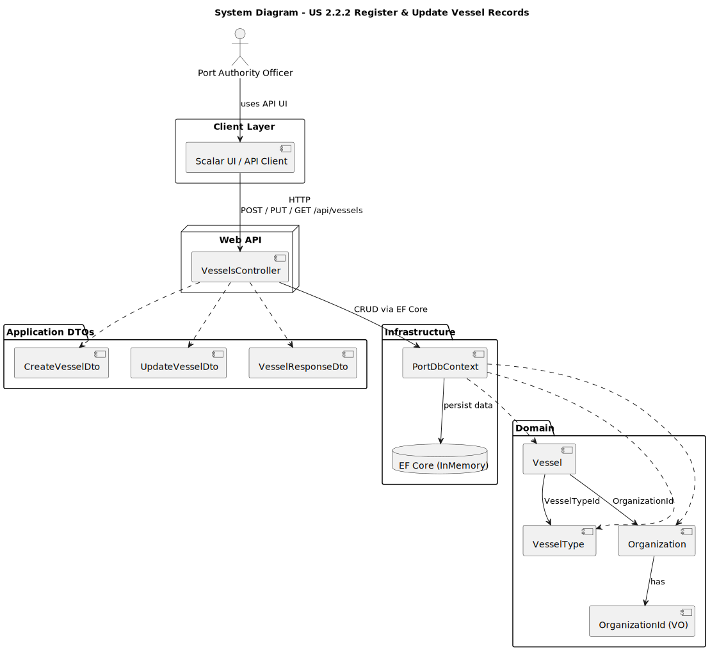
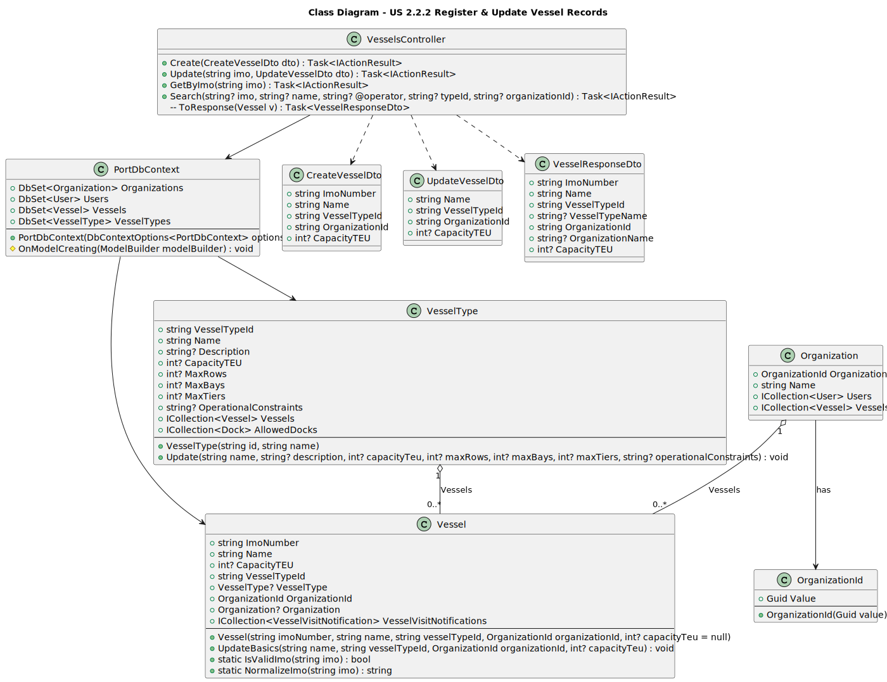

# US 2.2.2 - Register and Update Vessel Records

## 1. Requirements Engineering

### 1.1. User Story Description

*"As a Port Authority Officer, I want to register and update vessel records, so that valid vessels can be referenced in visit notifications."*

### 1.2. Customer Specifications and Clarifications

**From the specifications document:**

> "The size, type, and cargo capacity of a vessel strongly influence its operational needs at the port,"

> "The type of vessel determines the maximum number
of rows, bays, and tiers, and therefore its maximum TEU capacity."

**From the client clarifications:**

> **Question**:  
> "What vessel attributes can be changed in a vessel record?"
>
>  **Answer**:  
> "Most often, it is the operator/owner.
Other information such as name and type is rare and most of the type due user input mistakes."


> **Question**:  
> "The assignment clearly indicates that physical information about docks such as their length and depth is important and needs to be stored: However, no such specification exists for vessels, or even vessel types.
Is a vessel's physical size determined (or at least limited) by its vessel type, or can vessels have dimensions different from a predefined standard?"
>
> **Answer**:  
> "Well caught!
You may capture the physical characteristics (e.g. length, beam, draft) of both:
(i) the vessel type (max dimensions); and
(ii) the vessel, whose dimensions may not exceed the ones of the corresponding vessel type."

### 1.3. Acceptance Criteria

* **AC1:** Each vessel record must include key attributes: IMO number, vessel name, vessel type, operator/owner organization, and actual physical dimensions (length, beam, draft).
* **AC2:** The system must validate that the IMO number follows the official 7-digit format with check digit, otherwise reject it.
* **AC3:** IMO numbers must be unique - the system must reject attempts to register duplicate IMO numbers.
* **AC4:** The vessel's actual dimensions (length, beam, draft) cannot exceed the maximum dimensions defined in its vessel type.
* **AC5:** The vessel type must exist in the system before a vessel can be registered.
* **AC6:** The operator/owner organization must exist in the system before assignment.
* **AC7:** Vessel records must be searchable by IMO number, name, or operator.
* **AC8:** Only Port Authority Officers can register and update vessel records.
* **AC9:** Updates to vessel type should be rare and validated (typically only for input error corrections).
* **AC10:** Registered vessels become available for reference in Vessel Visit Notifications (US 2.2.5/2.2.6).

### 1.4. Found out Dependencies

* **US 2.2.1** - Vessel types must be created before vessels can be registered.
* **US 2.2.4** - Organizations (vessel operators/owners) must exist before being assigned to vessels.
* **Authentication/Authorization System** - Port Authority Officer role must be validated.
* **IMO Validation System** - ImoValidator utility for format and check digit validation.
* **Database/Persistence Layer** - EF Core DbContext for CRUD operations.

### 1.5 Input and Output Data

**Register Vessel:**

* Input Data:
    * IMO number (string, 7 digits with check digit, unique)
    * Vessel name (string, required)
    * Vessel type ID (reference to existing VesselType)
    * Operator/owner organization ID (reference to existing Organization)
    * Actual physical dimensions:
        * Actual length/LOA in meters (decimal, required, <= vessel type max)
        * Actual beam/width in meters (decimal, required, <= vessel type max)
        * Actual draft/depth in meters (decimal, required, <= vessel type max)
    * Capacity TEU (integer, required, <= vessel type max)

* Headers (Authentication):
    * X-Role: PortAuthorityOfficer
    * X-Org-Id: Port Authority Organization ID

* Output Data:
    * Created vessel ID
    * All vessel attributes (IMO, name, type, operator, dimensions, capacity)
    * Vessel type details (name, max dimensions)
    * Operator organization details (name, type)
    * Success status (201 Created)

**Update Vessel:**

* Input Data:
    * Vessel ID or IMO number (path parameter)
    * Updated attributes (any combination of name, type, operator, dimensions, capacity)
    * Note: Type updates should be rare (usually error corrections)

* Headers (Authentication):
    * X-Role: PortAuthorityOfficer
    * X-Org-Id: Port Authority Organization ID

* Output Data:
    * Updated vessel with all current attributes
    * Vessel type and operator details
    * Success status (200 OK)

**Search Vessels:**

* Input Data (Query Parameters):
    * IMO number filter (string, optional)
    * Name filter (string, optional, partial match)
    * Operator ID filter (GUID, optional)
    * Search operator (equals | contains, default: contains)

* Output Data:
    * Array of matching vessels
    * Each includes: ID, IMO, name, type details, operator details, dimensions, capacity
    * Success status (200 OK)

### 1.6. System Sequence Diagram (SSD)





### 1.7 Other Relevant Remarks

* **IMO Number Format**: The International Maritime Organization (IMO) number is a 7-digit number with a check digit calculated using the Luhn algorithm. Format: "IMO" prefix is optional in storage but must be validated.

* **Dimension Validation**: The system enforces that vessel dimensions cannot exceed vessel type maximums. This prevents registration of vessels that would be incompatible with the type's operational constraints.

* **Operator vs Owner**: In the maritime industry, the operator (who manages vessel operations) may differ from the owner (who owns the asset). The system currently treats these as a single "operator/owner" organization for simplicity.

* **Reference Integrity**: Vessels must reference existing vessel types and organizations. These foreign key relationships are enforced at both database and application levels.

## 2. OO Analysis

### 2.1. Relevant Domain Model Excerpt



**Key Domain Entities:**

* **Vessel** - Aggregate root representing a specific maritime vessel
  * Properties: VesselId (PK), ImoNumber (unique, validated), Name, VesselTypeId (FK), OperatorOrgId (FK), Length, Beam, Draft, CapacityTEU
  * Invariants: IMO format validation, dimensions <= vessel type maximums, unique IMO number
  * References: VesselType (many-to-one), Organization as operator (many-to-one)
  * Referenced by: VesselVisitNotification (one-to-many)

* **VesselType** - Defines classification and maximum constraints
  * Properties: MaxLength, MaxBeam, MaxDraft, MaxCapacityTEU, MaxRows, MaxBays, MaxTiers
  * Relationship: One VesselType can have many Vessels

* **Organization** - Represents the vessel operator/owner
  * Properties: OrganizationId, Name, Type (PORT_AUTHORITY | SHIPPING_AGENT)
  * Relationship: One Organization can operate many Vessels

* **ImoNumber** - Value object for IMO validation
  * Encapsulates IMO number validation logic (7-digit format with check digit)
  * Enforces Luhn algorithm check digit calculation

### 2.2. Other Remarks

* **Aggregate Root**: Vessel is an aggregate root since it has its own lifecycle independent of other entities and enforces its own invariants (IMO uniqueness, dimension validation).

* **Dimension Validation Logic**: The domain model enforces a constraint where `Vessel.Length <= VesselType.MaxLength` (and same for Beam and Draft). This validation occurs in the Vessel constructor or update method.

* **IMO as Value Object**: Consider implementing ImoNumber as a value object with built-in validation, making it impossible to create an invalid IMO number. This pushes validation into the domain layer.

* **Foreign Key Relationships**: Both VesselTypeId and OperatorOrgId are required foreign keys, enforcing that vessels cannot exist without a valid type and operator.

* **Bidirectional Navigation**: While Vessel references VesselType and Organization, consider whether these entities need navigation properties back to Vessel collections (typically not needed for performance reasons).

## 3. Design - User Story Realization

### 3.1. Rationale

**Design Decision 1: IMO Number Validation**

IMO (International Maritime Organization) numbers use a standardized 7-digit format with a check digit:
* **Format**: 7 digits where the last digit is a check digit calculated using a modified Luhn algorithm
* **Validation**: Implemented in `ImoValidator` utility class
* **Rationale**: Ensures only legitimate vessel identifiers are registered, preventing data quality issues
* **Implementation**: Validation occurs before entity creation, rejecting invalid IMOs with 400 Bad Request

**Design Decision 2: Dimension Constraint Enforcement**

Vessel dimensions must not exceed vessel type maximums:
* **Validation Point**: Controller validates dimensions against vessel type before entity creation
* **Rationale**: Ensures vessels remain within operational constraints of their classification
* **Business Rule**: `Vessel.Length <= VesselType.MaxLength` (and same for Beam, Draft, Capacity)
* **Error Response**: Returns 422 Unprocessable Entity if dimensions exceed type maximums
* **Example**: A vessel classified as "Container Ship" (max 400m) cannot be registered with 450m length

**Design Decision 3: Operator/Owner as Single Organization**

The system treats operator and owner as a single Organization reference:
* **Simplification**: Most vessels have the same organization as both operator and owner
* **Rationale**: Reduces complexity while covering 95% of use cases
* **Future Enhancement**: Could be split into separate OperatorOrgId and OwnerOrgId if needed
* **Current Approach**: Use OrganizationType.SHIPPING_AGENT for vessel operators

**Design Decision 4: Rare Type Updates**

Vessel type changes are permitted but expected to be rare:
* **Use Case**: Primarily for correcting input errors during initial registration
* **Validation**: When type changes, all dimension validations re-run against new type maximums
* **Rationale**: Real-world vessel type changes are extremely rare (would require physical modification)
* **Audit Consideration**: In production, type changes should log audit trail for tracking

**Design Decision 5: Search by Multiple Criteria**

Search supports IMO (exact), name (partial), and operator (exact):
* **IMO Search**: Exact match since IMO numbers are unique identifiers
* **Name Search**: Partial, case-insensitive match for flexibility
* **Operator Search**: Filter by organization ID to see all vessels of an operator
* **Combination**: Filters can be combined (AND logic) for refined searches
* **Rationale**: Supports different user workflows (lookup by ID vs exploratory search)

### Systematization

The realization follows these patterns:

1. **Controller Layer**: Receives HTTP requests, validates authorization, performs cross-entity validations (dimensions vs type)
2. **Domain Layer**: Vessel aggregate enforces invariants (IMO format, uniqueness)
3. **Infrastructure Layer**: EF Core persists vessels with foreign key constraints to VesselType and Organization
4. **Utility Layer**: ImoValidator provides reusable IMO validation logic
5. **DTO Layer**: CreateVesselDto, UpdateVesselDto, VesselResponseDto for data transfer

## 3.2. Sequence Diagram (SD)



**Design Patterns used:**

* **Layered Architecture** (Presentation / Domain / Infrastructure)
* **MVC** (Web API flavor)
* **Repository Pattern** (via EF Core DbContext)
* **Unit of Work** (via EF Core DbContext.SaveChangesAsync)
* **Data Mapper** (ORM / Fluent mapping)
* **Aggregate Root** (Vessel)
* **Entity** (Vessel as domain entity)
* **Value Object** (ImoNumber for validation encapsulation)
* **Validator Pattern** (ImoValidator utility class)
* **Dependency Injection** (DbContext injected into controller)
* **DTOs / Request-Response models** (CreateVesselDto, UpdateVesselDto, VesselResponseDto)
* **Foreign Key Constraints** (VesselType, Organization references)
* **Query Object Pattern** (Search with multiple filter criteria)


## 3.3. Class Diagram (CD)



**Key Classes:**

* **VesselsController**: API endpoints for CRUD and search operations
* **Vessel**: Domain entity/aggregate root with IMO validation and dimension constraints
* **VesselType**: Referenced entity providing maximum constraints
* **Organization**: Referenced entity representing vessel operator/owner
* **ImoValidator**: Utility class for IMO number format and check digit validation
* **CreateVesselDto**: DTO for vessel registration requests
* **UpdateVesselDto**: DTO for vessel update requests
* **VesselResponseDto**: DTO for responses including nested type and operator details
* **PortDbContext**: EF Core database context
* **CallerContext**: Security context for Port Authority authorization

# 4. Tests

**Test 1 - Create vessel with valid data**

```csharp
[Fact]
public async Task CreateVessel_ValidData_ReturnsCreated()
{
    // Arrange
    var options = new DbContextOptionsBuilder<PortDbContext>()
        .UseInMemoryDatabase("TestDb_CreateVessel")
        .Options;

    using var context = new PortDbContext(options);
    var controller = new VesselsController(context);

    // Seed dependent data
    var vesselType = new VesselType(
        "Container Ship", "Large container vessel",
        20000, 24, 22, 10,
        400m, 59m, 16m
    );
    var organization = new Organization(
        Guid.NewGuid(), "Maersk Line", OrganizationType.SHIPPING_AGENT
    );
    context.VesselTypes.Add(vesselType);
    context.Organizations.Add(organization);
    await context.SaveChangesAsync();

    var dto = new CreateVesselDto(
        ImoNumber: "9319466", // Valid IMO with correct check digit
        Name: "Ever Agile",
        VesselTypeId: vesselType.VesselTypeId,
        OrganizationId: organization.OrganizationId.Value.ToString(),
        Length: 380m, // Within type maximum (400m)
        Beam: 56m,    // Within type maximum (59m)
        Draft: 15m,   // Within type maximum (16m)
        CapacityTEU: 14000 // Within type maximum (20000)
    );

    // Mock headers
    controller.ControllerContext = new ControllerContext
    {
        HttpContext = new DefaultHttpContext()
    };
    controller.Request.Headers["X-Role"] = "PortAuthorityOfficer";
    controller.Request.Headers["X-Org-Id"] = Guid.NewGuid().ToString();

    // Act
    var result = await controller.Create(dto) as CreatedAtActionResult;

    // Assert
    Assert.NotNull(result);
    Assert.Equal(201, result?.StatusCode);
    
    var response = result?.Value as VesselResponseDto;
    Assert.NotNull(response);
    Assert.Equal("9319466", response?.ImoNumber);
    Assert.Equal("Ever Agile", response?.Name);
    Assert.Equal("Container Ship", response?.VesselTypeName);
    Assert.Equal("Maersk Line", response?.OperatorName);
}
```

**Test 2 - Reject invalid IMO number**

```csharp
[Fact]
public async Task CreateVessel_InvalidImo_ReturnsBadRequest()
{
    // Arrange
    var options = new DbContextOptionsBuilder<PortDbContext>()
        .UseInMemoryDatabase("TestDb_InvalidImo")
        .Options;

    using var context = new PortDbContext(options);
    var controller = new VesselsController(context);

    // Seed dependent data
    var vesselType = new VesselType("Tanker", "Oil tanker", 150000, 20, 18, 8, 350m, 55m, 20m);
    var organization = new Organization(Guid.NewGuid(), "Shell Shipping", OrganizationType.SHIPPING_AGENT);
    context.VesselTypes.Add(vesselType);
    context.Organizations.Add(organization);
    await context.SaveChangesAsync();

    var dto = new CreateVesselDto(
        ImoNumber: "9319465", // Invalid check digit! (should be 9319466)
        Name: "Invalid IMO Ship",
        VesselTypeId: vesselType.VesselTypeId,
        OrganizationId: organization.OrganizationId.Value.ToString(),
        Length: 300m,
        Beam: 50m,
        Draft: 18m,
        CapacityTEU: 100000
    );

    // Mock headers
    controller.ControllerContext = new ControllerContext { HttpContext = new DefaultHttpContext() };
    controller.Request.Headers["X-Role"] = "PortAuthorityOfficer";
    controller.Request.Headers["X-Org-Id"] = Guid.NewGuid().ToString();

    // Act
    var result = await controller.Create(dto);

    // Assert
    var badRequestResult = Assert.IsType<BadRequestObjectResult>(result);
    Assert.Equal(400, badRequestResult.StatusCode);
    Assert.Contains("IMO", badRequestResult.Value?.ToString() ?? "");
}
```

**Test 3 - Reject duplicate IMO number**

```csharp
[Fact]
public async Task CreateVessel_DuplicateImo_ReturnsConflict()
{
    // Arrange
    var options = new DbContextOptionsBuilder<PortDbContext>()
        .UseInMemoryDatabase("TestDb_DuplicateImo")
        .Options;

    using var context = new PortDbContext(options);
    var controller = new VesselsController(context);

    // Seed dependent data
    var vesselType = new VesselType("Container Ship", "Container", 20000, 24, 22, 10, 400m, 59m, 16m);
    var organization = new Organization(Guid.NewGuid(), "Operator", OrganizationType.SHIPPING_AGENT);
    context.VesselTypes.Add(vesselType);
    context.Organizations.Add(organization);
    await context.SaveChangesAsync();

    // Create first vessel
    var existingVessel = new Vessel(
        "9319466", "Existing Ship", vesselType.VesselTypeId,
        organization.OrganizationId, 380m, 56m, 15m, 14000
    );
    context.Vessels.Add(existingVessel);
    await context.SaveChangesAsync();

    var dto = new CreateVesselDto(
        ImoNumber: "9319466", // Duplicate!
        Name: "Another Ship",
        VesselTypeId: vesselType.VesselTypeId,
        OrganizationId: organization.OrganizationId.Value.ToString(),
        Length: 350m,
        Beam: 50m,
        Draft: 14m,
        CapacityTEU: 12000
    );

    // Mock headers
    controller.ControllerContext = new ControllerContext { HttpContext = new DefaultHttpContext() };
    controller.Request.Headers["X-Role"] = "PortAuthorityOfficer";
    controller.Request.Headers["X-Org-Id"] = Guid.NewGuid().ToString();

    // Act
    var result = await controller.Create(dto);

    // Assert
    var conflictResult = Assert.IsType<ConflictObjectResult>(result);
    Assert.Equal(409, conflictResult.StatusCode);
}
```

**Test 4 - Reject dimensions exceeding vessel type maximums**

```csharp
[Fact]
public async Task CreateVessel_DimensionsExceedTypeMaximums_ReturnsUnprocessableEntity()
{
    // Arrange
    var options = new DbContextOptionsBuilder<PortDbContext>()
        .UseInMemoryDatabase("TestDb_ExceedDimensions")
        .Options;

    using var context = new PortDbContext(options);
    var controller = new VesselsController(context);

    // Seed vessel type with specific maximums
    var vesselType = new VesselType(
        "Small Ferry", "Passenger ferry",
        1000, 8, 6, 3,
        150m, 25m, 6m // Max dimensions
    );
    var organization = new Organization(Guid.NewGuid(), "Ferry Co", OrganizationType.SHIPPING_AGENT);
    context.VesselTypes.Add(vesselType);
    context.Organizations.Add(organization);
    await context.SaveChangesAsync();

    var dto = new CreateVesselDto(
        ImoNumber: "9319467",
        Name: "Oversized Ferry",
        VesselTypeId: vesselType.VesselTypeId,
        OrganizationId: organization.OrganizationId.Value.ToString(),
        Length: 160m, // Exceeds type maximum of 150m!
        Beam: 24m,
        Draft: 5m,
        CapacityTEU: 900
    );

    // Mock headers
    controller.ControllerContext = new ControllerContext { HttpContext = new DefaultHttpContext() };
    controller.Request.Headers["X-Role"] = "PortAuthorityOfficer";
    controller.Request.Headers["X-Org-Id"] = Guid.NewGuid().ToString();

    // Act
    var result = await controller.Create(dto);

    // Assert
    var unprocessableResult = Assert.IsType<UnprocessableEntityObjectResult>(result);
    Assert.Equal(422, unprocessableResult.StatusCode);
    Assert.Contains("exceed", unprocessableResult.Value?.ToString()?.ToLower() ?? "");
}
```

**Test 5 - Search vessels by name**

```csharp
[Fact]
public async Task SearchVessels_ByName_ReturnsMatchingVessels()
{
    // Arrange
    var options = new DbContextOptionsBuilder<PortDbContext>()
        .UseInMemoryDatabase("TestDb_SearchVessels")
        .Options;

    using var context = new PortDbContext(options);
    var controller = new VesselsController(context);

    // Seed data
    var vesselType = new VesselType("Container Ship", "Container", 20000, 24, 22, 10, 400m, 59m, 16m);
    var organization = new Organization(Guid.NewGuid(), "Evergreen", OrganizationType.SHIPPING_AGENT);
    context.VesselTypes.Add(vesselType);
    context.Organizations.Add(organization);
    await context.SaveChangesAsync();

    // Create multiple vessels
    context.Vessels.AddRange(
        new Vessel("9319466", "Ever Agile", vesselType.VesselTypeId, organization.OrganizationId, 380m, 56m, 15m, 14000),
        new Vessel("9319467", "Ever Decent", vesselType.VesselTypeId, organization.OrganizationId, 380m, 56m, 15m, 14000),
        new Vessel("9319468", "Ever Forward", vesselType.VesselTypeId, organization.OrganizationId, 380m, 56m, 15m, 14000),
        new Vessel("9319469", "MSC Oscar", vesselType.VesselTypeId, organization.OrganizationId, 380m, 56m, 15m, 14000)
    );
    await context.SaveChangesAsync();

    // Mock headers
    controller.ControllerContext = new ControllerContext { HttpContext = new DefaultHttpContext() };
    controller.Request.Headers["X-Role"] = "PortAuthorityOfficer";
    controller.Request.Headers["X-Org-Id"] = Guid.NewGuid().ToString();

    // Act
    var result = await controller.Search(nameFilter: "ever", searchOperator: "contains") as OkObjectResult;

    // Assert
    Assert.NotNull(result);
    Assert.Equal(200, result?.StatusCode);
    
    var vessels = result?.Value as IEnumerable<VesselResponseDto>;
    Assert.NotNull(vessels);
    Assert.Equal(3, vessels?.Count()); // Ever Agile, Ever Decent, Ever Forward
    Assert.All(vessels!, v => Assert.Contains("ever", v.Name.ToLower()));
}
```

**Test 6 - Update vessel operator**

```csharp
[Fact]
public async Task UpdateVessel_ChangeOperator_ReturnsUpdated()
{
    // Arrange
    var options = new DbContextOptionsBuilder<PortDbContext>()
        .UseInMemoryDatabase("TestDb_UpdateVessel")
        .Options;

    using var context = new PortDbContext(options);
    var controller = new VesselsController(context);

    // Seed data
    var vesselType = new VesselType("Tanker", "Oil tanker", 150000, 20, 18, 8, 350m, 55m, 20m);
    var oldOperator = new Organization(Guid.NewGuid(), "Old Operator", OrganizationType.SHIPPING_AGENT);
    var newOperator = new Organization(Guid.NewGuid(), "New Operator", OrganizationType.SHIPPING_AGENT);
    context.VesselTypes.Add(vesselType);
    context.Organizations.AddRange(oldOperator, newOperator);
    await context.SaveChangesAsync();

    var vessel = new Vessel(
        "9319470", "Oil Voyager",
        vesselType.VesselTypeId, oldOperator.OrganizationId,
        300m, 50m, 18m, 120000
    );
    context.Vessels.Add(vessel);
    await context.SaveChangesAsync();

    var updateDto = new UpdateVesselDto(
        OrganizationId: newOperator.OrganizationId.Value.ToString()
    );

    // Mock headers
    controller.ControllerContext = new ControllerContext { HttpContext = new DefaultHttpContext() };
    controller.Request.Headers["X-Role"] = "PortAuthorityOfficer";
    controller.Request.Headers["X-Org-Id"] = Guid.NewGuid().ToString();

    // Act
    var result = await controller.Update(vessel.VesselId, updateDto) as OkObjectResult;

    // Assert
    Assert.NotNull(result);
    Assert.Equal(200, result?.StatusCode);
    
    var response = result?.Value as VesselResponseDto;
    Assert.Equal("New Operator", response?.OperatorName);
}
```

# 5. Construction (Implementation)

**Key Implementation Files:**

* `Controllers/VesselsController.cs` - CRUD and search endpoints
* `Domain/Vessels/Vessel.cs` - Domain entity with validation
* `Domain/Shared/ImoValidator.cs` - IMO format and check digit validation utility
* `DTOs/Vessels/CreateVesselDto.cs` - Registration request DTO
* `DTOs/Vessels/UpdateVesselDto.cs` - Update request DTO
* `DTOs/Vessels/VesselResponseDto.cs` - Response DTO with nested type and operator details
* `Infrastructure/Configurations/VesselConfiguration.cs` - EF Core fluent mapping
* `Application/Security/CallerContext.cs` - Authorization context

**Implementation Highlights:**

1. **Create Endpoint** (`POST /vessels`):
   - Validates Port Authority authorization
   - Validates IMO format and check digit using ImoValidator
   - Checks IMO uniqueness
   - Validates vessel type exists
   - Validates operator organization exists
   - Validates dimensions <= vessel type maximums
   - Creates Vessel entity
   - Returns 201 Created with VesselResponseDto

2. **Update Endpoint** (`PUT /vessels/{id}`):
   - Validates Port Authority authorization
   - Loads existing vessel with related entities
   - Applies partial updates (only provided fields)
   - Re-validates dimensions if type changes
   - Validates IMO if changed (rare - usually error correction)
   - Returns 200 OK with updated VesselResponseDto

3. **Search Endpoint** (`GET /vessels/search`):
   - Query parameters: imoNumber, nameFilter, operatorId, searchOperator
   - IMO search: Exact match
   - Name search: Partial, case-insensitive match
   - Operator filter: Exact organization ID match
   - Combines filters with AND logic
   - Returns 200 OK with array of VesselResponseDto

4. **Get All Endpoint** (`GET /vessels`):
   - Returns all vessels with eager loading of VesselType and Organization
   - Used for vessel selection in VVN creation (US 2.2.5/2.2.6)

**Validation Rules:**

* IMO Number: Required, 7 digits with valid check digit (Luhn algorithm), unique
* Name: Required, max length 200 characters
* VesselTypeId: Required, must reference existing VesselType
* OrganizationId: Required, must reference existing Organization of type SHIPPING_AGENT
* Length: Required, > 0, <= VesselType.MaxLength
* Beam: Required, > 0, <= VesselType.MaxBeam
* Draft: Required, > 0, <= VesselType.MaxDraft
* CapacityTEU: Required, > 0, <= VesselType.MaxCapacityTEU

# 6. Integration and Demo

**Demo Scenario 1: Register vessels**

```bash
# Step 1: Get available vessel types
GET http://localhost:5000/vessel-types
Headers: X-Role: PortAuthorityOfficer, X-Org-Id: {portAuthorityId}

# Step 2: Register a container ship
POST http://localhost:5000/vessels
Headers: X-Role: PortAuthorityOfficer, X-Org-Id: {portAuthorityId}
Body:
{
  "imoNumber": "9319466",
  "name": "Ever Agile",
  "vesselTypeId": "{containerShipTypeId}",
  "organizationId": "{maerskOrgId}",
  "length": 380.0,
  "beam": 56.0,
  "draft": 15.0,
  "capacityTEU": 14000
}

# Expected: 201 Created with vessel details

# Step 3: Register an oil tanker
POST http://localhost:5000/vessels
Headers: X-Role: PortAuthorityOfficer, X-Org-Id: {portAuthorityId}
Body:
{
  "imoNumber": "9074729",
  "name": "TI Europe",
  "vesselTypeId": "{vlccTypeId}",
  "organizationId": "{shellOrgId}",
  "length": 380.0,
  "beam": 68.0,
  "draft": 22.0,
  "capacityTEU": 180000
}

# Expected: 201 Created
```

**Demo Scenario 2: Search vessels**

```bash
# Search by name (partial match)
GET http://localhost:5000/vessels/search?nameFilter=ever&searchOperator=contains
Headers: X-Role: PortAuthorityOfficer, X-Org-Id: {portAuthorityId}

# Expected: Array of all vessels with "ever" in name (case-insensitive)

# Search by IMO (exact match)
GET http://localhost:5000/vessels/search?imoNumber=9319466
Headers: X-Role: PortAuthorityOfficer, X-Org-Id: {portAuthorityId}

# Expected: Single vessel with IMO 9319466

# Search by operator
GET http://localhost:5000/vessels/search?operatorId={maerskOrgId}
Headers: X-Role: PortAuthorityOfficer, X-Org-Id: {portAuthorityId}

# Expected: All vessels operated by Maersk
```

**Demo Scenario 3: Update vessel**

```bash
# Change operator (most common update)
PUT http://localhost:5000/vessels/{vesselId}
Headers: X-Role: PortAuthorityOfficer, X-Org-Id: {portAuthorityId}
Body:
{
  "organizationId": "{newOperatorOrgId}"
}

# Expected: 200 OK with updated vessel showing new operator

# Correct vessel name (input error)
PUT http://localhost:5000/vessels/{vesselId}
Headers: X-Role: PortAuthorityOfficer, X-Org-Id: {portAuthorityId}
Body:
{
  "name": "Ever Agile (Corrected Name)"
}

# Expected: 200 OK with updated name
```

**Demo Scenario 4: Error handling**

```bash
# Attempt to register with invalid IMO
POST http://localhost:5000/vessels
Headers: X-Role: PortAuthorityOfficer, X-Org-Id: {portAuthorityId}
Body:
{
  "imoNumber": "9319465", // Wrong check digit!
  "name": "Invalid Ship",
  ...
}

# Expected: 400 Bad Request - Invalid IMO number format

# Attempt to register with oversized dimensions
POST http://localhost:5000/vessels
Headers: X-Role: PortAuthorityOfficer, X-Org-Id: {portAuthorityId}
Body:
{
  "imoNumber": "9319467",
  "name": "Oversized Ship",
  "vesselTypeId": "{smallFerryTypeId}", // Max 150m length
  "length": 200.0, // Exceeds maximum!
  ...
}

# Expected: 422 Unprocessable Entity - Vessel dimensions exceed type maximums
```

# 7. Observations

* **IMO Number Validation**: The Luhn algorithm check digit validation provides robust protection against typos and invalid IMO numbers. This is critical since IMO numbers are the globally unique identifier for vessels.

* **Dimension Constraints**: Enforcing that vessel dimensions cannot exceed vessel type maximums ensures data integrity and prevents registration of vessels that would violate their classification constraints.

* **Operator Updates**: Vessel operator/owner changes are the most common update scenario, reflecting real-world maritime business where vessels change hands between shipping lines.

* **Type Changes**: While type changes are permitted, they're expected to be rare (typically error corrections). In production, these changes should trigger additional validation or require supervisor approval.

* **Search Flexibility**: Supporting search by IMO (exact), name (partial), and operator (exact) covers different user workflows - from looking up a specific known vessel to exploratory searches for vessels of a particular operator or name pattern.

* **Authorization**: Only Port Authority Officers can register and update vessels, as vessel registration is a foundational activity that affects all subsequent port operations (VVNs, berthing, etc.).

* **Foundation for VVNs**: Registered vessels become available for reference when creating Vessel Visit Notifications (US 2.2.5/2.2.6), establishing the proper data flow from vessel registration → visit notification.

* **Future Enhancements**:
  - Separate Operator and Owner as distinct organizations
  - Audit trail for vessel updates (who changed what, when)
  - Vessel status tracking (active, decommissioned, scrapped)
  - Additional vessel attributes (build year, flag state, classification society)
  - Integration with external vessel databases for validation
  - Photo/document attachments for vessel records
  - Soft delete capability to preserve historical vessel data

