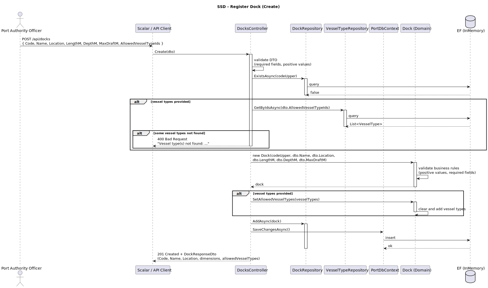
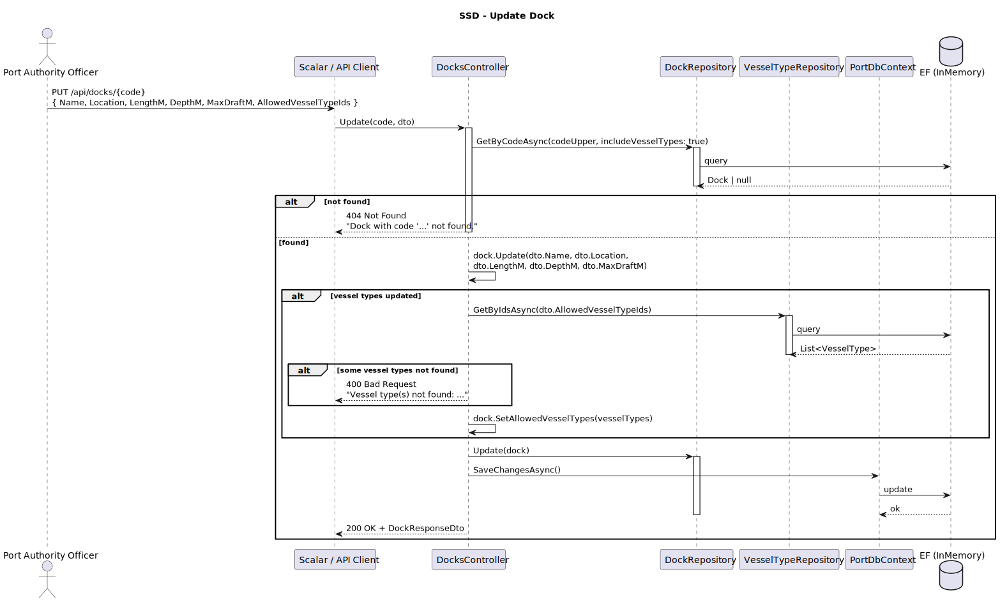
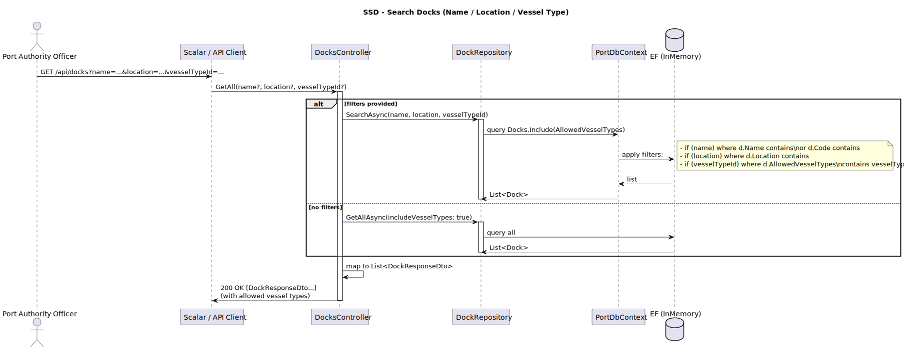
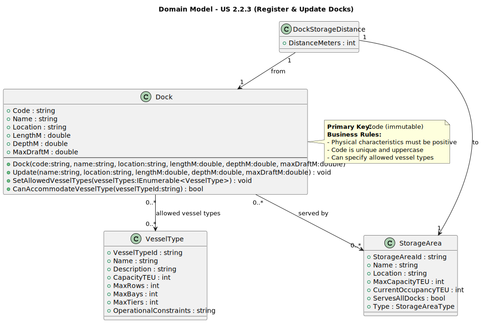
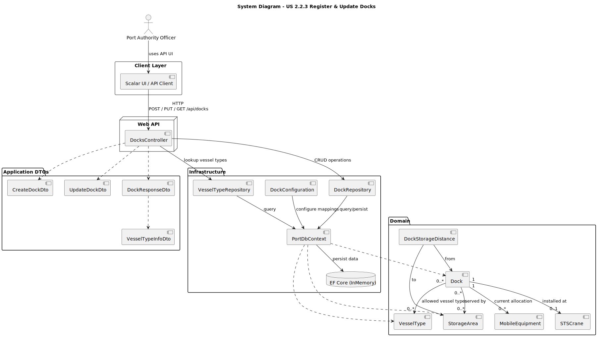
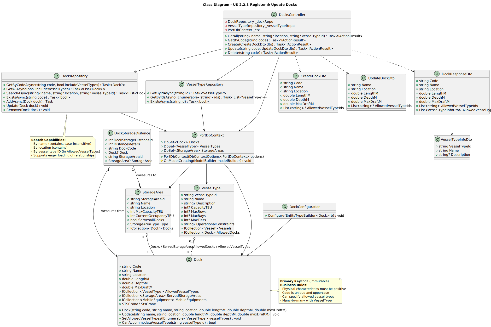

# US 2.2.3 - Register and Update Docks

## 1. Requirements Engineering

### 1.1. User Story Description

*"As a Port Authority Officer, I want to register and update docks, so that the system accurately reflects the docking capacity of the port."*

### 1.2. Customer Specifications and Clarifications

**From the specifications document:**

> "Docks are physical berthing locations where vessels are moored during their stay at the port."

> "The physical characteristics of docks (length, depth, draft) determine which vessel types can safely berth there."

**From the client clarifications:**

> **Question**:  
> "Which fields of a dock are allowed to be updated once it is registered?"
>
> **Answer**:  
> "All excepting the id."

> **Question**:  
> "Should the system maintain a log of dock updates, recording who made the changes and when?"
>
> **Answer**:  
> "Yes, for compliance with the statement 'All user interactions must be carefully logged, producing detailed records of every significant action performed in the system.'"

> **Question**:  
> "Regarding the user story for registering and updating a dock, we are not sure what is meant by 'location within the port.' Should this be stored as geographic coordinates, or as a relative/semantic position (e.g., area, zone) within the port?"
>
> **Answer**:  
> "In this case, you may consider the 'location within the port' as a free text."

### 1.3. Acceptance Criteria

* **AC1:** A dock record must include a unique identifier, name/number, location within the port, and physical characteristics (e.g., length, depth, max draft).
* **AC2:** The officer must specify the vessel types allowed to berth there.
* **AC3:** Docks must be searchable and filterable by name, vessel type, and location.

### 1.4. Found out Dependencies

* Have a Port Authority Officer user registered and authenticated.
* Vessel types must exist in the system to be assigned to docks.

### 1.5 Input and Output Data

* Input Data:
    * Unique code (identifier)
    * Name
    * Location (free text)
    * Length (meters)
    * Depth (meters)
    * Maximum draft (meters)
    * List of allowed vessel type IDs

* Selected data:
    * Vessel types (from existing records)

* Output Data:
    * (in)Success of the operation
    * Created/updated dock details

### 1.6. System Sequence Diagram (SSD)





### 1.7 Other Relevant Remarks

* The Code field acts as the primary key and cannot be changed after creation.
* All other fields (including allowed vessel types) can be updated.
* Location is stored as free text for flexibility.

## 2. OO Analysis

### 2.1. Relevant Domain Model Excerpt



### 2.2. Other Remarks

n/a

## 3. Design - User Story Realization

### 3.1. Rationale

Following the same architectural patterns as US 2.2.2:
- RESTful API endpoints for CRUD operations
- Repository pattern for data access
- Domain-driven design with aggregate roots
- DTOs for request/response mapping
- EF Core for persistence with fluent configuration

### Systematization ##

## 3.2. Sequence Diagram (SD)



**Design Patterns used:**

* Layered Architecture (Presentation / Domain / Infrastructure)
* MVC (Web API flavor)
* Repository Pattern (CRUD)
* Unit of Work (via EF Core DbContext)
* Data Mapper (ORM / Fluent mapping via DockConfiguration)
* Aggregate Root + Entity (DDD)
* Value Object (DDD)
* Dependency Injection / IoC (DbContext, Repositories)
* DTOs / Request-Response models
* Many-to-Many relationship mapping (Dock ↔ VesselType)

## 3.3. Class Diagram (CD)



# 4. Tests

Test 1 - Create a dock with valid data

```csharp
[Fact]
public async Task CreateDock_ValidData_ReturnsCreated()
{
    // Arrange
    var options = new DbContextOptionsBuilder<PortDbContext>()
        .UseInMemoryDatabase("TestDb_CreateDock")
        .Options;

    using var context = new PortDbContext(options);
    var dockRepo = new DockRepository(context);
    var vesselTypeRepo = new VesselTypeRepository(context);
    var controller = new DocksController(dockRepo, vesselTypeRepo, context);

    var dto = new CreateDockDto(
        Code: "D01",
        Name: "North Dock",
        Location: "North Terminal, Berth 1",
        LengthM: 400.0,
        DepthM: 15.0,
        MaxDraftM: 14.0,
        AllowedVesselTypeIds: new List<string> { "VT123" }
    );

    // Seed dependent data
    context.VesselTypes.Add(new VesselType("VT123", "Container"));
    await context.SaveChangesAsync();

    // Act
    var result = await controller.Create(dto) as CreatedAtActionResult;

    // Assert
    Assert.NotNull(result);
    Assert.Equal(201, result?.StatusCode);
}
```

Test 2 - Reject duplicate dock code

```csharp
[Fact]
public async Task CreateDock_DuplicateCode_ReturnsConflict()
{
    // Arrange
    var options = new DbContextOptionsBuilder<PortDbContext>()
        .UseInMemoryDatabase("TestDb_DuplicateDock")
        .Options;

    using var context = new PortDbContext(options);
    var dockRepo = new DockRepository(context);
    var vesselTypeRepo = new VesselTypeRepository(context);
    var controller = new DocksController(dockRepo, vesselTypeRepo, context);

    // Seed existing dock
    context.Docks.Add(new Dock("D01", "Existing Dock", "Terminal 1", 300, 12, 11));
    await context.SaveChangesAsync();

    var dto = new CreateDockDto(
        Code: "D01", // duplicate
        Name: "New Dock",
        Location: "Terminal 2",
        LengthM: 350.0,
        DepthM: 13.0,
        MaxDraftM: 12.0,
        AllowedVesselTypeIds: null
    );

    // Act
    var result = await controller.Create(dto) as ConflictObjectResult;

    // Assert
    Assert.NotNull(result);
    Assert.Equal(409, result?.StatusCode);
}
```

Test 3 - Update dock properties

```csharp
[Fact]
public async Task UpdateDock_ValidChanges_ReturnsOk()
{
    // Arrange
    var options = new DbContextOptionsBuilder<PortDbContext>()
        .UseInMemoryDatabase("TestDb_UpdateDock")
        .Options;

    using var context = new PortDbContext(options);
    var dockRepo = new DockRepository(context);
    var vesselTypeRepo = new VesselTypeRepository(context);
    var controller = new DocksController(dockRepo, vesselTypeRepo, context);

    // Seed dock
    var dock = new Dock("D01", "Old Name", "Old Location", 300, 12, 11);
    context.Docks.Add(dock);
    await context.SaveChangesAsync();

    var dto = new UpdateDockDto(
        Name: "Updated Name",
        Location: "Updated Location",
        LengthM: 350.0,
        DepthM: 14.0,
        MaxDraftM: 13.0,
        AllowedVesselTypeIds: null
    );

    // Act
    var result = await controller.Update("D01", dto) as OkObjectResult;

    // Assert
    Assert.NotNull(result);
    Assert.Equal(200, result?.StatusCode);
    
    var updatedDock = await dockRepo.GetByCodeAsync("D01");
    Assert.Equal("Updated Name", updatedDock?.Name);
    Assert.Equal(350.0, updatedDock?.LengthM);
}
```

Test 4 - Search docks by vessel type

```csharp
[Fact]
public async Task SearchDocks_ByVesselType_ReturnsFiltered()
{
    // Arrange
    var options = new DbContextOptionsBuilder<PortDbContext>()
        .UseInMemoryDatabase("TestDb_SearchDocks")
        .Options;

    using var context = new PortDbContext(options);
    var dockRepo = new DockRepository(context);
    var vesselTypeRepo = new VesselTypeRepository(context);
    var controller = new DocksController(dockRepo, vesselTypeRepo, context);

    // Seed data
    var vesselType = new VesselType("VT123", "Container");
    context.VesselTypes.Add(vesselType);
    
    var dock1 = new Dock("D01", "Dock 1", "Terminal 1", 300, 12, 11);
    var dock2 = new Dock("D02", "Dock 2", "Terminal 2", 350, 13, 12);
    
    dock1.SetAllowedVesselTypes(new[] { vesselType });
    
    context.Docks.AddRange(dock1, dock2);
    await context.SaveChangesAsync();

    // Act
    var result = await controller.GetAll(null, null, "VT123") as OkObjectResult;

    // Assert
    Assert.NotNull(result);
    var docks = result?.Value as List<DockResponseDto>;
    Assert.Single(docks); // Only dock1 should be returned
    Assert.Equal("D01", docks?.First().Code);
}
```

# 5. Construction (Implementation)

## 5.1. Domain Layer

**Dock.cs** - Aggregate root with business rules:
- Validates physical characteristics (positive values)
- Manages allowed vessel types (many-to-many)
- Provides `CanAccommodateVesselType()` business logic

## 5.2. Infrastructure Layer

**DockConfiguration.cs** - EF Core fluent configuration:
- Primary key: Code (string, max 20 chars)
- Properties with constraints (max lengths, required fields)
- Many-to-many relationship with VesselType
- Indexes for search optimization

**DockRepository.cs** - Data access with filtering:
- GetByCodeAsync with optional eager loading
- SearchAsync with multiple filter criteria
- GetAllAsync for listing

## 5.3. Application Layer

**DocksController.cs** - REST API endpoints:
- GET /api/docks - List/search with filters
- GET /api/docks/{code} - Get by code
- POST /api/docks - Create new dock
- PUT /api/docks/{code} - Update dock
- DELETE /api/docks/{code} - Delete dock

**DTOs:**
- CreateDockDto - Input for creation
- UpdateDockDto - Input for updates
- DockResponseDto - Output with related data

# 6. Integration and Demo

* Navigate to `/scalar/v1` to access API documentation
* Create vessel types first (dependency)
* Register docks with physical characteristics
* Assign vessel types to docks
* Search/filter docks by various criteria
* Update dock properties (all except Code)
* View allowed vessel types for each dock

# 7. Observations

* The Code field is immutable after creation (acts as business key)
* Location is stored as free text for flexibility per client requirements
* Many-to-many relationship allows multiple vessel types per dock and vice versa
* Validation ensures physical characteristics are positive values
* Repository includes search capabilities for all acceptance criteria
