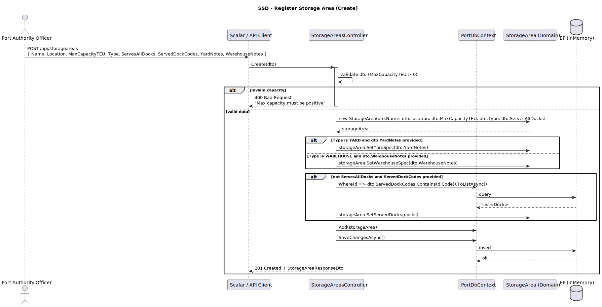
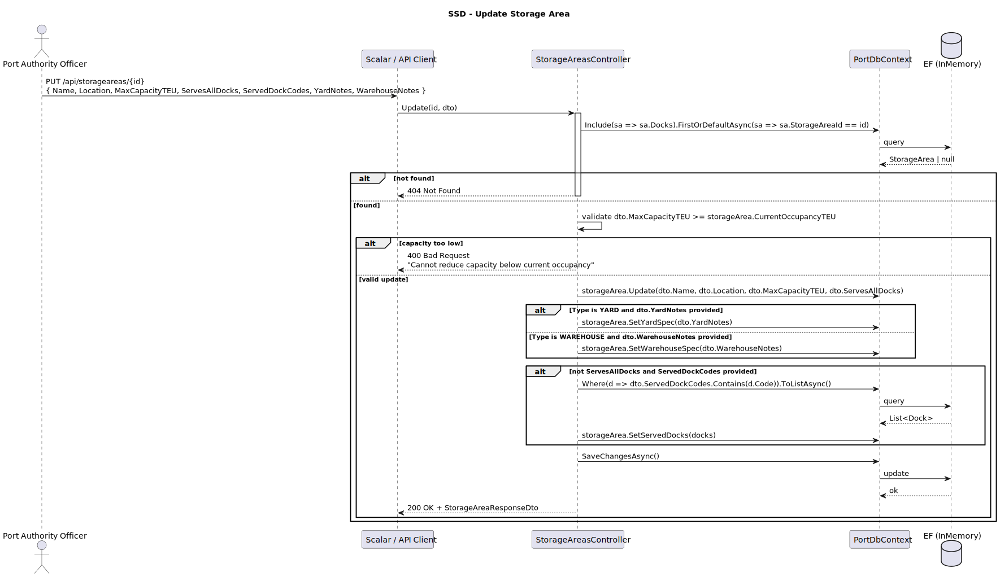
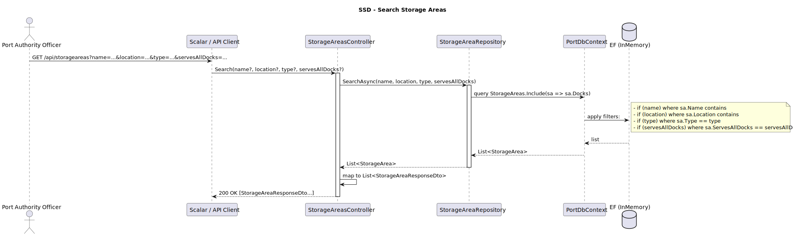
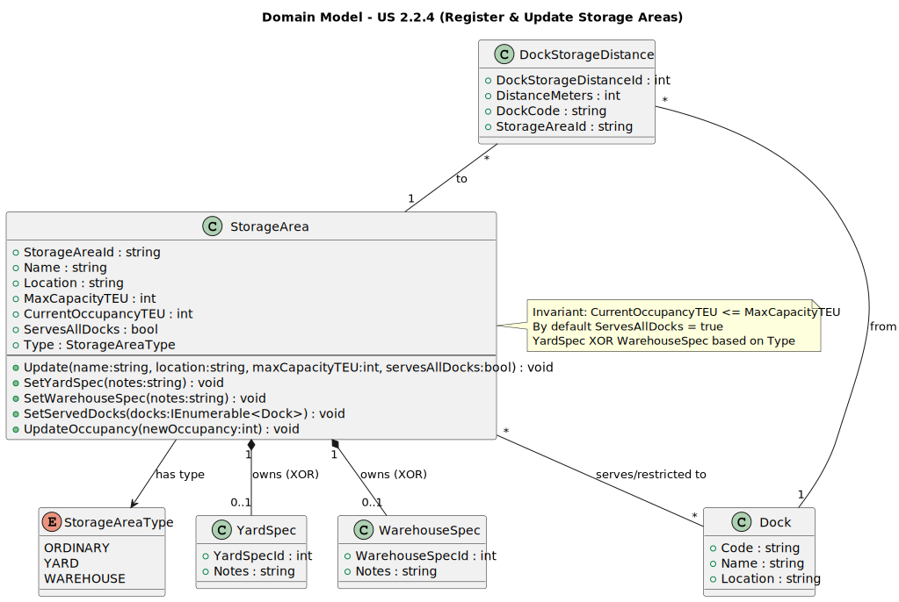
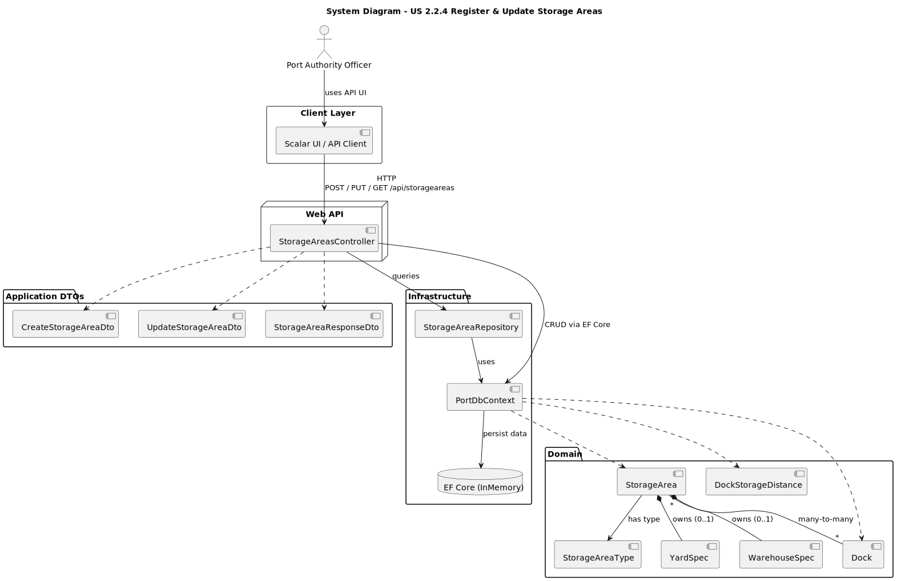
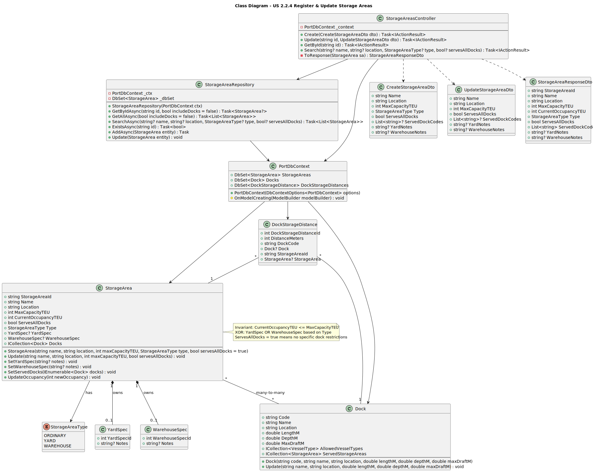

# US 2.2.4 - Register and Update Storage Areas

## 1. Requirements Engineering

### 1.1. User Story Description

*"As a Port Authority Officer, I want to register and update storage areas, so that (un)loading and storage operations can be assigned to the correct locations."*

### 1.2. Customer Specifications and Clarifications

**From the specifications document:**

> "Storage areas are critical for organizing containers within the port facility."

> "Each storage area must have sufficient capacity to handle the expected volume of containers."

**From the client clarifications:**

> **Question**:  
> "Can a storage area change its type after creation (e.g., from YARD to WAREHOUSE)?"
>
> **Answer**:  
> "No, the type is set at creation and represents the physical infrastructure. You can only update capacity, location details, and dock assignments."

> **Question**:  
> "How should we handle the distance between docks and storage areas?"
>
> **Answer**:  
> "Record the distance in meters. This is used for optimization and planning purposes. The system should allow updating these distances as port layout changes."

> **Question**:  
> "What happens if we try to reduce capacity below current occupancy?"
>
> **Answer**:  
> "The system must reject such updates. You cannot reduce capacity below current occupancy."

### 1.3. Acceptance Criteria

* **AC1:** Each storage area must have a unique identifier, type (e.g., yard, warehouse), and location within the port.
* **AC2:** Storage areas must specify maximum capacity (in TEUs) and current occupancy.
* **AC3:** By default, a storage area serves the entire port, but some may be restricted to specific docks.
* **AC4:** Complementary information such as distance between docks and storage areas must be recorded.
* **AC5:** Updates must not allow current occupancy to exceed maximum capacity.

### 1.4. Found out Dependencies

* Docks must exist in the system to associate storage areas with specific docks.
* DockStorageDistance records depend on both Dock and StorageArea entities.

### 1.5 Input and Output Data

* Input Data:
    * Storage Area Name
    * Location (within port)
    * Type (ORDINARY, YARD, WAREHOUSE)
    * Maximum Capacity (TEUs)
    * Current Occupancy (TEUs)
    * Serves All Docks (boolean)
    * Served Dock Codes (if not serving all)
    * Type-specific notes (Yard/Warehouse)

* Selected data:
    * Port Authority credentials
    * Existing docks for associations

* Output Data:
    * (in)Success of the operation
    * Storage area details
    * Validation errors

### 1.6. System Sequence Diagram (SSD)





### 1.7 Other Relevant Remarks

Storage areas use a discriminated type pattern with ORDINARY, YARD, and WAREHOUSE types. YARD and WAREHOUSE types can have additional specifications stored as owned entities (YardSpec, WarehouseSpec).

## 2. OO Analysis

### 2.1. Relevant Domain Model Excerpt



### 2.2. Other Remarks

The system enforces the XOR constraint between YardSpec and WarehouseSpec at the domain level, ensuring only the appropriate specification is set based on the storage area type.

## 3. Design - User Story Realization

### 3.1. Rationale

Following the same architectural patterns as US 2.2.3:
- RESTful API endpoints for CRUD operations
- Repository pattern for data access with advanced filtering
- Domain-driven design with aggregate roots
- DTOs for request/response mapping
- EF Core for persistence with fluent configuration
- Owned entities for type-specific specifications (YardSpec, WarehouseSpec)

### Systematization

## 3.2. Sequence Diagram (SD)



**Design Patterns used:**

* Layered Architecture (Presentation / Domain / Infrastructure)
* MVC (Web API flavor)
* Repository Pattern (CRUD + custom queries)
* Unit of Work (via EF Core DbContext)
* Data Mapper (ORM / Fluent mapping via StorageAreaConfiguration)
* Aggregate Root + Entity (DDD)
* Value Object (DDD - owned entities YardSpec/WarehouseSpec)
* Dependency Injection / IoC (DbContext, Repositories)
* DTOs / Request-Response models
* Many-to-Many relationship mapping (StorageArea ↔ Dock)

## 3.3. Class Diagram (CD)



# 4. Tests

Test 1 - Create a storage area with valid data

```csharp
[Fact]
public async Task CreateStorageArea_ValidData_ReturnsCreated()
{
    // Arrange
    var options = new DbContextOptionsBuilder<PortDbContext>()
        .UseInMemoryDatabase("TestDb_CreateStorageArea")
        .Options;

    using var context = new PortDbContext(options);
    var controller = new StorageAreasController(context);

    var dto = new CreateStorageAreaDto(
        Name: "Container Yard A",
        Location: "North Terminal",
        MaxCapacityTEU: 5000,
        Type: StorageAreaType.YARD,
        ServesAllDocks: true,
        YardNotes: "Open-air storage"
    );

    // Act
    var result = await controller.Create(dto) as CreatedAtActionResult;

    // Assert
    Assert.NotNull(result);
    Assert.Equal(201, result?.StatusCode);
}
```

Test 2 - Reject update when occupancy exceeds capacity

```csharp
[Fact]
public async Task UpdateStorageArea_OccupancyExceedsCapacity_ReturnsBadRequest()
{
    // Arrange
    var options = new DbContextOptionsBuilder<PortDbContext>()
        .UseInMemoryDatabase("TestDb_OccupancyExceeds")
        .Options;

    using var context = new PortDbContext(options);
    var controller = new StorageAreasController(context);

    var area = new StorageArea("Yard B", "South Terminal", 1000, StorageAreaType.YARD);
    area.UpdateOccupancy(800);
    context.StorageAreas.Add(area);
    await context.SaveChangesAsync();

    var dto = new UpdateStorageAreaDto(
        Name: "Yard B",
        Location: "South Terminal",
        MaxCapacityTEU: 500, // Less than current occupancy
        ServesAllDocks: true
    );

    // Act
    var result = await controller.Update(area.StorageAreaId, dto) as BadRequestObjectResult;

    // Assert
    Assert.NotNull(result);
    Assert.Equal(400, result?.StatusCode);
}
```

Test 3 - Search storage areas by type

```csharp
[Fact]
public async Task SearchStorageAreas_ByType_ReturnsFiltered()
{
    // Arrange
    var options = new DbContextOptionsBuilder<PortDbContext>()
        .UseInMemoryDatabase("TestDb_SearchByType")
        .Options;

    using var context = new PortDbContext(options);
    var controller = new StorageAreasController(context);

    context.StorageAreas.Add(new StorageArea("Yard 1", "Location 1", 1000, StorageAreaType.YARD));
    context.StorageAreas.Add(new StorageArea("Warehouse 1", "Location 2", 2000, StorageAreaType.WAREHOUSE));
    context.StorageAreas.Add(new StorageArea("Yard 2", "Location 3", 1500, StorageAreaType.YARD));
    await context.SaveChangesAsync();

    // Act
    var result = await controller.Search(null, null, StorageAreaType.YARD, null) as OkObjectResult;
    var areas = result?.Value as List<StorageAreaResponseDto>;

    // Assert
    Assert.NotNull(areas);
    Assert.Equal(2, areas?.Count);
    Assert.All(areas!, a => Assert.Equal(StorageAreaType.YARD, a.Type));
}
```

Test 4 - Enforce XOR constraint for YardSpec and WarehouseSpec

```csharp
[Fact]
public void SetYardSpec_OnWarehouseType_ThrowsException()
{
    // Arrange
    var area = new StorageArea("Warehouse A", "Terminal 1", 3000, StorageAreaType.WAREHOUSE);

    // Act & Assert
    var exception = Assert.Throws<InvalidOperationException>(() => 
        area.SetYardSpec("Should not work")
    );
    Assert.Contains("YardSpec can only be set for YARD type", exception.Message);
}
```

# 5. Construction (Implementation)

## 5.1. Domain Layer

**StorageArea.cs** - Aggregate root with business rules:
- Validates capacity constraints (positive values, occupancy ≤ capacity)
- Manages type-specific specifications (XOR constraint)
- Controls dock associations (many-to-many)
- Provides `UpdateOccupancy()` with validation

**YardSpec.cs / WarehouseSpec.cs** - Owned entities:
- Type-specific additional information
- Automatically owned by StorageArea entity
- XOR constraint enforced at domain level

## 5.2. Infrastructure Layer

**StorageAreaConfiguration.cs** - EF Core fluent configuration:
- Primary key: StorageAreaId (string, max 64 chars)
- Properties with constraints (max lengths, required fields)
- Enum conversion for StorageAreaType
- Owned entities configuration (YardSpec, WarehouseSpec)
- Many-to-many relationship with Dock
- Indexes for search optimization

**StorageAreaRepository.cs** - Data access with filtering:
- GetByIdAsync with optional eager loading of Docks
- SearchAsync with multiple filter criteria (name, location, type, servesAllDocks)
- GetAllAsync for listing with optional includes
- ExistsAsync for validation

## 5.3. Application Layer

**StorageAreasController.cs** - REST API endpoints:
- GET /api/storageareas - List/search with filters
- GET /api/storageareas/{id} - Get by ID
- POST /api/storageareas - Create new storage area
- PUT /api/storageareas/{id} - Update storage area
- DELETE /api/storageareas/{id} - Delete storage area

**DTOs:**
- CreateStorageAreaDto - Input for creation with type and specs
- UpdateStorageAreaDto - Input for updates (type immutable)
- StorageAreaResponseDto - Output with dock associations

# 6. Integration and Demo

* Navigate to `/scalar/v1` to access API documentation
* Create docks first (optional dependency for restricted storage areas)
* Register storage areas with:
  - Basic info (name, location, capacity)
  - Type selection (ORDINARY, YARD, WAREHOUSE)
  - Dock associations (all or specific)
  - Type-specific notes (for YARD or WAREHOUSE)
* Search/filter storage areas by:
  - Name
  - Location
  - Type
  - ServesAllDocks flag
* Update storage area properties:
  - Name, location, capacity (validated against occupancy)
  - Dock assignments
  - Type-specific notes
  - Note: Type is immutable after creation
* View current occupancy and capacity utilization
* System validates:
  - Capacity > 0
  - Occupancy ≤ Capacity
  - XOR constraint for YardSpec/WarehouseSpec

# 7. Observations

* The StorageAreaId is auto-generated (GUID string) and immutable
* Type is set at creation and cannot be changed (represents physical infrastructure)
* Owned entities (YardSpec, WarehouseSpec) follow the XOR pattern based on Type
* Many-to-many relationship allows flexible dock-storage associations
* ServesAllDocks flag simplifies configuration for general-purpose areas
* Validation ensures operational integrity (capacity constraints)
* Repository includes comprehensive search capabilities for all acceptance criteria
* DockStorageDistance entity can be used for future optimization features
