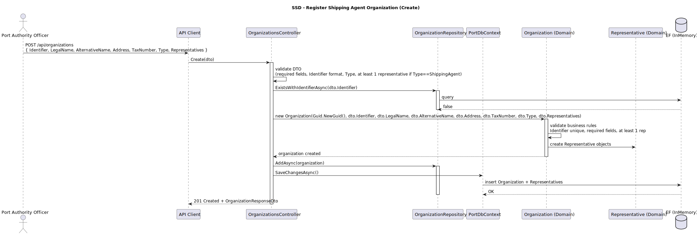
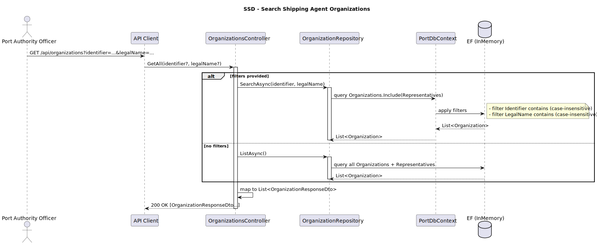
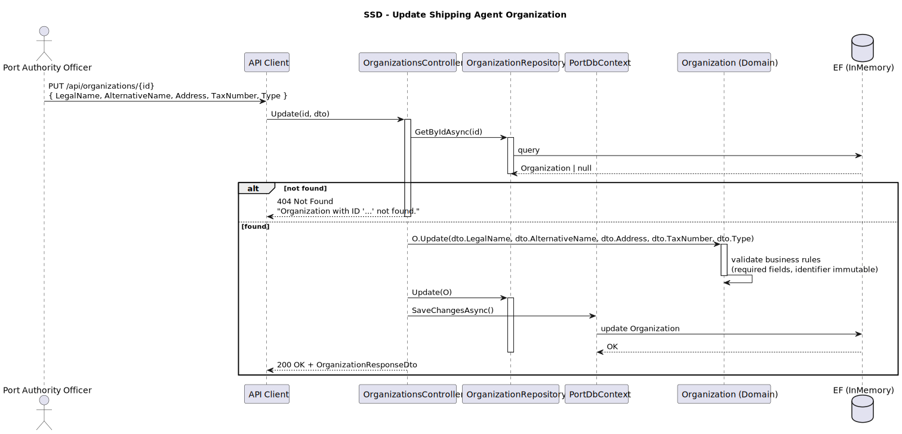
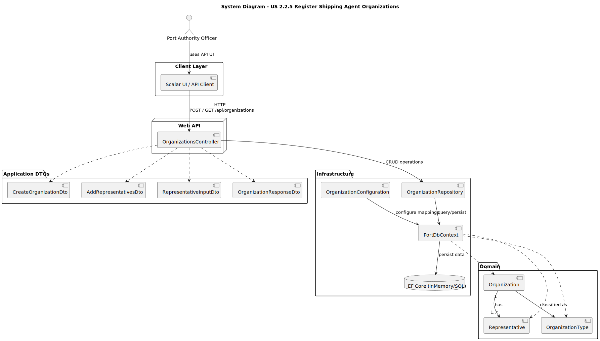
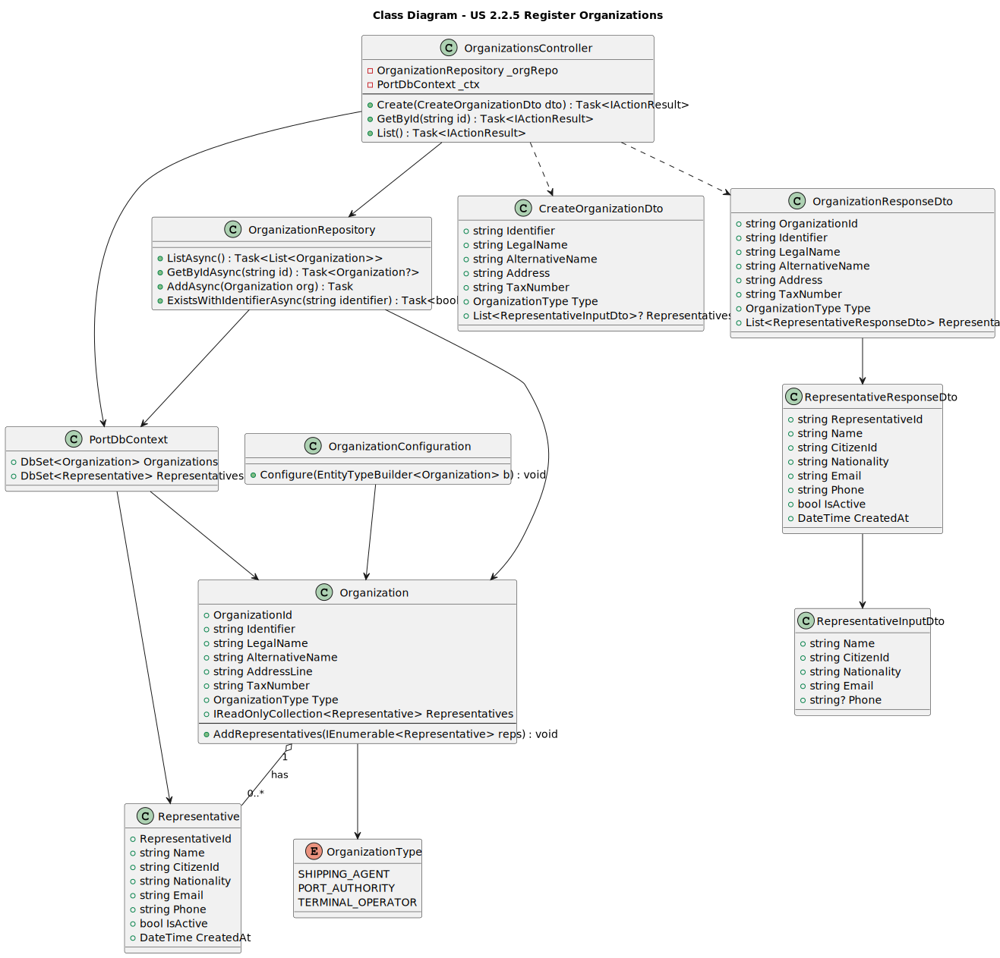

# US 2.2.5 – Register Shipping Agent Organizations

## 1. Requirements Engineering

### 1.1. User Story Description

> **As a Port Authority Officer,**  
> I want to register new shipping agent organizations,  
> so that they can operate within the port’s digital system.

---

### 1.2. Customer Specifications and Clarifications

**From the specifications document:**

> “Each organization must have at least an identifier, legal and alternative names, an address, and its tax number.”  
> “Each organization must include at least one representative at the time of registration.”  
> “Representatives must be registered with name, citizen ID, nationality, email, and phone number.”

**From the client clarifications:**

> **Q:** Can we register multiple representatives during organization creation?  
> **A:** Yes, as long as at least one representative is provided. Additional ones can be managed later (see US 2.2.6).

> **Q:** Are both legal and alternative names mandatory?  
> **A:** Legal name is required; the alternative name is optional but recommended for business identification.

> **Q:** Can an organization operate without being approved immediately after registration?  
> **A:** Yes. Registration adds it in a "Pending Approval" state. The activation/approval workflow is handled separately.

---

### 1.3. Acceptance Criteria

* **AC1:** Each organization must have:
  - Unique identifier (OrganizationId)
  - Legal name (required)
  - Alternative name (optional)
  - Address
  - Tax number (unique per organization)

* **AC2:** Each organization must include at least one representative at registration.

* **AC3:** Each representative must include:
  - Name
  - Citizen ID
  - Nationality (2-letter ISO code)
  - Email (unique per representative)
  - Phone (optional)

* **AC4:** The system must validate all required fields and unique constraints.

* **AC5:** The system must reject registration if the organization already exists (same Tax Number).

---

### 1.4. Found Out Dependencies

* Representatives must be linked to a valid organization (`OrganizationId` foreign key).
* Organization cannot exist without at least one Representative.
* **US 2.2.6** depends on this functionality to manage (create, update, deactivate) representatives after registration.

---

### 1.5. Input and Output Data

**Input Data**
- Legal Name
- Alternative Name
- Address
- Tax Number
- List of Representatives (at least one):
  - Name
  - Citizen ID
  - Nationality
  - Email
  - Phone (optional)

**Output Data**
- Success/failure response
- Created organization details
- Validation errors if applicable

---

### 1.6. System Sequence Diagram (SSD)

### *SSD – Register Organizations*  


#### *SSD – Search Organizations* 

#### *SSD – Update Organization*

---

### 1.7. Other Relevant Remarks

* Organizations are aggregate roots; representatives are child entities.
* Email uniqueness is enforced per representative within the system.
* Organization TaxNumber is unique and used for validation.
* Cascade persistence ensures representatives are saved with their organization.

---

## 2. OO Analysis

### 2.1. Relevant Domain Model Excerpt

> The domain model includes `Organization` as the aggregate root and `Representative` as an owned entity within it.  
> The `OrganizationType` enumeration classifies organizations (e.g., SHIPPING_AGENT, PORT_AUTHORITY).

### 2.2. Other Remarks

n/a

---

## 3. Design – User Story Realization

### 3.1. Rationale

The implementation follows **DDD (Domain-Driven Design)** and **Layered Architecture** principles:

* RESTful API endpoints (Create, Update, Search)
* Repository pattern for data access
* Domain entities encapsulating validation logic
* EF Core ORM for persistence and mapping
* DTOs for input/output separation
* Controllers handle validation, response mapping, and business rule enforcement

---

### 3.2. System Diagram (SD)



**Design Patterns used:**
* Layered Architecture (Presentation / Domain / Infrastructure)
* MVC (Web API flavor)
* Repository Pattern (CRUD)
* Unit of Work (via EF Core DbContext)
* Data Mapper (ORM / Fluent mapping via OrganizationConfiguration)
* Aggregate Root + Entity (DDD)
* Value Object (DDD)
* Dependency Injection / IoC (DbContext, Repositories)
* DTOs / Request–Response models

---

### 3.3. Class Diagram (CD)


---

## 4. Tests

### Test 1 – Register Organization Successfully
```csharp
[Fact]
public async Task CreateOrganization_ValidData_ReturnsCreated()
{
    var options = new DbContextOptionsBuilder<PortDbContext>()
        .UseInMemoryDatabase("CreateOrganization")
        .Options;

    using var context = new PortDbContext(options);
    var controller = new OrganizationsController(context);

    var dto = new CreateOrganizationDto(
        "Atlantic Shipping Ltd", "ATL Shipping", "Pier 3, North Port", "PT123456789",
        new List<RepresentativeInputDto> {
            new("Carlos Silva", "12345678", "PT", "carlos@atl.pt", "+351912345678")
        }
    );

    var result = await controller.Create(dto) as CreatedAtActionResult;

    Assert.NotNull(result);
    Assert.Equal(201, result?.StatusCode);
}
```


Test 2 – Reject Duplicate TaxNumber

```csharp
[Fact]
public async Task CreateOrganization_DuplicateTaxNumber_ReturnsBadRequest()
{
    var options = new DbContextOptionsBuilder<PortDbContext>()
        .UseInMemoryDatabase("DuplicateTaxNumber")
        .Options;

    using var context = new PortDbContext(options);
    context.Organizations.Add(new Organization("Atlantic", "ATL", "Pier 3", "PT123456789"));
    await context.SaveChangesAsync();

    var controller = new OrganizationsController(context);
    var dto = new CreateOrganizationDto("Atlantic Shipping", "ATL", "Pier 4", "PT123456789", new());

    var result = await controller.Create(dto) as BadRequestObjectResult;

    Assert.Equal(400, result?.StatusCode);
}
```

Test 3 – Search Organization by Name

```csharp
[Fact]
public async Task SearchOrganization_ByName_ReturnsFilteredList()
{
    var options = new DbContextOptionsBuilder<PortDbContext>()
        .UseInMemoryDatabase("SearchOrganization")
        .Options;

    using var context = new PortDbContext(options);
    context.Organizations.AddRange(
        new Organization("Atlantic Shipping", "ATL", "Pier 1", "PT123"),
        new Organization("Pacific Traders", "PAC", "Pier 2", "PT456")
    );
    await context.SaveChangesAsync();

    var controller = new OrganizationsController(context);
    var result = await controller.GetAll("Atlantic", null) as OkObjectResult;
    var orgs = result?.Value as List<OrganizationResponseDto>;

    Assert.Single(orgs!);
    Assert.Equal("Atlantic Shipping", orgs![0].LegalName);
}
```


# 5. Construction (Implementation)

## 5.1. Domain Layer

* **Organization.cs** – Aggregate root enforcing unique TaxNumber and requiring ≥ 1 representative.
* **Representative.cs** – Entity validating Email, Nationality, and CitizenId.

## 5.2. Infrastructure Layer

* **OrganizationConfiguration.cs** – Configures EF Core mapping, relationships, and constraints.

* **OrganizationRepository.cs** – Manages persistence, uniqueness validation, and search filters.

## 5.3. Application Layer

* **OrganizationsController.cs** – REST controller with Create, Update, and Search endpoints.

* **DTOs:** CreateOrganizationDto, UpdateOrganizationDto, OrganizationResponseDto, RepresentativeInputDto.

# 6. Integration and Demo

* Access API via `/scalar/v1` documentation
* Register new organizations with representatives
* Search existing organizations by name or tax number
* Update basic details (legal/alternative name, address)
* Each representative receives notifications using stored contact info

# 7. Observations

* `OrganizationId` is system-generated and immutable.
* `TaxNumber` uniquely identifies organizations.
* Each organization must always have ≥ 1 representative.
* Validation is handled in both DTO and domain layer.
* Future integrations (e.g., approval workflow) will extend this aggregate root.
