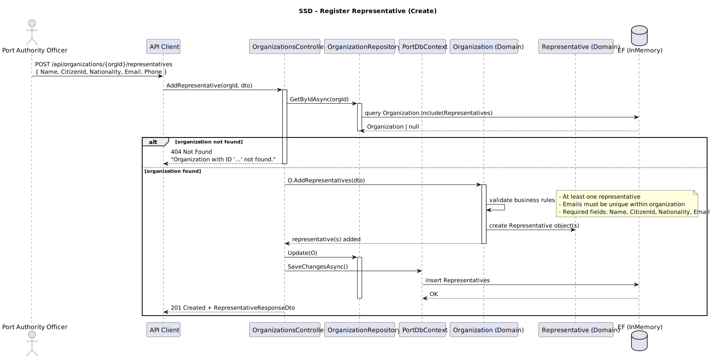
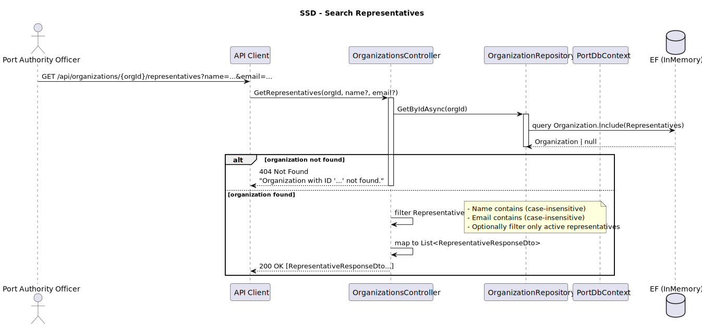
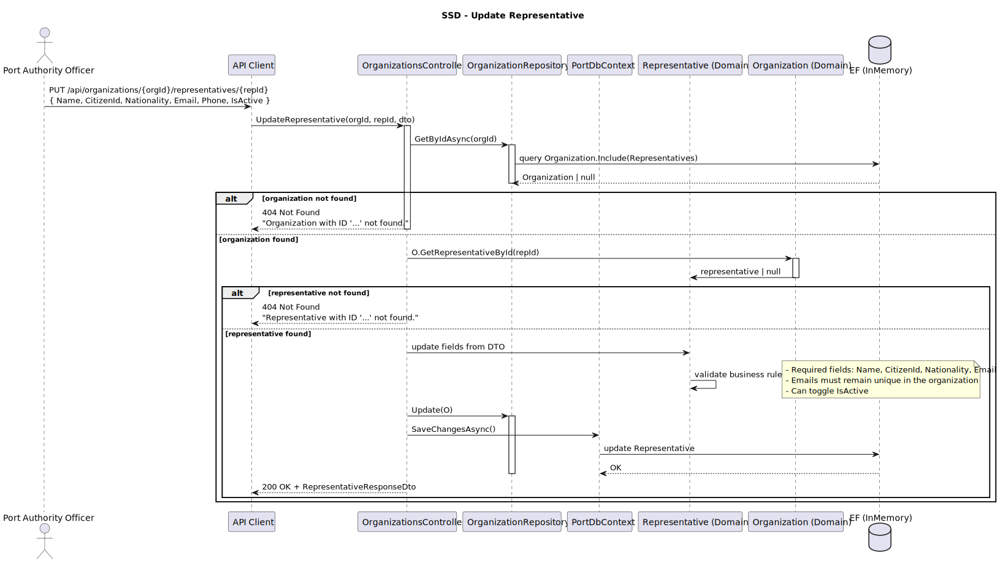
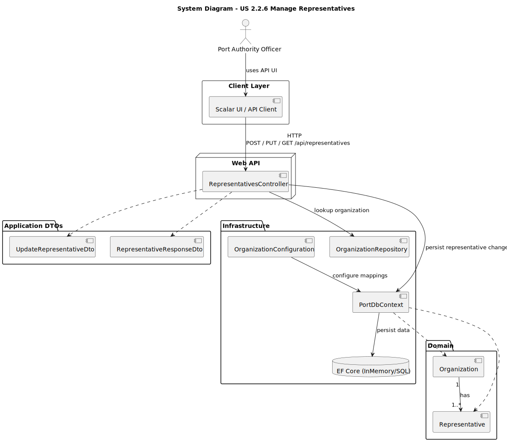
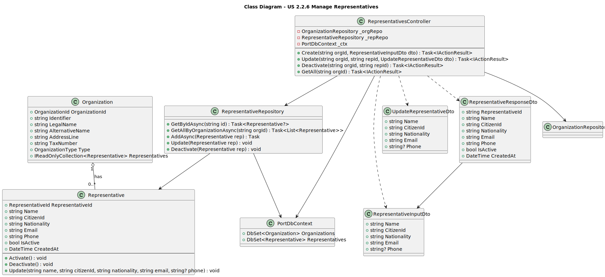

# US 2.2.6 – Manage Representatives of Shipping Agent Organizations

## 1. Requirements Engineering

### 1.1. User Story Description

> **As a Port Authority Officer,**  
> I want to manage representatives of shipping agent organizations,  
> so that the contact information and responsible personnel are always up to date.

---

### 1.2. Customer Specifications and Clarifications

**From the specifications document:**

> “Representatives are linked to one and only one organization.”  
> “Each representative must have name, citizen ID, nationality, email, and phone number.”  
> “The system must allow adding, updating, or removing representatives after the organization has been registered.”

**From the client clarifications:**

> **Q:** Can we deactivate representatives instead of deleting them?  
> **A:** Yes. Representatives should be deactivated to preserve historical data and past associations.

> **Q:** Can a representative belong to multiple organizations?  
> **A:** No. Each representative belongs to exactly one organization.

> **Q:** Are email addresses unique globally or per organization?  
> **A:** Unique globally (no two representatives can share the same email).

---

### 1.3. Acceptance Criteria

* **AC1:** A representative must always be linked to a valid organization.
* **AC2:** The system must allow:
    - Registering new representatives for an existing organization.
    - Updating a representative’s details.
    - Deactivating a representative (not deleting).
* **AC3:** Each representative must have:
    - Name (required)
    - Citizen ID (required)
    - Nationality (ISO 3166-1 alpha-2)
    - Email (unique globally)
    - Phone (optional)
* **AC4:** Validation errors must be reported to the user with meaningful messages.
* **AC5:** The system must prevent duplicate Citizen IDs or Emails across all organizations.

---

### 1.4. Found Out Dependencies

* Depends on **US 2.2.5** (organization must exist before adding representatives).
* Changes to representatives must not violate organization constraints (at least one active representative must exist per organization).
* Notification or audit logging systems may subscribe to representative change events (for future extension).

---

### 1.5. Input and Output Data

**Input Data**
- Organization ID (required)
- Representative details:
    - Name
    - Citizen ID
    - Nationality
    - Email
    - Phone (optional)
    - Active flag (for update/deactivation)

**Output Data**
- Success/failure response
- Representative details (including Organization ID)
- Validation error messages if applicable

---

### 1.6. System Sequence Diagrams (SSD)

#### **SSD – Register Representative**

* **SSD – Search Representative(s)**

* **SSD – Update Representative**


---

### 1.7. Other Relevant Remarks

* Representatives are **entities** within the `Organization` aggregate.
* Deactivation instead of deletion ensures auditability and traceability.
* Each organization must maintain at least one **active** representative at all times.
* Domain rules and database constraints enforce global email uniqueness.

---

## 2. OO Analysis

### 2.1. Relevant Domain Model Excerpt

> The domain model includes:
> - **Organization** (aggregate root)
> - **Representative** (child entity)
> - Relationships: `Organization 1..* ↔ Representative 1`
> - Value Objects: `Email`, `Nationality`

---

### 2.2. Other Remarks

* Aggregate consistency is maintained through domain events and invariants.
* Cascade persistence is configured so that changes to representatives are tracked under their organization.

---

## 3. Design – User Story Realization

### 3.1. Rationale

This user story extends the **Organization** aggregate to include representative management operations.  
The implementation follows **DDD** and **layered architecture** principles:

- REST API endpoints for representative management (`/api/representatives`)
- Repository pattern for persistence
- Domain entities with encapsulated validation logic
- DTOs for input/output mapping
- EF Core ORM with relationship configuration
- Controllers handle validation, mapping, and error responses

---

### 3.2. System Diagram (SD)
 

**Design Patterns used:**
- **Layered Architecture** (Presentation / Domain / Infrastructure)
- **Repository Pattern** (for Organization and Representative)
- **Aggregate Root Pattern** (`Organization` controls representative lifecycle)
- **DTOs** for request/response mapping
- **Dependency Injection (IoC)** for repository access
- **Unit of Work** via `PortDbContext`
- **Domain Events** (for notifications or auditing of changes)

---

### 3.3. Class Diagram (CD – Organization and Representative)


- **Organization**
    - OrganizationId
    - LegalName
    - AlternativeName
    - Address
    - TaxNumber
    - Representatives (List<Representative>)
    - Methods: `AddRepresentative()`, `UpdateRepresentative()`, `DeactivateRepresentative()`

- **Representative**
    - RepresentativeId
    - Name
    - CitizenId
    - Nationality
    - Email
    - Phone
    - IsActive
    - Methods: `Deactivate()`, `UpdateInfo()`

- **Relationships**
    - `Organization 1..* ↔ Representative 1`
    - Cascading persistence from Organization → Representative

---

## 4. Tests

### Test 1 – Register Representative Successfully
```csharp
[Fact]
public async Task CreateRepresentative_ValidData_ReturnsCreated()
{
    var options = new DbContextOptionsBuilder<PortDbContext>()
        .UseInMemoryDatabase("CreateRepresentative")
        .Options;

    using var context = new PortDbContext(options);
    var org = new Organization("Atlantic Shipping", "ATL", "Pier 3", "PT123");
    context.Organizations.Add(org);
    await context.SaveChangesAsync();

    var controller = new RepresentativesController(context);
    var dto = new CreateRepresentativeDto("Maria Costa", "78912345", "PT", "maria@atl.pt", "+351987654321", org.Id);

    var result = await controller.Create(dto) as CreatedAtActionResult;
    Assert.NotNull(result);
    Assert.Equal(201, result?.StatusCode);
}
```


### Test 2 – Prevent Duplicate Email
```csharp
[Fact]
public async Task CreateRepresentative_DuplicateEmail_ReturnsBadRequest()
{
    var options = new DbContextOptionsBuilder<PortDbContext>()
        .UseInMemoryDatabase("DuplicateEmail")
        .Options;

    using var context = new PortDbContext(options);
    context.Representatives.Add(new Representative("Ana Silva", "1234", "PT", "ana@org.pt", "+351911111111", 1));
    await context.SaveChangesAsync();

    var controller = new RepresentativesController(context);
    var dto = new CreateRepresentativeDto("Carla Santos", "5678", "PT", "ana@org.pt", "+351922222222", 1);

    var result = await controller.Create(dto) as BadRequestObjectResult;
    Assert.Equal(400, result?.StatusCode);
}
```

### Test 3 – Deactivate Representative
```csharp
[Fact]
public async Task DeactivateRepresentative_ValidId_ReturnsOk()
{
    var options = new DbContextOptionsBuilder<PortDbContext>()
        .UseInMemoryDatabase("DeactivateRepresentative")
        .Options;

    using var context = new PortDbContext(options);
    var rep = new Representative("João Lopes", "8888", "PT", "joao@org.pt", "+351933333333", 1);
    context.Representatives.Add(rep);
    await context.SaveChangesAsync();

    var controller = new RepresentativesController(context);
    var result = await controller.Deactivate(rep.Id) as OkResult;

    Assert.Equal(200, result?.StatusCode);
}
```
## 5. Construction (Implementation)
### 5.1. Domain Layer

+ **Representative.cs** – Entity responsible for validation and lifecycle (activate/deactivate).
+ **Organization.cs** – Aggregate root controlling representative creation and updates.

### 5.2. Infrastructure Layer

+ **RepresentativeConfiguration.cs** – EF Core entity mapping and constraints.

+ **RepresentativeRepository.cs** – CRUD operations, uniqueness checks (email/citizen ID).

### 5.3. Application Layer

+ **RepresentativesController.cs** – Endpoints for create, update, deactivate, and search.
+ **DTOs:** CreateRepresentativeDto, UpdateRepresentativeDto, RepresentativeResponseDto.

## 6. Integration and Demo

+ Access API via /scalar/v1
+ Manage representatives linked to registered organizations
+ Add, update, or deactivate representatives
+ Validation errors and uniqueness checks enforced at both DTO and domain levels
+ Demonstration through integration with existing Organization endpoints

## 7. Observations

+ A representative must always belong to exactly one organization.
+ Global uniqueness for `Email` and `CitizenID` enforced at database level.
+ Deactivation preserves referential integrity and audit history.
+ Future extension: link representatives to authentication system for login capabilities.