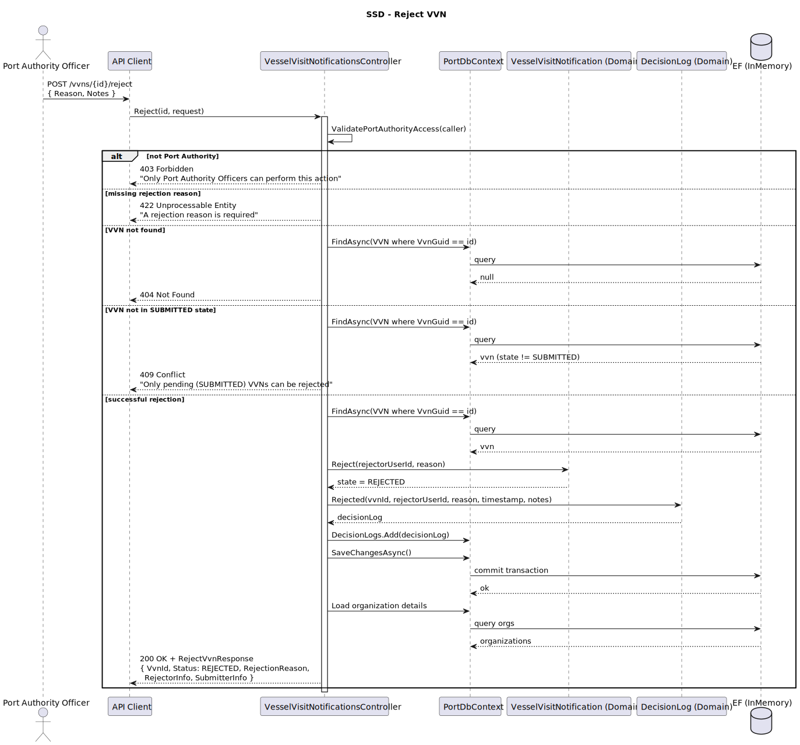
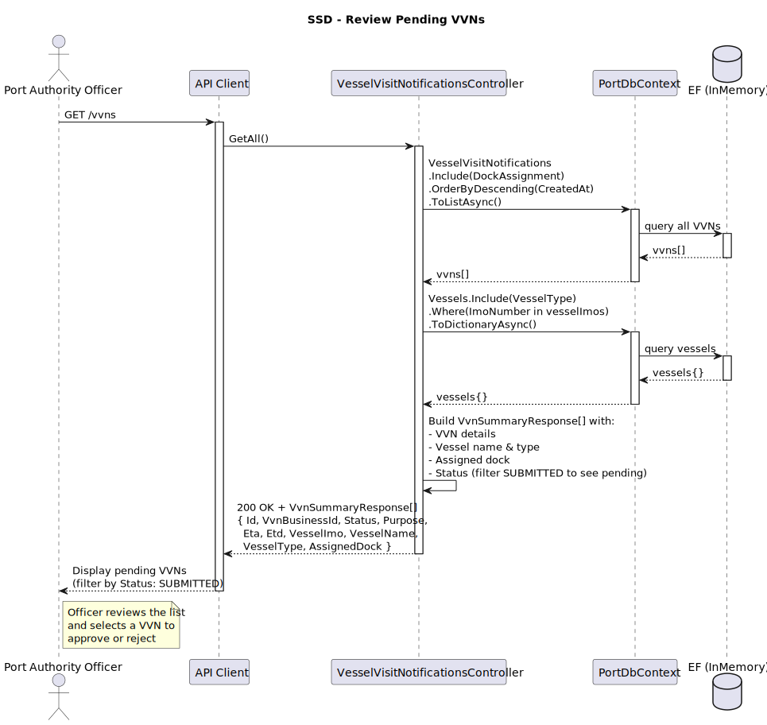
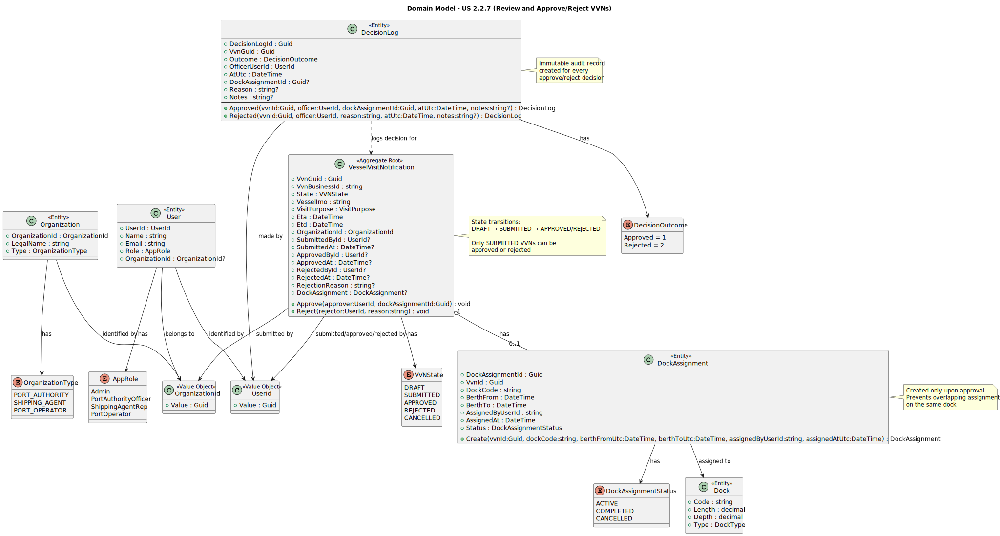
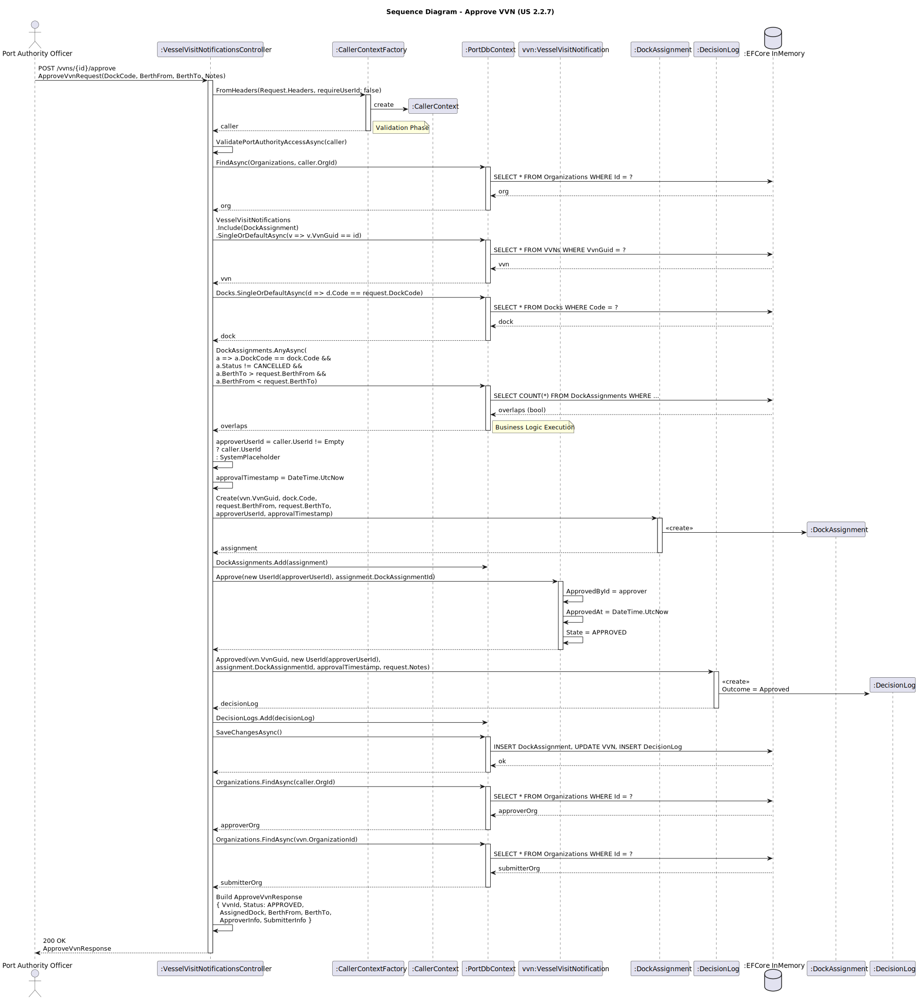
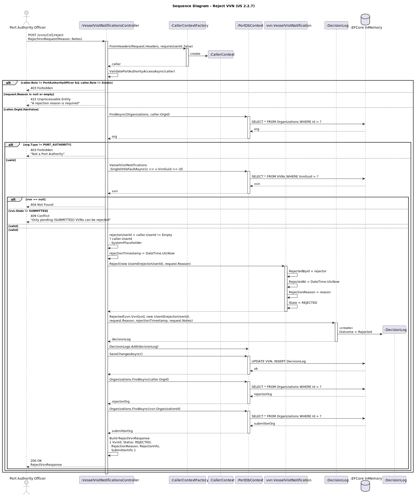
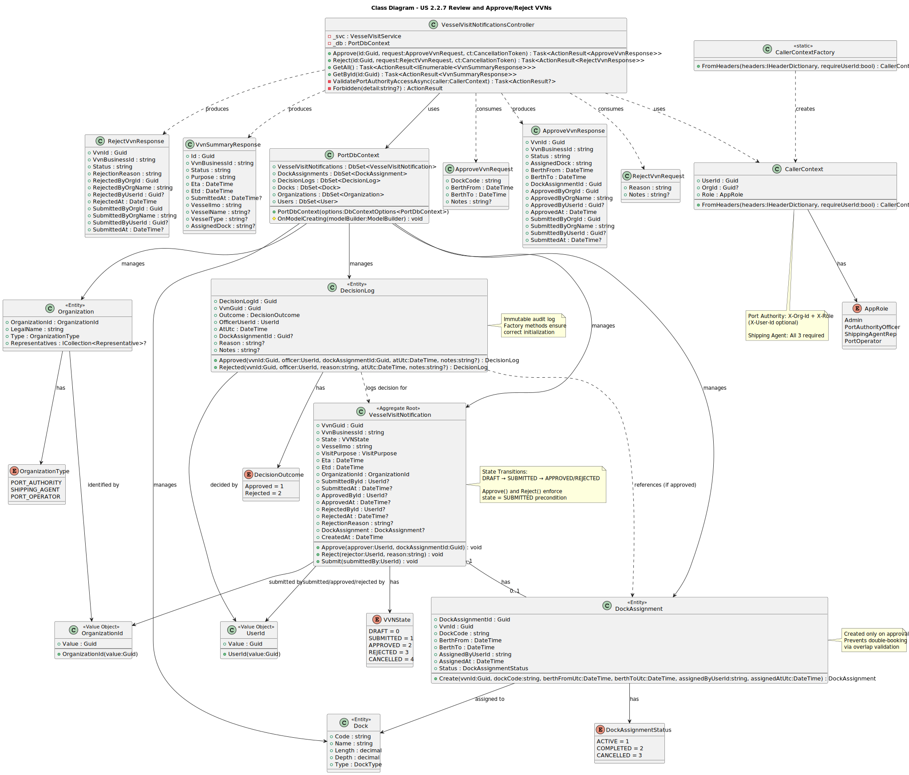

# US 2.2.7 - Review and Approve/Reject Vessel Visit Notifications

## 1. Requirements Engineering

### 1.1. User Story Description

*"As a Port Authority Officer, I want to review pending Vessel Visit Notifications and approve or reject them, so that docking schedules remain under port control."*

### 1.2. Customer Specifications and Clarifications

**From the specifications document:**

> "The Port Authority is responsible for reviewing and approving or rejecting vessel visit notifications to maintain control over port operations and ensure safe, efficient scheduling of vessel arrivals."

> "All decisions made by port authority officers must be properly logged with comprehensive audit information including timestamp, officer identification, and the outcome of the decision."

**From the client clarifications:**

> **Question**:  
> "What information must be provided when approving a VVN?"
>
> **Answer**:  
> "When approving a notification, the officer must assign a dock where the vessel should berth, along with the berth time window (from/to). The system should prevent overlapping assignments on the same dock."

> **Question**:  
> "What happens when a VVN is rejected?"
>
> **Answer**:  
> "When rejecting a VVN, the officer must provide a clear reason (e.g., 'missing cargo manifest', 'invalid crew documentation', etc.). The shipping agent can then review and update the notification for resubmission."

> **Question**:  
> "Can an approved VVN be modified?"
>
> **Answer**:  
> "No, once approved, a VVN is locked and cannot be edited. If changes are needed, the VVN must be cancelled and a new one submitted."

### 1.3. Acceptance Criteria

* **AC1:** When a notification is approved, the officer must assign a dock and berth time window (from/to dates).
* **AC2:** The system must prevent overlapping dock assignments for the same time period.
* **AC3:** When a notification is rejected, the officer must provide a mandatory reason for rejection.
* **AC4:** If rejected, the VVN state changes to REJECTED, allowing the shipping agent to review and update it.
* **AC5:** All decisions (approve/reject) must be logged with timestamp, officer ID, organization ID, dock assignment (if approved), reason (if rejected), and decision outcome.
* **AC6:** Only VVNs in SUBMITTED state can be approved or rejected.
* **AC7:** Only Port Authority Officers can approve or reject VVNs.
* **AC8:** The approval/rejection response must include comprehensive audit information including submitter details, approver/rejector details, and timestamps.

### 1.4. Found out Dependencies

* **US 2.2.1** - Vessels must be registered before VVNs can reference them.
* **US 2.2.3** - Docks must exist before they can be assigned during approval.
* **US 2.2.4** - Organizations (Port Authority and Shipping Agents) must exist.
* **US 2.2.5 or 2.2.6** - VVNs must be created and submitted by shipping agents before they can be reviewed.
* **Decision Logging System** - DecisionLog entity must track all approval/rejection decisions for auditing.

### 1.5 Input and Output Data

**Approve VVN:**

* Input Data:
    * VVN ID (GUID)
    * Dock Code (string)
    * Berth From (DateTime UTC)
    * Berth To (DateTime UTC)
    * Optional Notes (string)

* Headers (Authentication):
    * X-Role: PortAuthorityOfficer
    * X-Org-Id: Port Authority Organization ID
    * X-User-Id: Officer User ID (optional for Port Authority)

* Output Data:
    * VVN ID and Business ID
    * Updated Status (APPROVED)
    * Dock Assignment Details (dock code, berth times, assignment ID)
    * Approval Information (approver org/user, timestamp)
    * Submitter Information (submitter org/user, timestamp)

**Reject VVN:**

* Input Data:
    * VVN ID (GUID)
    * Reason (string, mandatory)
    * Optional Notes (string)

* Headers (Authentication):
    * X-Role: PortAuthorityOfficer
    * X-Org-Id: Port Authority Organization ID
    * X-User-Id: Officer User ID (optional for Port Authority)

* Output Data:
    * VVN ID and Business ID
    * Updated Status (REJECTED)
    * Rejection Reason
    * Rejector Information (rejector org/user, timestamp)
    * Submitter Information (submitter org/user, timestamp)

### 1.6. System Sequence Diagram (SSD)





### 1.7 Other Relevant Remarks

* The system uses a simplified authentication model for Port Authority:
  * Port Authority Officers only need X-Org-Id + X-Role headers
  * X-User-Id is optional and defaults to a system placeholder if not provided
  * This is different from Shipping Agents who require all three headers for individual tracking

* DecisionLog serves as an immutable audit trail for compliance and dispute resolution.

* The dock overlap validation is implemented at the application level to prevent double-booking.

* After rejection, the VVN returns to an editable state (REJECTED), allowing the shipping agent to make corrections and resubmit.

## 2. OO Analysis

### 2.1. Relevant Domain Model Excerpt



**Key Domain Entities:**

* **VesselVisitNotification** - Aggregate root representing the visit request
  * States: DRAFT → SUBMITTED → APPROVED/REJECTED
  * Methods: `Approve(officer, dockAssignmentId)`, `Reject(officer, reason)`

* **DecisionLog** - Immutable audit record for approval/rejection decisions
  * Properties: DecisionOutcome, OfficerUserId, AtUtc, DockAssignmentId, Reason, Notes
  * Factory methods: `Approved(...)`, `Rejected(...)`

* **DockAssignment** - Assignment of a VVN to a specific dock and time window
  * Properties: DockCode, BerthFrom, BerthTo, AssignedByUserId, Status
  * Created only upon approval

* **Organization** - Represents Port Authority and Shipping Agent entities
  * Type: PORT_AUTHORITY or SHIPPING_AGENT

* **UserId** - Value object representing user identification

### 2.2. Other Remarks

* The domain enforces state transitions: only SUBMITTED VVNs can be approved or rejected.
* DecisionLog uses factory methods to ensure proper initialization based on outcome type.
* DockAssignment is created via factory method `DockAssignment.Create(...)` to ensure consistency.

## 3. Design - User Story Realization

### 3.1. Rationale

**Design Decision 1: Simplified Port Authority Authentication**

The system was designed to distinguish between two types of users:

* **Port Authority Officers**: Organizational role-based access
  * Only require X-Org-Id + X-Role
  * Individual user tracking is optional
  * Rationale: Port Authority acts as a unified organizational entity

* **Shipping Agent Representatives**: Individual user tracking required
  * Require X-User-Id + X-Org-Id + X-Role
  * Rationale: Need to track which individual representative submitted/modified VVNs

This design reflects the real-world operational model where Port Authority decisions are organizational, not personal.

**Design Decision 2: Immutable Decision Logging**

DecisionLog entities are created but never modified, providing:
* Complete audit trail for regulatory compliance
* Dispute resolution capability
* Historical tracking of all decisions

**Design Decision 3: State-Based Validation**

The VVN entity enforces state transitions at the domain level:
* Only SUBMITTED VVNs can be approved/rejected
* Prevents invalid operations (e.g., approving a DRAFT VVN)
* Business rules enforced in domain, not just controller

**Design Decision 4: Dock Overlap Prevention**

Overlap validation occurs in the controller before approval:
* Queries existing assignments for the same dock
* Checks for time window conflicts
* Returns 422 Unprocessable Entity if conflict detected
* Rationale: Prevents operational conflicts and double-booking

### Systematization

The realization follows these patterns:

1. **Controller Layer**: Receives HTTP request, validates authentication/authorization
2. **Domain Layer**: Enforces business rules and state transitions
3. **Infrastructure Layer**: Persists changes (VVN, DockAssignment, DecisionLog)
4. **Response DTOs**: Return comprehensive audit information to client

## 3.2. Sequence Diagram (SD)




**Design Patterns used:**

* **Layered Architecture** (Presentation / Domain / Infrastructure)
* **MVC** (Web API flavor)
* **Repository Pattern** (via EF Core DbContext)
* **Unit of Work** (via EF Core DbContext.SaveChangesAsync)
* **Data Mapper** (ORM / Fluent mapping)
* **Aggregate Root** (VesselVisitNotification)
* **Entity** (DecisionLog, DockAssignment)
* **Value Object** (UserId, OrganizationId)
* **Factory Method** (DecisionLog.Approved/Rejected, DockAssignment.Create)
* **State Pattern** (VVNState enumeration with state-based validations)
* **Dependency Injection** (DbContext, Services)
* **DTOs / Request-Response models** (ApproveVvnRequest/Response, RejectVvnRequest/Response)
* **Authorization Pattern** (CallerContext, ValidatePortAuthorityAccessAsync)

## 3.3. Class Diagram (CD)



**Key Classes:**

* **VesselVisitNotificationsController**: API endpoints for approve/reject operations
* **VesselVisitNotification**: Domain aggregate with Approve() and Reject() methods
* **DecisionLog**: Audit entity with factory methods
* **DockAssignment**: Assignment entity created during approval
* **CallerContext**: Security context containing user/org/role information
* **ApproveVvnRequest/Response**: DTOs for approval operation
* **RejectVvnRequest/Response**: DTOs for rejection operation

# 4. Tests

**Test 1 - Approve VVN with valid data**

```csharp
[Fact]
public async Task ApproveVvn_ValidRequest_ReturnsApprovalResponse()
{
    // Arrange
    var options = new DbContextOptionsBuilder<PortDbContext>()
        .UseInMemoryDatabase("TestDb_ApproveVvn")
        .Options;

    using var context = new PortDbContext(options);
    var service = new VesselVisitService(context, new VvnIdGenerator());
    var controller = new VesselVisitNotificationsController(service, context);

    // Seed data: organization, vessel, dock, VVN
    var portAuthority = new Organization(Guid.NewGuid(), "Port of Leixões", OrganizationType.PORT_AUTHORITY);
    var shippingAgent = new Organization(Guid.NewGuid(), "Maritime Ltd", OrganizationType.SHIPPING_AGENT);
    var dock = new Dock("D1", 300m, 12m, DockType.CONTAINER);
    
    context.Organizations.AddRange(portAuthority, shippingAgent);
    context.Docks.Add(dock);
    await context.SaveChangesAsync();

    var vvn = await service.CreateVvnAsync(
        "9319466", VisitPurpose.Load, 
        DateTime.UtcNow.AddDays(5), DateTime.UtcNow.AddDays(7),
        "Captain Smith", "CC123456", "UK", 25,
        new OrganizationId(shippingAgent.OrganizationId.Value)
    );
    
    await service.SubmitAsync(vvn.VvnGuid, Guid.NewGuid());

    // Mock headers
    controller.ControllerContext = new ControllerContext
    {
        HttpContext = new DefaultHttpContext()
    };
    controller.Request.Headers["X-Role"] = "PortAuthorityOfficer";
    controller.Request.Headers["X-Org-Id"] = portAuthority.OrganizationId.Value.ToString();

    var approveRequest = new ApproveVvnRequest
    {
        DockCode = "D1",
        BerthFrom = DateTime.UtcNow.AddDays(5),
        BerthTo = DateTime.UtcNow.AddDays(6),
        Notes = "Approved for standard container operations"
    };

    // Act
    var result = await controller.Approve(vvn.VvnGuid, approveRequest, CancellationToken.None) as OkObjectResult;

    // Assert
    Assert.NotNull(result);
    Assert.Equal(200, result?.StatusCode);
    
    var response = result?.Value as ApproveVvnResponse;
    Assert.NotNull(response);
    Assert.Equal("APPROVED", response?.Status);
    Assert.Equal("D1", response?.AssignedDock);
    Assert.NotNull(response?.DockAssignmentId);
    Assert.NotNull(response?.ApprovedAt);
    
    // Verify decision log created
    var decisionLog = await context.DecisionLogs.FirstOrDefaultAsync(d => d.VvnGuid == vvn.VvnGuid);
    Assert.NotNull(decisionLog);
    Assert.Equal(DecisionOutcome.Approved, decisionLog?.Outcome);
}
```

**Test 2 - Reject approval when dock overlaps**

```csharp
[Fact]
public async Task ApproveVvn_OverlappingDockAssignment_ReturnsUnprocessableEntity()
{
    // Arrange
    var options = new DbContextOptionsBuilder<PortDbContext>()
        .UseInMemoryDatabase("TestDb_OverlapVvn")
        .Options;

    using var context = new PortDbContext(options);
    var service = new VesselVisitService(context, new VvnIdGenerator());
    var controller = new VesselVisitNotificationsController(service, context);

    // Seed existing dock assignment
    var dock = new Dock("D1", 300m, 12m, DockType.CONTAINER);
    context.Docks.Add(dock);
    
    var existingAssignment = DockAssignment.Create(
        Guid.NewGuid(),
        "D1",
        DateTime.UtcNow.AddDays(5),
        DateTime.UtcNow.AddDays(6),
        Guid.NewGuid().ToString(),
        DateTime.UtcNow
    );
    context.DockAssignments.Add(existingAssignment);
    await context.SaveChangesAsync();

    // Create new VVN
    var portAuthority = new Organization(Guid.NewGuid(), "Port Authority", OrganizationType.PORT_AUTHORITY);
    var shippingAgent = new Organization(Guid.NewGuid(), "Agent", OrganizationType.SHIPPING_AGENT);
    context.Organizations.AddRange(portAuthority, shippingAgent);
    await context.SaveChangesAsync();

    var vvn = await service.CreateVvnAsync(
        "9319467", VisitPurpose.Unload,
        DateTime.UtcNow.AddDays(5), DateTime.UtcNow.AddDays(7),
        "Captain Jones", "CC789012", "FR", 20,
        new OrganizationId(shippingAgent.OrganizationId.Value)
    );
    await service.SubmitAsync(vvn.VvnGuid, Guid.NewGuid());

    // Mock headers
    controller.ControllerContext = new ControllerContext { HttpContext = new DefaultHttpContext() };
    controller.Request.Headers["X-Role"] = "PortAuthorityOfficer";
    controller.Request.Headers["X-Org-Id"] = portAuthority.OrganizationId.Value.ToString();

    var approveRequest = new ApproveVvnRequest
    {
        DockCode = "D1",
        BerthFrom = DateTime.UtcNow.AddDays(5).AddHours(2), // Overlaps!
        BerthTo = DateTime.UtcNow.AddDays(5).AddHours(10)
    };

    // Act
    var result = await controller.Approve(vvn.VvnGuid, approveRequest, CancellationToken.None);

    // Assert
    Assert.IsType<UnprocessableEntityObjectResult>(result);
}
```

**Test 3 - Reject VVN with valid reason**

```csharp
[Fact]
public async Task RejectVvn_ValidReason_ReturnsRejectionResponse()
{
    // Arrange
    var options = new DbContextOptionsBuilder<PortDbContext>()
        .UseInMemoryDatabase("TestDb_RejectVvn")
        .Options;

    using var context = new PortDbContext(options);
    var service = new VesselVisitService(context, new VvnIdGenerator());
    var controller = new VesselVisitNotificationsController(service, context);

    // Seed data
    var portAuthority = new Organization(Guid.NewGuid(), "Port Authority", OrganizationType.PORT_AUTHORITY);
    var shippingAgent = new Organization(Guid.NewGuid(), "Shipping Agent", OrganizationType.SHIPPING_AGENT);
    context.Organizations.AddRange(portAuthority, shippingAgent);
    await context.SaveChangesAsync();

    var vvn = await service.CreateVvnAsync(
        "9319468", VisitPurpose.Load,
        DateTime.UtcNow.AddDays(3), DateTime.UtcNow.AddDays(5),
        "Captain Brown", "CC111222", "ES", 18,
        new OrganizationId(shippingAgent.OrganizationId.Value)
    );
    await service.SubmitAsync(vvn.VvnGuid, Guid.NewGuid());

    // Mock headers
    controller.ControllerContext = new ControllerContext { HttpContext = new DefaultHttpContext() };
    controller.Request.Headers["X-Role"] = "PortAuthorityOfficer";
    controller.Request.Headers["X-Org-Id"] = portAuthority.OrganizationId.Value.ToString();

    var rejectRequest = new RejectVvnRequest
    {
        Reason = "Missing cargo manifest",
        Notes = "Please submit complete cargo manifest before resubmission"
    };

    // Act
    var result = await controller.Reject(vvn.VvnGuid, rejectRequest, CancellationToken.None) as OkObjectResult;

    // Assert
    Assert.NotNull(result);
    Assert.Equal(200, result?.StatusCode);
    
    var response = result?.Value as RejectVvnResponse;
    Assert.NotNull(response);
    Assert.Equal("REJECTED", response?.Status);
    Assert.Equal("Missing cargo manifest", response?.RejectionReason);
    Assert.NotNull(response?.RejectedAt);
    
    // Verify decision log created
    var decisionLog = await context.DecisionLogs.FirstOrDefaultAsync(d => d.VvnGuid == vvn.VvnGuid);
    Assert.NotNull(decisionLog);
    Assert.Equal(DecisionOutcome.Rejected, decisionLog?.Outcome);
    Assert.Equal("Missing cargo manifest", decisionLog?.Reason);
}
```

**Test 4 - Reject approval of non-SUBMITTED VVN**

```csharp
[Fact]
public async Task ApproveVvn_NotInSubmittedState_ReturnsConflict()
{
    // Arrange
    var options = new DbContextOptionsBuilder<PortDbContext>()
        .UseInMemoryDatabase("TestDb_ApproveWrongState")
        .Options;

    using var context = new PortDbContext(options);
    var service = new VesselVisitService(context, new VvnIdGenerator());
    var controller = new VesselVisitNotificationsController(service, context);

    // Seed data
    var portAuthority = new Organization(Guid.NewGuid(), "Port Authority", OrganizationType.PORT_AUTHORITY);
    var shippingAgent = new Organization(Guid.NewGuid(), "Agent", OrganizationType.SHIPPING_AGENT);
    var dock = new Dock("D1", 300m, 12m, DockType.CONTAINER);
    context.Organizations.AddRange(portAuthority, shippingAgent);
    context.Docks.Add(dock);
    await context.SaveChangesAsync();

    // Create VVN but don't submit it (remains in DRAFT)
    var vvn = await service.CreateVvnAsync(
        "9319469", VisitPurpose.Load,
        DateTime.UtcNow.AddDays(10), DateTime.UtcNow.AddDays(12),
        "Captain Davis", "CC333444", "PT", 22,
        new OrganizationId(shippingAgent.OrganizationId.Value)
    );
    // Note: NOT calling SubmitAsync, so state remains DRAFT

    // Mock headers
    controller.ControllerContext = new ControllerContext { HttpContext = new DefaultHttpContext() };
    controller.Request.Headers["X-Role"] = "PortAuthorityOfficer";
    controller.Request.Headers["X-Org-Id"] = portAuthority.OrganizationId.Value.ToString();

    var approveRequest = new ApproveVvnRequest
    {
        DockCode = "D1",
        BerthFrom = DateTime.UtcNow.AddDays(10),
        BerthTo = DateTime.UtcNow.AddDays(11)
    };

    // Act
    var result = await controller.Approve(vvn.VvnGuid, approveRequest, CancellationToken.None);

    // Assert
    var conflictResult = Assert.IsType<ConflictObjectResult>(result);
    Assert.Equal(409, conflictResult.StatusCode);
}
```

**Test 5 - Reject rejection without reason**

```csharp
[Fact]
public async Task RejectVvn_MissingReason_ReturnsUnprocessableEntity()
{
    // Arrange
    var options = new DbContextOptionsBuilder<PortDbContext>()
        .UseInMemoryDatabase("TestDb_RejectNoReason")
        .Options;

    using var context = new PortDbContext(options);
    var service = new VesselVisitService(context, new VvnIdGenerator());
    var controller = new VesselVisitNotificationsController(service, context);

    // Seed data
    var portAuthority = new Organization(Guid.NewGuid(), "Port Authority", OrganizationType.PORT_AUTHORITY);
    var shippingAgent = new Organization(Guid.NewGuid(), "Agent", OrganizationType.SHIPPING_AGENT);
    context.Organizations.AddRange(portAuthority, shippingAgent);
    await context.SaveChangesAsync();

    var vvn = await service.CreateVvnAsync(
        "9319470", VisitPurpose.Unload,
        DateTime.UtcNow.AddDays(8), DateTime.UtcNow.AddDays(9),
        "Captain Wilson", "CC555666", "GB", 30,
        new OrganizationId(shippingAgent.OrganizationId.Value)
    );
    await service.SubmitAsync(vvn.VvnGuid, Guid.NewGuid());

    // Mock headers
    controller.ControllerContext = new ControllerContext { HttpContext = new DefaultHttpContext() };
    controller.Request.Headers["X-Role"] = "PortAuthorityOfficer";
    controller.Request.Headers["X-Org-Id"] = portAuthority.OrganizationId.Value.ToString();

    var rejectRequest = new RejectVvnRequest
    {
        Reason = "", // Empty reason - should fail validation
        Notes = "Some notes"
    };

    // Act
    var result = await controller.Reject(vvn.VvnGuid, rejectRequest, CancellationToken.None);

    // Assert
    var unprocessableResult = Assert.IsType<UnprocessableEntityObjectResult>(result);
    Assert.Equal(422, unprocessableResult.StatusCode);
}
```

**Test 6 - Non-Port Authority user cannot approve**

```csharp
[Fact]
public async Task ApproveVvn_ShippingAgentUser_ReturnsForbidden()
{
    // Arrange
    var options = new DbContextOptionsBuilder<PortDbContext>()
        .UseInMemoryDatabase("TestDb_ApproveWrongRole")
        .Options;

    using var context = new PortDbContext(options);
    var service = new VesselVisitService(context, new VvnIdGenerator());
    var controller = new VesselVisitNotificationsController(service, context);

    // Seed data
    var shippingAgent = new Organization(Guid.NewGuid(), "Agent", OrganizationType.SHIPPING_AGENT);
    var dock = new Dock("D1", 300m, 12m, DockType.CONTAINER);
    context.Organizations.Add(shippingAgent);
    context.Docks.Add(dock);
    await context.SaveChangesAsync();

    var vvn = await service.CreateVvnAsync(
        "9319471", VisitPurpose.Load,
        DateTime.UtcNow.AddDays(15), DateTime.UtcNow.AddDays(17),
        "Captain Miller", "CC777888", "NL", 28,
        new OrganizationId(shippingAgent.OrganizationId.Value)
    );
    await service.SubmitAsync(vvn.VvnGuid, Guid.NewGuid());

    // Mock headers with ShippingAgentRep role (wrong role!)
    controller.ControllerContext = new ControllerContext { HttpContext = new DefaultHttpContext() };
    controller.Request.Headers["X-Role"] = "ShippingAgentRep";
    controller.Request.Headers["X-Org-Id"] = shippingAgent.OrganizationId.Value.ToString();
    controller.Request.Headers["X-User-Id"] = Guid.NewGuid().ToString();

    var approveRequest = new ApproveVvnRequest
    {
        DockCode = "D1",
        BerthFrom = DateTime.UtcNow.AddDays(15),
        BerthTo = DateTime.UtcNow.AddDays(16)
    };

    // Act
    var result = await controller.Approve(vvn.VvnGuid, approveRequest, CancellationToken.None);

    // Assert
    var problemResult = Assert.IsType<ObjectResult>(result);
    Assert.Equal(403, problemResult.StatusCode);
}
```

# 5. Construction (Implementation)

**Key Implementation Files:**

* `Controllers/VesselVisitNotificationsController.cs` - Approve and Reject endpoints
* `Domain/Visits/VesselVisitNotification.cs` - Approve() and Reject() domain methods
* `Domain/Visits/DecisionLog.cs` - Audit logging entity with factory methods
* `Domain/DockAssignments/DockAssignment.cs` - Dock assignment entity
* `DTOs/Vvns/ApproveVvnRequest.cs` & `ApproveVvnResponse.cs` - Approval DTOs
* `DTOs/Vvns/RejectVvnRequest.cs` & `RejectVvnResponse.cs` - Rejection DTOs
* `Application/Security/CallerContext.cs` - Authentication context with optional user ID for Port Authority

**Implementation Highlights:**

1. **Approve Endpoint** (`POST /vvns/{id}/approve`):
   - Validates Port Authority authorization
   - Checks VVN is in SUBMITTED state
   - Verifies dock exists
   - Prevents overlapping assignments
   - Creates DockAssignment entity
   - Transitions VVN to APPROVED state
   - Creates DecisionLog.Approved record
   - Returns comprehensive ApproveVvnResponse

2. **Reject Endpoint** (`POST /vvns/{id}/reject`):
   - Validates Port Authority authorization
   - Checks VVN is in SUBMITTED state
   - Requires mandatory rejection reason
   - Transitions VVN to REJECTED state
   - Creates DecisionLog.Rejected record
   - Returns comprehensive RejectVvnResponse

3. **Decision Logging**:
   - Immutable audit records
   - Captures officer ID, timestamp, outcome
   - Stores dock assignment ID (for approvals) or reason (for rejections)
   - Supports optional notes field

# 6. Integration and Demo

**Demo Scenario 1: Approve a VVN**

```bash
# Step 1: List pending VVNs
GET http://localhost:5000/vvns
Headers: X-Role: PortAuthorityOfficer, X-Org-Id: {portAuthorityId}

# Step 2: Approve a specific VVN
POST http://localhost:5000/vvns/{vvnId}/approve
Headers: X-Role: PortAuthorityOfficer, X-Org-Id: {portAuthorityId}
Body:
{
  "dockCode": "D1",
  "berthFrom": "2025-10-30T08:00:00Z",
  "berthTo": "2025-10-30T18:00:00Z",
  "notes": "Approved for container unloading operations"
}

# Expected: 200 OK with comprehensive approval response
```

**Demo Scenario 2: Reject a VVN**

```bash
# Reject a VVN with reason
POST http://localhost:5000/vvns/{vvnId}/reject
Headers: X-Role: PortAuthorityOfficer, X-Org-Id: {portAuthorityId}
Body:
{
  "reason": "Incomplete cargo manifest - missing hazardous materials declaration",
  "notes": "Please update manifest and resubmit"
}

# Expected: 200 OK with comprehensive rejection response
# VVN state changes to REJECTED, allowing agent to update and resubmit
```

**Demo Scenario 3: Attempt overlapping approval**

```bash
# Try to approve VVN with overlapping dock assignment
POST http://localhost:5000/vvns/{vvnId2}/approve
Headers: X-Role: PortAuthorityOfficer, X-Org-Id: {portAuthorityId}
Body:
{
  "dockCode": "D1",
  "berthFrom": "2025-10-30T12:00:00Z",  # Overlaps with previous assignment!
  "berthTo": "2025-10-30T20:00:00Z"
}

# Expected: 422 Unprocessable Entity
# Error: "The selected dock/time window overlaps an existing assignment"
```

# 7. Observations

* **Port Authority Simplified Authentication**: The system allows Port Authority to operate without mandatory individual user tracking (X-User-Id optional), reflecting organizational rather than personal decision-making. This differs from Shipping Agents where individual accountability is required.

* **State Machine Enforcement**: The VVN entity enforces strict state transitions at the domain level, preventing invalid operations and ensuring data integrity.

* **Comprehensive Audit Trail**: Every approval and rejection creates an immutable DecisionLog record, supporting regulatory compliance and dispute resolution.

* **Dock Conflict Prevention**: The overlap validation prevents operational issues but uses a simple time-based check. In production, this might need enhancement to consider vessel size, tide schedules, and other factors.

* **Resubmission After Rejection**: Rejected VVNs return to an editable state, allowing shipping agents to correct issues and resubmit without creating a new notification.

* **Rich Response DTOs**: The approval and rejection responses include comprehensive information about both the decision maker (Port Authority) and the original submitter (Shipping Agent), providing full context for audit and tracking purposes.

* **Future Enhancements**:
  - Automated conflict detection based on vessel dimensions vs dock capacity
  - Integration with tide schedules for berthing feasibility
  - Notification system to alert shipping agents of decisions
  - Dashboard for Port Authority to view pending VVNs with filtering/sorting
