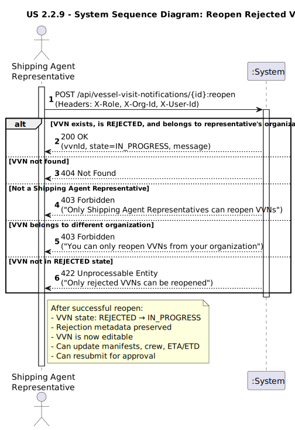
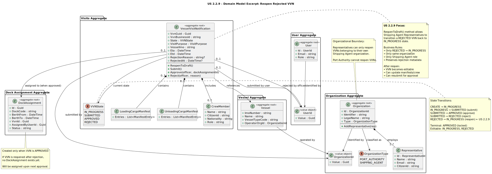
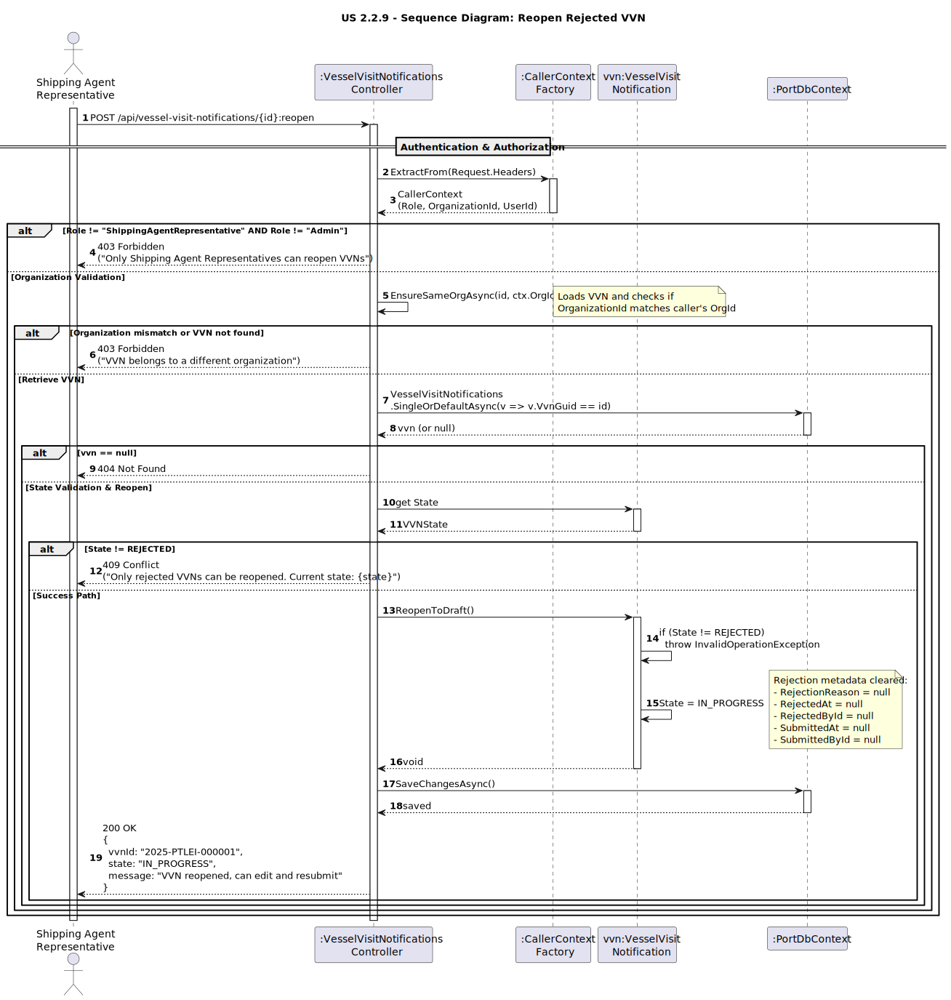
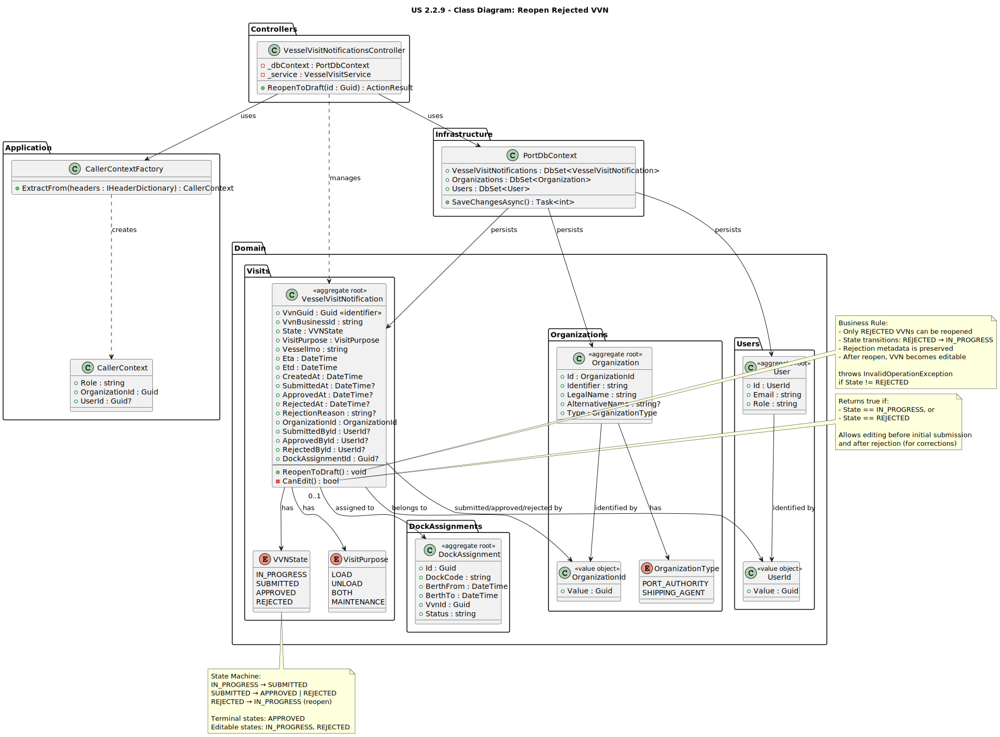

# US 2.2.9 - Reopen Rejected VVN to Draft

## 1. Requirements Engineering

### 1.1. User Story Description

*"As a Shipping Agent Representative, I want to reopen a rejected Vessel Visit Notification back to draft status, so that I can correct the issues identified by the Port Authority and resubmit it for approval."*

### 1.2. Customer Specifications and Clarifications

**From the specifications document:**

> "When a VVN is rejected by the Port Authority, the shipping agent should be able to review the rejection reason, make necessary corrections, and resubmit the notification without creating a completely new VVN."

> "The system should maintain the full audit trail of all state transitions, including rejections and reopenings, for compliance and traceability purposes."

**From the client clarifications:**

> **Question**:  
> "After a VVN is rejected, can the shipping agent edit it directly or does it need to be reopened first?"
>
> **Answer**:  
> "A rejected VVN should be reopened to IN_PROGRESS state first. This explicit action signals the agent's intent to address the rejection and creates a clear audit trail."

> **Question**:  
> "Can an approved VVN be reopened?"
>
> **Answer**:  
> "No, only REJECTED VVNs can be reopened. Once approved, a VVN is locked. If changes are needed after approval, the VVN must be cancelled and a new one created."

> **Question**:  
> "Who can reopen a rejected VVN?"
>
> **Answer**:  
> "Only Shipping Agent Representatives from the same organization that submitted the original VVN can reopen it. Port Authority Officers cannot reopen VVNs."

> **Question**:  
> "What happens to the rejection reason when a VVN is reopened?"
>
> **Answer**:  
> "The rejection reason is preserved in the VVN's history for reference. The agent can review it to understand what needs to be corrected before resubmitting."

### 1.3. Acceptance Criteria

* **AC1:** Only VVNs in REJECTED state can be reopened.
* **AC2:** When reopened, the VVN state transitions from REJECTED to IN_PROGRESS.
* **AC3:** Only Shipping Agent Representatives can reopen VVNs.
* **AC4:** A representative can only reopen VVNs that belong to their organization.
* **AC5:** The rejection reason and rejection timestamp must be preserved after reopening for audit purposes.
* **AC6:** After reopening, the VVN becomes editable again (manifests, crew, ETA/ETD can be updated).
* **AC7:** The system must prevent reopening of VVNs in other states (IN_PROGRESS, SUBMITTED, APPROVED).
* **AC8:** The reopening operation must be idempotent - attempting to reopen an already IN_PROGRESS VVN should fail gracefully.
* **AC9:** Port Authority Officers cannot reopen VVNs (role-based access control).
* **AC10:** The response must clearly indicate the VVN is now editable and can be resubmitted.

### 1.4. Found out Dependencies

* **US 2.2.7** - VVNs must be rejected by Port Authority before they can be reopened.
* **US 2.2.8** - The original VVN creation and submission workflow must exist.
* **US 2.2.5/2.2.6** - Organizations and representatives must exist and be properly identified.
* **Authentication/Authorization System** - Shipping Agent Representative role must be validated.
* **Audit System** - State transitions must be tracked for compliance.

### 1.5 Input and Output Data

**Reopen Rejected VVN:**

* Input Data:
    * VVN ID (GUID, path parameter)

* Headers (Authentication):
    * X-Role: ShippingAgentRepresentative (required)
    * X-Org-Id: Shipping Agent Organization ID (required)
    * X-User-Id: Representative User ID (required)

* Output Data:
    * Success message indicating VVN is now in IN_PROGRESS state
    * VVN ID (both GUID and Business ID)
    * Updated state (IN_PROGRESS)
    * Preserved rejection information (reason, rejected by, rejected at timestamp)
    * Success status (200 OK)

* Error Scenarios:
    * 404 Not Found - VVN does not exist
    * 403 Forbidden - User is not a Shipping Agent Representative or VVN belongs to different organization
    * 422 Unprocessable Entity - VVN is not in REJECTED state
    * 401 Unauthorized - Missing or invalid authentication headers

### 1.6. System Sequence Diagram (SSD)



**Main Scenario:**
1. Shipping Agent Representative reviews rejected VVN and decides to correct and resubmit
2. Representative calls POST /api/vessel-visit-notifications/{id}:reopen with authentication headers
3. System validates representative's role (must be ShippingAgentRepresentative)
4. System retrieves VVN from database
5. System validates VVN belongs to representative's organization
6. System validates VVN is in REJECTED state
7. Domain entity executes ReopenToDraft() method
8. VVN state transitions from REJECTED to IN_PROGRESS
9. Changes are persisted to database
10. System returns 200 OK with updated VVN status

**Alternative Scenarios:**
- VVN not found → 404 Not Found
- Wrong role → 403 Forbidden
- Different organization → 403 Forbidden
- Wrong state (not REJECTED) → 422 Unprocessable Entity

### 1.7 Other Relevant Remarks

* **State Machine Enforcement:** The domain entity enforces valid state transitions. Only REJECTED → IN_PROGRESS is allowed for reopening.

* **Audit Trail Preservation:** All rejection information (reason, rejector, timestamp) is preserved even after reopening, ensuring complete traceability.

* **Organizational Boundary:** Representatives can only reopen VVNs from their own organization, preventing cross-organizational interference.

* **Edit After Reopen:** Once reopened, the VVN follows the same editing rules as IN_PROGRESS VVNs - manifests, crew, and timing can be modified.

* **Resubmission Workflow:** After making corrections, the representative must explicitly submit the VVN again using the submit endpoint (POST {id}:submit).

* **No Automatic Approval:** Reopening and correcting a VVN does not guarantee approval - it must go through the review process again.

## 2. OO Analysis

### 2.1. Relevant Domain Model Excerpt



**Key Domain Entities:**

* **VesselVisitNotification** - Aggregate root representing the visit request
  * States: IN_PROGRESS ↔ SUBMITTED → APPROVED/REJECTED → (reopen) → IN_PROGRESS
  * Method: `ReopenToDraft()` - transitions REJECTED → IN_PROGRESS
  * Business Rule: Only REJECTED VVNs can be reopened
  * Audit Fields: RejectionReason, RejectedAt, RejectedById (preserved)

* **Organization** - Represents Shipping Agent entities
  * Type: SHIPPING_AGENT
  * Organizational boundary for VVN ownership

* **UserId** - Value object representing user identification
  * Tracks the representative reopening the VVN

* **VVNState Enum** - State machine transitions
  * IN_PROGRESS: Initial state and post-reopen state (editable)
  * SUBMITTED: Awaiting Port Authority review (read-only)
  * APPROVED: Accepted by Port Authority (locked)
  * REJECTED: Declined by Port Authority (can be reopened)

### 2.2. Other Remarks

* The domain model enforces the principle that rejected VVNs should not be "thrown away" but instead can be corrected and improved.

* The `CanEdit()` private method in VesselVisitNotification returns true for both IN_PROGRESS and REJECTED states, but reopening provides a clear signal that the agent is actively addressing the rejection.

* The preservation of rejection metadata (reason, timestamp, rejector) enables the shipping agent to understand what went wrong and make informed corrections.

* The state transition is implemented as a domain method (`ReopenToDraft()`) rather than a simple property setter, enforcing business rules and maintaining domain integrity.

## 3. Design - User Story Realization

### 3.1. Rationale

The realization follows a standard layered architecture:

| Layer | Responsibility |
|-------|----------------|
| **Presentation** | VesselVisitNotificationsController handles HTTP requests, validates headers, returns appropriate status codes |
| **Application** | VesselVisitService (optional - direct repository access in this case) |
| **Domain** | VesselVisitNotification.ReopenToDraft() enforces business rules and state transitions |
| **Persistence** | PortDbContext and EF Core manage database operations |

**Design Decisions:**

1. **Endpoint Pattern:** Using `:reopen` suffix (POST /vvns/{id}:reopen) follows the pattern for action-oriented operations that don't map to standard REST verbs.

2. **Idempotency:** The operation validates current state before attempting transition, preventing invalid state changes.

3. **Authorization:** Role and organization checks happen at controller level before domain logic executes.

4. **Domain-Driven State Transition:** The `ReopenToDraft()` method encapsulates business logic, ensuring invalid transitions are impossible.

5. **Audit Preservation:** Rejection metadata is never cleared, maintaining full historical context.

### 3.2. Sequence Diagram (SD)



**Main Flow:**
- Authentication & Authorization: Extract and validate caller context (role, organization, user)
- Retrieve VVN: Load VVN from database by GUID
- Organization Validation: Ensure VVN belongs to representative's organization
- State Validation: Confirm VVN is in REJECTED state
- Reopen: Execute domain method ReopenToDraft() to transition state
- Persistence: Save changes to database
- Response: Return 200 OK with updated VVN information

**Error Flows:**
- Missing/Invalid Role: 403 Forbidden before database access
- VVN Not Found: 404 Not Found after database query
- Wrong Organization: 403 Forbidden after organization check
- Wrong State: 422 Unprocessable Entity with detailed error message

### 3.3. Class Diagram (CD)



**Key Classes and Responsibilities:**

* **VesselVisitNotificationsController:** Entry point for HTTP requests, handles authentication/authorization, orchestrates the reopen operation
* **CallerContextFactory:** Extracts authentication information from HTTP headers
* **VesselVisitNotification (Aggregate Root):** Domain entity containing business logic for state transitions
* **VVNState (Enum):** Defines valid states and enforces state machine rules
* **PortDbContext:** Provides data access and persistence capabilities
* **OrganizationId, UserId (Value Objects):** Type-safe identifiers for domain entities

### 3.4. Applied Patterns

* **Domain-Driven Design (DDD):**
  * VesselVisitNotification is an Aggregate Root
  * State transitions are encapsulated in domain methods
  * Business rules enforced at domain level

* **State Pattern:**
  * VVNState enum defines valid states
  * State transitions governed by business rules
  * Invalid transitions prevented by domain logic

* **Repository Pattern:**
  * PortDbContext provides data access abstraction
  * Domain objects remain persistence-ignorant
  * EF Core handles ORM concerns

* **Role-Based Access Control (RBAC):**
  * X-Role header determines allowed operations
  * Organization validation ensures boundary enforcement
  * Different roles have different capabilities

### 3.5. Tests

**Test Coverage Areas:**

1. **Successful Reopen:**
   - Test reopening a REJECTED VVN returns 200 OK
   - Test VVN state changes to IN_PROGRESS
   - Test rejection metadata is preserved

2. **Authorization:**
   - Test Port Authority cannot reopen VVNs (403 Forbidden)
   - Test representative cannot reopen VVNs from other organizations (403 Forbidden)
   - Test missing authentication headers return 401 Unauthorized

3. **State Validation:**
   - Test cannot reopen IN_PROGRESS VVN (422 Unprocessable Entity)
   - Test cannot reopen SUBMITTED VVN (422 Unprocessable Entity)
   - Test cannot reopen APPROVED VVN (422 Unprocessable Entity)

4. **Not Found:**
   - Test reopening non-existent VVN returns 404 Not Found

5. **Edit After Reopen:**
   - Test VVN is editable after reopening
   - Test manifests can be updated
   - Test VVN can be resubmitted

6. **Idempotency:**
   - Test appropriate error when attempting to reopen already IN_PROGRESS VVN

## 4. Implementation

### 4.1. Controller Endpoint

**Location:** `Controllers/VesselVisitNotificationsController.cs`

```csharp
/// <summary>
/// POST /api/vessel-visit-notifications/{id}:reopen
/// Reopens a REJECTED VVN back to IN_PROGRESS state, allowing the shipping agent
/// to correct issues and resubmit.
/// </summary>
[HttpPost("{id:guid}:reopen")]
public async Task<ActionResult> ReopenToDraft([FromRoute] Guid id)
{
    // Authentication & Authorization
    var ctx = CallerContextFactory.ExtractFrom(Request.Headers);
    
    if (ctx.Role != "ShippingAgentRepresentative")
        return Forbid("Only Shipping Agent Representatives can reopen VVNs.");
    
    // Retrieve VVN
    var vvn = await _dbContext.VesselVisitNotifications
        .FirstOrDefaultAsync(v => v.VvnGuid == id);
    
    if (vvn == null)
        return NotFound(new { message = "VVN not found" });
    
    // Organization validation
    if (vvn.OrganizationId.Value != ctx.OrganizationId)
        return Forbid("You can only reopen VVNs from your organization.");
    
    // State validation & reopen
    if (vvn.State != VVNState.REJECTED)
    {
        return UnprocessableEntity(new ProblemDetails
        {
            Title = "Invalid VVN State",
            Detail = $"Only rejected VVNs can be reopened. Current state: {vvn.State}",
            Status = 422
        });
    }
    
    vvn.ReopenToDraft();
    await _dbContext.SaveChangesAsync();
    
    return Ok(new
    {
        vvnId = vvn.VvnBusinessId,
        state = vvn.State.ToString(),
        message = "VVN has been reopened and is now in IN_PROGRESS state. " +
                  "You can edit and resubmit it."
    });
}
```

### 4.2. Domain Method

**Location:** `Domain/Visits/VesselVisitNotification.cs`

```csharp
/// <summary>
/// Reopens a REJECTED VVN back to IN_PROGRESS state.
/// This allows the shipping agent to correct issues and resubmit.
/// Rejection metadata (reason, timestamp, rejector) is preserved for audit.
/// </summary>
public void ReopenToDraft()
{
    if (State != VVNState.REJECTED)
    {
        throw new InvalidOperationException(
            $"Only REJECTED VVNs can be reopened. Current state: {State}");
    }
    
    // Transition to IN_PROGRESS
    State = VVNState.IN_PROGRESS;
    
    // Rejection metadata is preserved (NOT cleared)
    // RejectionReason, RejectedAt, RejectedById remain for audit trail
}
```

### 4.3. Helper Method

The existing `CanEdit()` method already supports editing for both IN_PROGRESS and REJECTED states:

```csharp
private bool CanEdit() => State == VVNState.IN_PROGRESS || State == VVNState.REJECTED;
```

## 5. Integration

### 5.1. API Documentation

**Endpoint:** `POST /api/vessel-visit-notifications/{id}:reopen`

**Headers:**
- `X-Role`: ShippingAgentRepresentative (required)
- `X-Org-Id`: Organization GUID (required)
- `X-User-Id`: User GUID (required)

**Path Parameters:**
- `id`: VVN GUID (required)

**Response 200 OK:**
```json
{
  "vvnId": "2025-PTLEI-000001",
  "state": "IN_PROGRESS",
  "message": "VVN has been reopened and is now in IN_PROGRESS state. You can edit and resubmit it."
}
```

**Response 403 Forbidden:**
```json
{
  "message": "Only Shipping Agent Representatives can reopen VVNs."
}
```
or
```json
{
  "message": "You can only reopen VVNs from your organization."
}
```

**Response 404 Not Found:**
```json
{
  "message": "VVN not found"
}
```

**Response 422 Unprocessable Entity:**
```json
{
  "title": "Invalid VVN State",
  "detail": "Only rejected VVNs can be reopened. Current state: APPROVED",
  "status": 422
}
```

### 5.2. Typical Workflow

1. **VVN is Rejected:**
   - Port Authority reviews VVN
   - Rejects with reason: "Missing hazardous cargo crew documentation"
   - VVN state → REJECTED

2. **Shipping Agent Reviews Rejection:**
   - Representative calls GET /api/vessel-visit-notifications/{id}
   - Sees rejection reason
   - Decides to correct and resubmit

3. **Reopen VVN:**
   - Representative calls POST /api/vessel-visit-notifications/{id}:reopen
   - VVN state → IN_PROGRESS
   - Rejection metadata preserved

4. **Make Corrections:**
   - Representative calls PUT /api/vessel-visit-notifications/{id}/crew
   - Adds required crew member documentation
   - Updates cargo manifest if needed

5. **Resubmit:**
   - Representative calls POST /api/vessel-visit-notifications/{id}:submit
   - VVN state → SUBMITTED
   - Goes back to Port Authority for review

6. **Second Review:**
   - Port Authority reviews updated VVN
   - Approves (if corrections adequate) or rejects again (if still insufficient)

### 5.3. Related Endpoints

- **US 2.2.8:** POST /api/vessel-visit-notifications (Create VVN)
- **US 2.2.8:** POST /api/vessel-visit-notifications/{id}:submit (Submit for approval)
- **US 2.2.7:** POST /api/vessel-visit-notifications/{id}/reject (Reject VVN)
- **US 2.2.10:** GET /api/vessel-visit-notifications (View status)
- **US 2.2.9:** POST /api/vessel-visit-notifications/{id}:reopen (Reopen rejected)

## 6. Observations

### 6.1. Business Value

This user story provides significant business value:

1. **Reduces Administrative Overhead:** Agents don't need to create entirely new VVNs when simple corrections are needed.

2. **Maintains Context:** All historical information (original submission, rejection, corrections) is preserved in one continuous record.

3. **Clear Audit Trail:** Every state transition is tracked, enabling compliance and dispute resolution.

4. **Faster Turnaround:** Agents can quickly correct and resubmit rather than starting from scratch.

5. **Learning Opportunity:** Preserved rejection reasons help agents understand and avoid common mistakes.

### 6.2. Quality Attributes

* **Security:** Role-based access control ensures only authorized representatives can reopen VVNs from their organization.

* **Traceability:** Full audit trail of state transitions, including rejections and reopenings.

* **Usability:** Clear error messages guide users when operations fail.

* **Maintainability:** Domain logic encapsulated in domain methods, not scattered across layers.

* **Testability:** Clear separation of concerns enables comprehensive unit and integration testing.

### 6.3. Future Enhancements

Potential improvements for future iterations:

1. **Notification System:** Automatically notify Port Authority when a previously rejected VVN is corrected and resubmitted.

2. **Analytics:** Track how often VVNs are rejected and reopened to identify common issues and improve training.

3. **Versioning:** Store snapshots of VVN content at each state transition for detailed comparison.

4. **Bulk Operations:** Allow reopening multiple rejected VVNs at once (with bulk correction capabilities).

5. **Smart Suggestions:** Analyze rejection reasons and suggest specific corrections based on common patterns.

---

**Document Version:** 1.0  
**Last Updated:** October 26, 2025  
**Author:** Development Team  
**Status:** Implementation Complete
