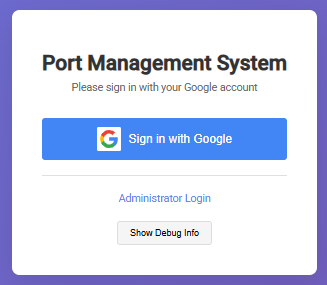
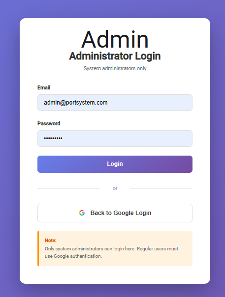
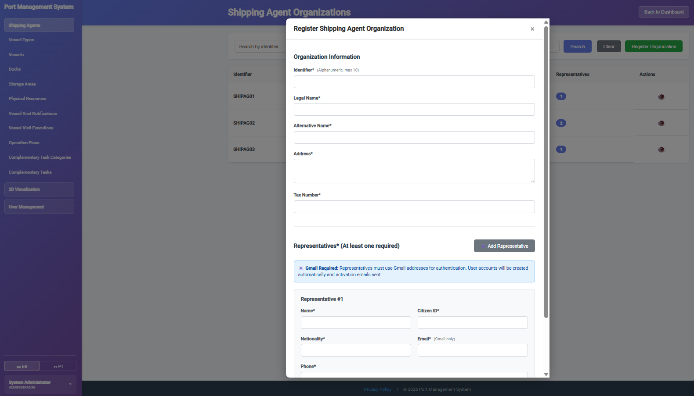
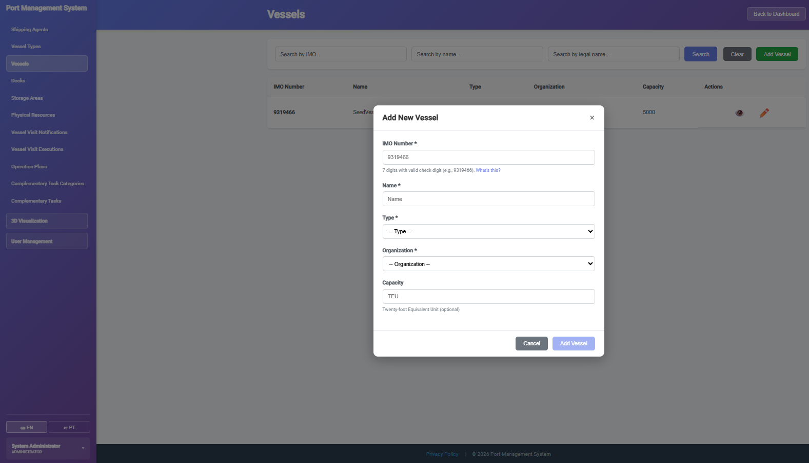
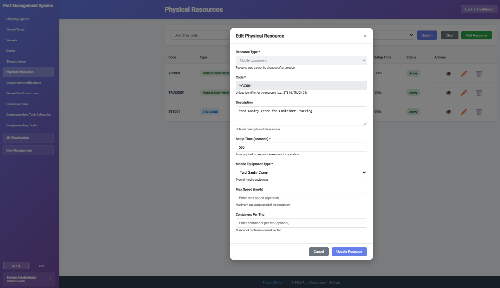
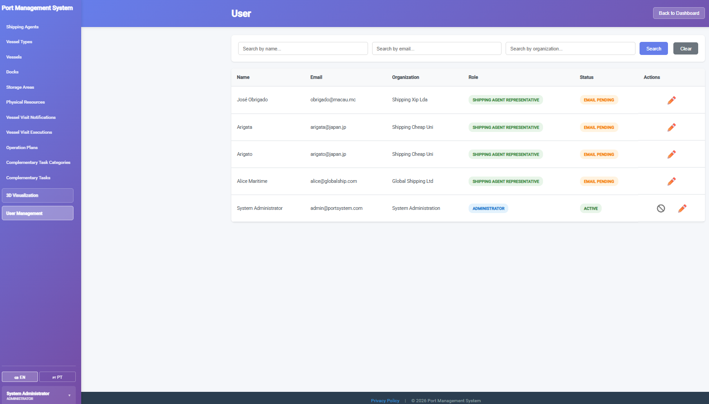
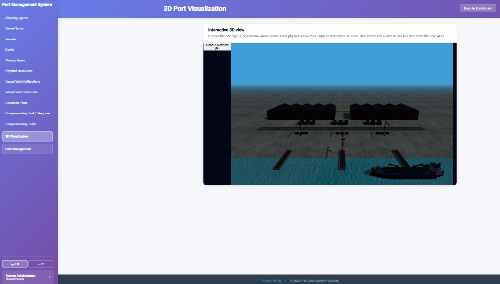
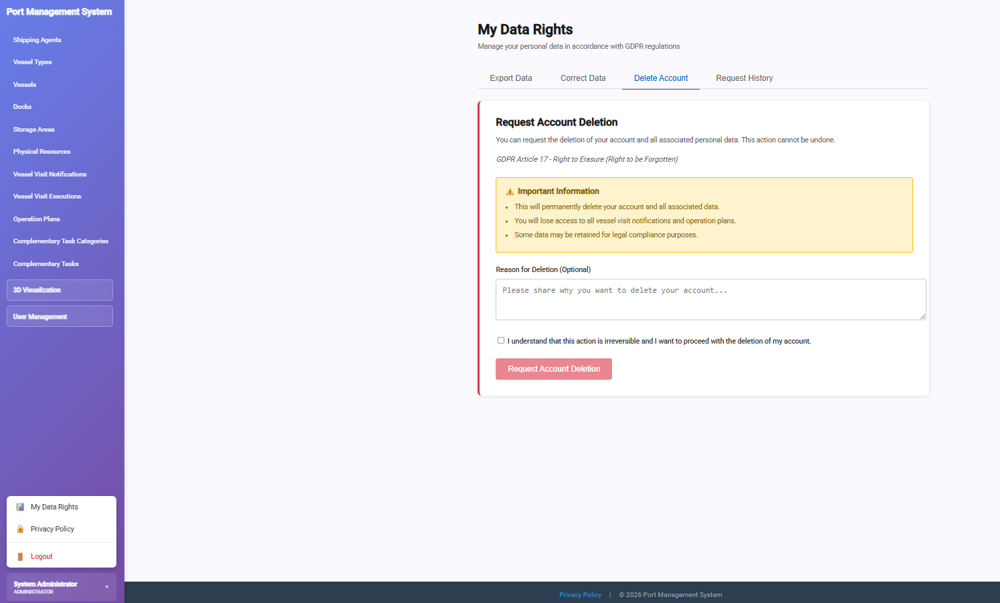

# 🚢 Port Management System - Complete Documentation

> A comprehensive port operations management system built with Clean Architecture, Domain-Driven Design, and 3D visualization


<div align="center">
  


*Modern port operations management with real-time 3D visualization*

</div>

## ✨ Highlights

- 🏗️ **Clean Architecture** - Multi-layered design with DDD principles
- 🎯 **Multi-Backend System** - .NET Core API + Node.js/TypeScript OEM backend
- 🔐 **Google OAuth Integration** - Secure authentication with JWT tokens
- 📦 **MongoDB Operations** - Advanced operations & execution management
- 🌐 **3D Port Visualization** - Real-time WebGL rendering with Three.js
- 🐳 **Prolog AI Planning** - Intelligent vessel scheduling and dock assignment
- 🧪 **Comprehensive Testing** - xUnit (.NET), Jest (TypeScript), Cypress (E2E)
- 📊 **Clean DDD** - Aggregates, entities, value objects, repositories
- 🔄 **RESTful APIs** - OpenAPI/Swagger documentation
- 🎨 **Modern Frontend** - Angular 20 with Material Design

## 📚 Documentation

- 📝 [Sprint A Documentation](Docs/Sprint%20A) - Domain modeling and initial requirements
- 📖 [Sprint B Documentation](Docs/Sprint%20B) - Core features and 3D visualization
- 📘 [Sprint C Documentation](Docs/Sprint%20C) - Operations management and AI planning
- 🔒 [GDPR Compliance](Docs/GDPR) - Privacy policy and data protection

## 🚀 Quick Start

### Prerequisites

- **.NET SDK 9.0** or higher
- **Node.js 18+** and npm
- **MongoDB 7.x** (for OEM backend)
- **SWI-Prolog** (optional, for AI planning)

### Build & Run

```bash
# Clone the repository
git clone https://github.com/Frsoul7/port-management-app.git
cd port-management-app

# Backend .NET (Core API - Port 5001)
cd backend/src
dotnet restore
dotnet ef database update
dotnet run

# Backend OEM (Operations - Port 3000)
cd backend-oem
npm install
cp .env.example .env  # Configure MongoDB connection
npm run dev

# Frontend (Angular - Port 4200)
cd frontend
npm install
npm start
```

### Access Points

- **Frontend**: http://localhost:4200
- **.NET API**: https://localhost:5001/swagger
- **OEM API**: http://localhost:3000/api-docs
- **3D Visualization**: http://localhost:4200/visualization

## 📸 Screenshots

### Authentication & Dashboard

<div align="center">


*Google OAuth integration for secure authentication*



*Role-based dashboard with comprehensive port management features*

</div>

### Vessel Visit Management

<div align="center">


*Vessel registration with IMO validation and type classification*



*Create and manage Vessel Visit Notifications (VVN) with cargo manifest*

</div>

### 3D Port Visualization

<div align="center">



*Real-time 3D visualization of port layout with WebGL rendering*



*Interactive dock assignment and vessel positioning*

</div>

### Operations & Planning

<div align="center">



*AI-generated operation plans with Prolog optimization*



*Real-time vessel visit execution monitoring*



*Intelligent resource allocation and dock balancing*

</div>

## 🎓 Academic Context

**Institution**: [Instituto Superior de Engenharia do Porto (ISEP)](http://www.isep.ipp.pt/)  
**Program**: [Informatics Engineering (LEI)](http://www.isep.ipp.pt/Course/Course/26)  
**Academic Year**: 2025-2026  
**Team**: Group 3DE-05

### Courses Integration

- **LAPR5** - Software Engineering & Architecture (Clean Architecture, DDD)
- **ARQSI** - Software Architecture (Microservices, RESTful APIs)
- **SGRAI** - Computer Graphics (Three.js, WebGL, 3D modeling)
- **ASIST** - Information Systems Security (OAuth, JWT, GDPR)
- **GESTA** - Project Management (Agile/Scrum methodology)
- **IARTI** - Artificial Intelligence (Prolog planning algorithms)

### Team Members

- Gonçalo Da Silva Araújo - [1220671@isep.ipp.pt]
- Inês Fernandes Ressurreição - [1221197@isep.ipp.pt]
- Martim Abreu Monteiro - [1230772@isep.ipp.pt]
- Nuno Eduardo Pinheiro Teixeira - [1231375@isep.ipp.pt]
- Fernando Regalado Lobo Ribeiro - [1060064@isep.ipp.pt]

### Faculty

- Jorge Manuel Neves Coelho (LAPR5, IARTI)
- José Antonio Reis Tavares (ARQSI)
- João Paulo Jorge Pereira (SGRAI)
- Daniel Jorge da Costa Lima de Paiva Valente (ASIST)
- Maria Beatriz Cabral Ribeiro da Fonseca Pinheiro (GESTA)


## 🎯 Key Features

### For Port Authority Officers

- **Vessel Registration** - Register and manage vessel fleet with IMO validation
- **VVN Approval** - Review and approve/reject vessel visit notifications
- **Dock Management** - Configure docks, assign berths, manage capacity
- **Resource Oversight** - Monitor cranes, equipment, and storage areas
- **3D Port View** - Visualize entire port operations in real-time

### For Shipping Agents

- **VVN Creation** - Submit vessel visit notifications with detailed information
- **Cargo Manifest** - Manage cargo manifests with container details
- **Crew Management** - Register crew members and captain information
- **Visit Tracking** - Monitor VVN status and approvals
- **Schedule Viewing** - Access vessel schedules and dock assignments

### For Logistics Planners

- **Operation Plans** - Generate AI-optimized operation plans using Prolog
- **Dock Balancing** - Intelligent dock assignment and load balancing
- **Resource Allocation** - Optimize crane and equipment distribution
- **Conflict Detection** - Automatic detection of scheduling conflicts
- **Performance Analytics** - Track operation efficiency and metrics

### Advanced Features

- **3D Visualization** - Interactive WebGL port layout with Three.js
- **AI Planning** - Prolog-based intelligent scheduling and optimization
- **Real-time Monitoring** - Live vessel visit execution tracking
- **Incident Management** - Report and track operational incidents
- **Complementary Tasks** - Manage additional port operations
- **GDPR Compliance** - Full data protection and privacy controls

## 🏗️ Architecture

### System Overview

```
┌─────────────────────────────────────────────────────────────┐
│                  Port Management System                      │
├─────────────────────────────────────────────────────────────┤
│                                                              │
│  ┌──────────────┐  ┌──────────────┐  ┌──────────────┐      │
│  │   Angular    │  │     .NET     │  │   Node.js    │      │
│  │   Frontend   │◄─┤  Core API    │◄─┤  OEM API     │      │
│  │  (Port 4200) │  │ (Port 5001)  │  │ (Port 3000)  │      │
│  └──────┬───────┘  └──────┬───────┘  └──────┬───────┘      │
│         │                  │                  │              │
│    ┌────▼────┐       ┌────▼────┐       ┌────▼────┐         │
│    │Three.js │       │   EF    │       │ MongoDB │         │
│    │  WebGL  │       │  Core   │       │ Mongoose│         │
│    └─────────┘       └─────────┘       └─────────┘         │
│                                                              │
│  ┌──────────────────────────────────────────────────┐       │
│  │           Prolog Planning Engine (IARTI)         │       │
│  │   - Genetic Algorithms  - Heuristic Planning     │       │
│  │   - Dock Balancing      - Multi-Crane Scheduling │       │
│  └──────────────────────────────────────────────────┘       │
└─────────────────────────────────────────────────────────────┘
```

### Clean Architecture Layers

**Domain Layer** (Innermost - Pure Business Logic)
- Entities: `Vessel`, `VesselVisitNotification`, `Organization`, `Dock`
- Aggregates: `VVN`, `ScheduledVisit`, `DockAssignment`
- Value Objects: `ImoNumber`, `VesselCapacity`, `CargoManifest`
- Domain Services: Validation, business rules
- Factory Interfaces: Object creation patterns

**Application Layer** (Use Cases & DTOs)
- Use Case Controllers: `CreateVVN`, `ApproveVVN`, `RegisterVessel`
- DTOs: Request/Response objects, Visualization data
- Service Interfaces: `IVesselService`, `IVvnService`
- Authorization Policies: Role-based access control

**Infrastructure Layer** (External Concerns)
- EF Core: `PortDbContext`, entity configurations
- Repositories: Data access implementations
- External Services: Google OAuth, email notifications
- Mappers: Entity ↔ DTO conversion

**Presentation Layer** (API Endpoints)
- REST Controllers: `VesselsController`, `VvnsController`, `VisualizationController`
- Middleware: Authentication, error handling, logging
- OpenAPI: Swagger/Scalar documentation

### Technology Stack

**Backend (.NET)**
- .NET 9.0 with C# 13
- ASP.NET Core Web API
- Entity Framework Core (InMemory/SQL Server)
- Google OAuth 2.0
- JWT Authentication
- Swagger + Scalar

**Backend OEM (Node.js)**
- TypeScript 5.x
- Express.js
- MongoDB + Mongoose ODM
- Clean Architecture (DDD)
- Jest Testing
- Winston Logging

**Frontend**
- Angular 20
- Three.js (WebGL)
- RxJS
- Angular Material
- Cypress E2E Testing

**AI Planning**
- SWI-Prolog 9.x
- Genetic Algorithms
- Heuristic Planning (SPT, MST, Weighted Priority)
- Multi-objective Optimization

## 📐 Project Structure

```
port-management-app/
│
├── backend/                        # .NET Core API
│   ├── src/
│   │   ├── Domain/                # Core business logic (DDD)
│   │   │   ├── Shared/           # Base classes, interfaces
│   │   │   ├── Organizations/    # Organization aggregate
│   │   │   ├── Users/            # User management
│   │   │   ├── Vessels/          # Vessel entities
│   │   │   ├── Visits/           # VVN aggregate
│   │   │   ├── HumanResources/   # Staff, crew
│   │   │   ├── Resources/        # Physical resources
│   │   │   ├── Docks/            # Dock management
│   │   │   └── Factory/          # Domain factories
│   │   ├── Application/          # Use cases
│   │   │   ├── DTOs/            # Data transfer objects
│   │   │   ├── Services/        # Application services
│   │   │   ├── Authorization/   # Policy handlers
│   │   │   └── Security/        # Security utilities
│   │   ├── Infrastructure/       # Data access
│   │   │   ├── PortDbContext.cs
│   │   │   ├── Configurations/  # EF configurations
│   │   │   ├── Repositories/    # Repository implementations
│   │   │   └── Mappers/         # DTO mappers
│   │   ├── Presentation/        # API layer
│   │   │   └── Controllers/     # REST endpoints
│   │   ├── Program.cs           # Entry point
│   │   └── appsettings.json     # Configuration
│   └── tests/                    # xUnit tests
│
├── backend-oem/                   # Node.js OEM API
│   ├── src/
│   │   ├── domain/               # Domain layer (DDD)
│   │   │   ├── entities/        # Domain entities
│   │   │   ├── repositories/    # Repository interfaces
│   │   │   ├── services/        # Domain services
│   │   │   └── value-objects/   # Value objects
│   │   ├── application/         # Application layer
│   │   │   ├── dtos/           # Data transfer objects
│   │   │   └── services/       # Use case services
│   │   ├── infrastructure/      # Infrastructure layer
│   │   │   ├── database/       # MongoDB models
│   │   │   ├── repositories/   # Repository implementations
│   │   │   └── http-clients/   # External API clients
│   │   ├── presentation/        # Presentation layer
│   │   │   ├── controllers/    # Request handlers
│   │   │   └── routes/         # Express routes
│   │   └── server.ts           # Entry point
│   └── tests/                   # Jest unit tests
│
├── frontend/                     # Angular application
│   ├── src/
│   │   ├── app/
│   │   │   ├── core/           # Core module
│   │   │   │   ├── guards/     # Route guards
│   │   │   │   ├── interceptors/ # HTTP interceptors
│   │   │   │   └── services/   # Core services
│   │   │   ├── features/       # Feature modules
│   │   │   │   ├── auth/       # Authentication
│   │   │   │   ├── vessels/    # Vessel management
│   │   │   │   ├── vvns/       # VVN management
│   │   │   │   ├── visualization/ # 3D port view
│   │   │   │   └── operation-plans/ # OEM features
│   │   │   ├── three/          # Three.js services
│   │   │   └── shared/         # Shared components
│   │   └── environments/       # Environment configs
│   ├── public/models/           # 3D GLB models
│   └── cypress/                 # E2E tests
│
├── IARTI/                        # Prolog AI Planning
│   ├── Algoritmos/
│   │   ├── main.pl             # Entry point
│   │   ├── genetic_algorithm.pl
│   │   ├── dock_balancing.pl
│   │   ├── heuristic_*.pl      # Various heuristics
│   │   ├── multi_cranes.pl     # Resource optimization
│   │   └── orchestrator.pl     # Planning orchestrator
│   └── Docs/                    # AI documentation
│
└── Docs/                         # Project documentation
    ├── Sprint A/                # Requirements & domain model
    ├── Sprint B/                # Core features & 3D viz
    ├── Sprint C/                # Operations & AI planning
    ├── GDPR/                    # Privacy compliance
    └── Screenshots/             # Application screenshots
```
│   │   │   ├── Repositories/      # Repository implementations
│   │   │   ├── Mappers/           # Entity mappers
│   │   │   └── UnitOfWork.cs      # Unit of Work pattern
│   │   ├── Presentation/          # Presentation Layer (Web API)
│   │   │   └── Controllers/       # REST API controllers
│   │   │       └── VisualizationController.cs  # 3D data API
│   │   ├── Program.cs             # Application entry point
│   │   └── appsettings.json       # Configuration
│   ├── tests/                      # Test projects
│   └── LEI-SEM5-PI-2025-26-3DE-05.sln  # Solution file
│
├── backend-oem/                    # Backend OEM (Operations & Execution Management)
│   ├── src/                        # Source code (TypeScript + Express + MongoDB)
│   │   ├── domain/                 # Domain Layer (Core business logic)
│   │   │   ├── entities/          # Domain entities
│   │   │   │   ├── OperationPlan.ts
│   │   │   │   ├── VesselVisitExecution.ts
│   │   │   │   ├── ComplementaryTask.ts
│   │   │   │   ├── TaskCategory.ts
│   │   │   │   ├── IncidentType.ts
│   │   │   │   └── Incident.ts
│   │   │   ├── ports/             # Port interfaces (DIP - Dependency Inversion)
│   │   │   │   ├── ICoreBackendClient.ts
│   │   │   │   └── IPlanningClient.ts
│   │   │   ├── repositories/      # Repository interfaces
│   │   │   ├── services/          # Domain services
│   │   │   └── value-objects/     # Value objects
│   │   ├── application/           # Application Layer (Use cases)
│   │   │   ├── dtos/              # Data transfer objects
│   │   │   ├── interfaces/        # Service interfaces
│   │   │   └── services/          # Application services
│   │   │       ├── OperationPlanService.ts
│   │   │       ├── VesselVisitExecutionService.ts
│   │   │       ├── ComplementaryTaskService.ts
│   │   │       ├── TaskCategoryService.ts
│   │   │       ├── IncidentTypeService.ts
│   │   │       └── IncidentService.ts
│   │   ├── infrastructure/        # Infrastructure Layer
│   │   │   ├── container.ts       # Dependency Injection container
│   │   │   ├── database/          # MongoDB models and connection
│   │   │   │   ├── models/        # Mongoose schemas
│   │   │   │   ├── seeders/       # Database seeders
│   │   │   │   └── connection.ts  # Database connection
│   │   │   ├── repositories/      # Repository implementations
│   │   │   ├── http/              # HTTP utilities
│   │   │   ├── http-clients/      # External API clients
│   │   │   └── middleware/        # Express middleware
│   │   ├── presentation/          # Presentation Layer (REST API)
│   │   │   ├── controllers/       # Request handlers
│   │   │   │   ├── OperationPlanController.ts
│   │   │   │   ├── VesselVisitExecutionController.ts
│   │   │   │   ├── ComplementaryTaskController.ts
│   │   │   │   ├── TaskCategoryController.ts
│   │   │   │   ├── IncidentTypeController.ts
│   │   │   │   └── IncidentController.ts
│   │   │   └── routes/            # Express routes
│   │   │       ├── operationPlan.routes.ts
│   │   │       ├── vesselVisitExecution.routes.ts
│   │   │       ├── complementaryTask.routes.ts
│   │   │       ├── taskCategory.routes.ts
│   │   │       ├── incidentType.routes.ts
│   │   │       └── incident.routes.ts
│   │   ├── shared/                # Shared utilities
│   │   ├── config/                # Configuration
│   │   └── server.ts              # Application entry point
│   ├── tests/                      # Test projects
│   │   ├── unitTests/             # Unit tests (Jest)
│   │   └── integration/           # Integration tests
│   ├── logs/                       # Application logs
│   ├── package.json               # NPM dependencies
│   ├── tsconfig.json              # TypeScript configuration
│   └── jest.config.js             # Jest test configuration
│
├── frontend/                       # Frontend Angular application
│   ├── src/
│   │   ├── app/
│   │   │   ├── core/              # Core module (auth, guards, interceptors)
│   │   │   │   └── services/
│   │   │   │       └── visualization.service.ts  # 3D data service
│   │   │   ├── features/          # Feature modules (VVN, vessels, users, etc.)
│   │   │   │   └── visualization/ # 3D port visualization
│   │   │   │       └── port-3d.component.ts
│   │   │   ├── three/             # Three.js services
│   │   │   │   └── services/
│   │   │   │       ├── model-loader.service.ts
│   │   │   │       ├── port-assets.service.ts
│   │   │   │       └── port-scene.service.ts
│   │   │   └── shared/            # Shared components
│   │   └── environments/
│   ├── public/models/              # 3D GLB models
│   │   ├── Ocean.glb              # Ocean animation
│   │   ├── dock.glb               # Dock structures
│   │   ├── vessel_container.glb   # Container vessels
│   │   ├── warehouse.glb          # Warehouse buildings
│   │   └── yard.glb               # Yard areas
│   ├── angular.json
│   └── package.json
│
├── Docs/                           # Documentation
│   ├── Sprint A/                   # Sprint A documentation
│   ├── Sprint B/                   # Sprint B documentation (with 3D viz)
│   ├── Sprint C/                   # Sprint C documentation
│   │   ├── Architecture/          # Architecture documentation
│   │   ├── UserStories/           # User stories (folder renamed from 'User Stories')
│   │   ├── USs/                   # US implementation docs
│   │   ├── Misc/                  # Miscellaneous documents
│   │   └── NewDocs/               # New documentation
│   └── GDPR/                       # GDPR compliance reports
│       └── GDPR_Compliance_Report_SprintC.pdf
│
└── README.md                       # This file
```


## 🔄 Application Workflows

### 📋 Vessel Registration Workflow

#### 1. Port Authority Registers Vessel
```http
POST /api/vessels
Headers:
  X-Org-Id: aaaaaaaa-aaaa-aaaa-aaaa-aaaaaaaaaaaa
  X-Role: portauthorityofficer
Body:
{
  "imoNumber": "9074729",
  "name": "Atlantic Voyager",
  "vesselTypeId": "<vessel-type-id>",
  "organizationId": "<shipping-agent-org-id>",
  "capacityTEU": 5000
}
```

#### 2. System Validates IMO Number
- Checksum validation (last digit verification)
- Uniqueness check across database
- Vessel type compatibility

#### 3. Vessel Registered & Available
- Vessel appears in fleet registry
- Ready for VVN submissions
- Accessible in 3D visualization

### 📝 VVN Lifecycle Workflow

#### 1. Shipping Agent Creates VVN
```
Agent Login → Navigate to VVN Creation
→ Select Vessel (from fleet) → Enter visit details
→ Set ETA/ETD → Specify purpose (LOAD/DISCHARGE/BOTH)
→ Add crew information → Submit for approval
```

#### 2. Add Cargo Manifest (Optional)
```
VVN Created → Navigate to Manifest Management
→ Add container entries → Specify cargo type
→ Set hazardous materials flags → Update total TEU
→ Save manifest entries
```

#### 3. Port Authority Reviews VVN
```
Port Officer Login → View Pending VVNs
→ Review vessel details → Check manifest
→ Verify crew compliance → Assess dock availability
→ APPROVE or REJECT with reason
```

#### 4. Approved VVN Enters Planning
```
VVN Status: Approved → Sent to OEM Backend
→ AI Planning Engine generates operation plan
→ Dock assignment optimized → Resources allocated
→ Execution tracking begins
```

### 🎯 Operation Plan Generation (AI Planning)

#### 1. Trigger Plan Generation
```
Approved VVN → Planner Request
→ Prolog orchestrator invoked
→ Available docks queried → Resource constraints loaded
```

#### 2. Prolog AI Optimization
```
Genetic Algorithm:
  - Population: 100 operation plans
  - Generations: 50 iterations
  - Fitness: Minimize total time + balance load
  
Heuristics Applied:
  - SPT (Shortest Processing Time)
  - MST (Minimum Slack Time)
  - Weighted Priority (cargo type importance)
  
Dock Balancing:
  - Even distribution across berths
  - Avoid overload on single dock
  - Respect crane capabilities
```

#### 3. Plan Validation & Storage
```
Best Plan Selected → Conflict Detection
→ Check crane availability → Verify timeline
→ Store in MongoDB → Notify logistics planner
```

#### 4. Execution Monitoring
```
Plan Approved → VVE (Vessel Visit Execution) created
→ Real-time status updates → Operation tracking
→ Incident reporting (if delays occur)
→ Completion verification → Performance metrics
```

### 🚢 Complete Example: From Vessel to Departure

#### Day 1: Vessel Registration (Port Authority)
```
10:00 - Register "Atlantic Voyager" (IMO: 9074729)
10:05 - Vessel type: Container Ship, Capacity: 5000 TEU
10:10 - Ownership: Global Shipping Ltd
Result: Vessel active in system
```

#### Day 2: VVN Submission (Shipping Agent)
```
14:00 - Create VVN for "Atlantic Voyager"
14:15 - ETA: 2025-12-01 10:00, ETD: 2025-12-02 18:00
14:30 - Purpose: LOAD, Crew: 25, Captain: Smith
14:45 - Add manifest: 200 containers (150 standard, 50 refrigerated)
15:00 - Submit VVN for approval
Result: VVN status = PENDING
```

#### Day 3: VVN Approval (Port Authority)
```
09:00 - Review VVN #VVN-000123
09:15 - Check manifest: 200 containers, 50 hazardous
09:30 - Verify crew compliance: ✓ All valid
09:45 - Approve VVN
Result: VVN status = APPROVED
```

#### Day 4: Operation Planning (AI System + Planner)
```
10:00 - AI generates operation plan via Prolog
10:05 - Dock assignment: Berth #3 (optimal load balance)
10:10 - Resource allocation: 2 STS cranes, 5 yard trucks
10:15 - Timeline: 8-hour operation window
10:20 - Planner reviews and approves plan
Result: Operation Plan #OP-000456 ready
```

#### Day 5: Vessel Arrival & Execution
```
10:00 - Vessel berths at Dock #3
10:30 - Operations begin: discharge 100 containers
13:00 - Load 150 new containers
16:00 - Refueling and inspections
18:00 - Operations complete, vessel departs
Result: VVE completed successfully
```

## 🧪 Testing

### Backend (.NET) Tests
```bash
cd backend/src

# Run all tests
dotnet test

# Run with coverage
dotnet test /p:CollectCoverage=true

# Run specific test category
dotnet test --filter "Category=Integration"
```

**Test Coverage:**
- 49+ test classes for domain logic
- Unit tests for entities, value objects, aggregates
- Integration tests for repositories and services
- Authorization policy tests

### Backend OEM (Node.js) Tests
```bash
cd backend-oem

# Run all tests
npm test

# Run with coverage
npm run test:coverage

# Watch mode for development
npm run test:watch
```

**Test Coverage:**
- 50+ unit tests (Jest)
- Domain entity validation tests
- Service layer integration tests
- HTTP client mocking

### Frontend (Angular) Tests
```bash
cd frontend

# Unit tests (Karma)
npm run test

# E2E tests (Cypress)
npm run e2e

# Open Cypress UI
npm run cypress:open
```

**Test Coverage:**
- Component unit tests (Jasmine)
- Service unit tests with HTTP mocking
- E2E scenarios (Cypress): Login, VVN creation, vessel registration
- 3D visualization rendering tests

## 🔧 Configuration

### Backend (.NET) Configuration

**appsettings.json:**
```json
{
  "ConnectionStrings": {
    "DefaultConnection": "Server=localhost;Database=PortManagement;Trusted_Connection=True;"
  },
  "Google": {
    "ClientId": "your-google-client-id.apps.googleusercontent.com",
    "ClientSecret": "your-google-client-secret"
  },
  "Jwt": {
    "Secret": "your-jwt-secret-key-min-32-characters",
    "Issuer": "PortManagementAPI",
    "Audience": "PortManagementClient",
    "ExpiryMinutes": 60
  }
}
```

**Database Options:**
```csharp
// InMemory (Development)
options.UseInMemoryDatabase("PortManagementDb");

// SQL Server (Production)
options.UseSqlServer(
    Configuration.GetConnectionString("DefaultConnection")
);
```

### Backend OEM Configuration

**.env:**
```env
# Server
PORT=3000
NODE_ENV=development

# MongoDB
MONGODB_URI=mongodb://localhost:27017/port-oem
MONGODB_DB_NAME=port-oem

# Core Backend Integration
CORE_BACKEND_URL=http://localhost:5001

# JWT
JWT_SECRET=your-secure-jwt-secret-key

# Google OAuth
GOOGLE_CLIENT_ID=your-google-client-id.apps.googleusercontent.com
GOOGLE_CLIENT_SECRET=your-google-client-secret

# Logging
LOG_LEVEL=debug
LOG_DIR=./logs
```

### Frontend Configuration

**public/config.json:**
```json
{
  "apiUrl": "https://localhost:5001/api",
  "oemApiUrl": "http://localhost:3000/api/v1",
  "googleClientId": "your-google-client-id.apps.googleusercontent.com",
  "mapboxToken": "your-mapbox-token"
}
```

### Prolog Planning Configuration

**IARTI/Algoritmos/orchestrator.pl:**
```prolog
% Genetic Algorithm Parameters
population_size(100).
generations(50).
mutation_rate(0.15).
crossover_rate(0.85).

% Optimization Weights
weight_time(0.4).
weight_cost(0.3).
weight_balance(0.3).

% Dock Constraints
max_vessels_per_dock(3).
min_dock_spacing(50).  % meters
```

## 🔐 Security & Authentication

### Authentication Flow

1. **User initiates Google OAuth** → Frontend redirects to Google
2. **Google authenticates** → Returns authorization code
3. **Backend exchanges code** → Receives Google user info
4. **Backend creates/finds user** → Generates JWT token
5. **Frontend stores JWT** → Includes in subsequent requests

### Role-Based Access Control

**Roles:**
- `portauthorityofficer` - Full CRUD on vessels, approve VVNs, manage docks
- `shippingagentrep` - Create VVNs, manage manifests, view vessels
- `logisticsplanner` - Approve operation plans, allocate resources
- `admin` - System administration, user management

**Authorization Headers:**
```http
X-User-Id: <user-guid>
X-Org-Id: <organization-guid>
X-Role: <user-role>
```

### GDPR Compliance

- **Right to Access** - Users can download personal data
- **Right to Erasure** - Data deletion requests supported
- **Right to Rectification** - Profile updates available
- **Data Portability** - Export in JSON format
- **Consent Management** - Privacy policy acknowledgment
- **Audit Logging** - All data access tracked

Documentation: [GDPR Compliance Report](Docs/GDPR/GDPR_Compliance_Report_SprintC.pdf)

## 🎨 3D Visualization Features

### Technologies

- **Three.js** - WebGL-based 3D rendering
- **GLB Models** - Optimized 3D assets
- **OrbitControls** - Camera navigation
- **Raycasting** - Interactive selection

### Available Models

```
public/models/
├── Ocean.glb              # Animated ocean surface
├── dock.glb               # Dock structures with berths
├── dock_simple.glb        # Simplified dock model
├── vessel_container.glb   # Container ship (71MB)
├── warehouse.glb          # Storage warehouses
├── yard.glb               # Container yard areas
├── ContentoresRandom.glb  # Container stacks
└── estrada.glb            # Access roads
```

### Visualization Services

**model-loader.service.ts:**
- GLB model loading with caching
- Texture optimization
- Error handling and fallbacks

**port-scene.service.ts:**
- Scene composition and lighting
- Camera positioning and animation
- Render loop management

**port-assets.service.ts:**
- Asset positioning based on backend data
- Dynamic vessel placement
- Real-time updates from API

**Interactive Features:**
- Click vessels to view details
- Hover for quick info tooltips
- Camera pan, zoom, rotate
- Day/night cycle (optional)


## 🤖 AI Planning (Prolog/IARTI)

### Planning Algorithms

**Genetic Algorithm (`genetic_algorithm.pl`):**
- Population-based optimization
- Crossover and mutation operators
- Multi-objective fitness evaluation
- Convergence criteria

**Heuristics:**
- **SPT** (Shortest Processing Time) - Minimize total operation time
- **MST** (Minimum Slack Time) - Prioritize urgent operations
- **Weighted Priority** - Balance cargo importance and time constraints
- **Dock Balancing** - Even distribution across berths

**Multi-Crane Scheduling (`multi_cranes.pl`):**
- Crane assignment optimization
- Non-interference constraints
- Travel time minimization
- Resource utilization maximization

### Integration with Backend

```typescript
// Backend OEM calls Prolog via HTTP API
const planningResult = await axios.post('http://localhost:5000/api/plan', {
  vessels: [...],
  docks: [...],
  constraints: {...}
});

// Prolog returns optimized operation plan
{
  "vesselId": "VVN-000123",
  "dockId": "DOCK-003",
  "operations": [
    { "type": "DISCHARGE", "containers": 100, "duration": 240 },
    { "type": "LOAD", "containers": 150, "duration": 360 }
  ],
  "resources": {
    "cranes": 2,
    "trucks": 5
  },
  "fitness": 0.87
}
```

## 📊 API Documentation

### REST Endpoints Overview

#### Core Backend (.NET) - Port 5001

**Organizations:**
- `GET /api/organizations` - List all organizations
- `GET /api/organizations/{id}` - Get organization by ID
- `POST /api/organizations` - Create shipping agent
- `PATCH /api/organizations/{id}/representatives/{repId}` - Update representative

**Vessels:**
- `GET /api/vessels` - List all vessels (with filters)
- `GET /api/vessels/{imo}` - Get vessel by IMO number
- `POST /api/vessels` - Register new vessel (Port Authority only)
- `PUT /api/vessels/{imo}` - Update vessel details
- `DELETE /api/vessels/{imo}` - Delete vessel

**VVNs (Vessel Visit Notifications):**
- `GET /api/vvns` - List VVNs (with status filters)
- `GET /api/vvns/{vvnNumber}` - Get VVN details
- `POST /api/vvns` - Create new VVN (Shipping Agent)
- `PATCH /api/vvns/{vvnNumber}/approve` - Approve VVN (Port Authority)
- `PATCH /api/vvns/{vvnNumber}/reject` - Reject VVN with reason
- `POST /api/vvns/{vvnNumber}/manifest` - Add manifest entry

**Docks:**
- `GET /api/docks` - List all docks
- `POST /api/docks` - Create dock
- `PUT /api/docks/{id}` - Update dock
- `DELETE /api/docks/{id}` - Delete dock

**Storage Areas:**
- `GET /api/storage-areas` - List storage areas
- `POST /api/storage-areas` - Create storage area
- `PATCH /api/storage-areas/{id}/occupancy` - Update occupancy

**3D Visualization:**
- `GET /api/visualization/port-layout` - Get complete 3D port layout
- `GET /api/visualization/live-objects` - Get live vessel positions

#### OEM Backend (Node.js) - Port 3000

**Operation Plans:**
- `GET /api/v1/operation-plans` - List all operation plans
- `GET /api/v1/operation-plans/:id` - Get plan details
- `POST /api/v1/operation-plans` - Create/generate plan
- `PATCH /api/v1/operation-plans/:id/approve` - Approve plan
- `GET /api/v1/operation-plans/missing` - VVNs without plans
- `GET /api/v1/operation-plans/resource-allocation` - Resource overview

**Vessel Visit Executions (VVE):**
- `GET /api/v1/vessel-visit-executions` - List executions
- `GET /api/v1/vessel-visit-executions/:id` - Get execution details
- `POST /api/v1/vessel-visit-executions/:id/berthing` - Record berthing
- `PATCH /api/v1/vessel-visit-executions/:id/operations/:opIndex` - Update operation
- `POST /api/v1/vessel-visit-executions/:id/complete` - Mark complete

**Incidents:**
- `GET /api/v1/incidents` - List incidents
- `POST /api/v1/incidents` - Report incident
- `GET /api/v1/incident-types` - List incident types
- `POST /api/v1/incident-types` - Create incident type

**Complementary Tasks:**
- `GET /api/v1/complementary-tasks` - List tasks
- `POST /api/v1/complementary-tasks` - Create task
- `PUT /api/v1/complementary-tasks/:id` - Update task
- `DELETE /api/v1/complementary-tasks/:id` - Delete task

**Task Categories:**
- `GET /api/v1/task-categories` - List categories

### Swagger Documentation

- **.NET API**: https://localhost:5001/swagger
- **Scalar UI**: https://localhost:5001/scalar/v1
- **OEM API**: http://localhost:3000/api-docs

## 🛠️ Development Setup

### Prerequisites Installation

**Windows:**
```powershell
# Install Chocolatey (if not already installed)
Set-ExecutionPolicy Bypass -Scope Process -Force
iex ((New-Object System.Net.WebClient).DownloadString('https://chocolatey.org/install.ps1'))

# Install .NET SDK
choco install dotnet-sdk

# Install Node.js
choco install nodejs-lts

# Install MongoDB
choco install mongodb

# Install SWI-Prolog (optional)
choco install swi-prolog
```

**macOS:**
```bash
# Install Homebrew (if not already installed)
/bin/bash -c "$(curl -fsSL https://raw.githubusercontent.com/Homebrew/install/HEAD/install.sh)"

# Install .NET SDK
brew install --cask dotnet-sdk

# Install Node.js
brew install node

# Install MongoDB
brew tap mongodb/brew
brew install mongodb-community

# Install SWI-Prolog (optional)
brew install swi-prolog
```

**Linux (Ubuntu/Debian):**
```bash
# Install .NET SDK
wget https://packages.microsoft.com/config/ubuntu/22.04/packages-microsoft-prod.deb
sudo dpkg -i packages-microsoft-prod.deb
sudo apt-get update
sudo apt-get install -y dotnet-sdk-9.0

# Install Node.js
curl -fsSL https://deb.nodesource.com/setup_20.x | sudo -E bash -
sudo apt-get install -y nodejs

# Install MongoDB
wget -qO - https://www.mongodb.org/static/pgp/server-7.0.asc | sudo apt-key add -
echo "deb [ arch=amd64,arm64 ] https://repo.mongodb.org/apt/ubuntu jammy/mongodb-org/7.0 multiverse" | sudo tee /etc/apt/sources.list.d/mongodb-org-7.0.list
sudo apt-get update
sudo apt-get install -y mongodb-org

# Install SWI-Prolog (optional)
sudo apt-add-repository ppa:swi-prolog/stable
sudo apt-get update
sudo apt-get install -y swi-prolog
```

### Database Setup

**SQL Server (Production):**
```bash
# Update connection string in appsettings.json
# Then run migrations
cd backend/src
dotnet ef migrations add Initial
dotnet ef database update
```

**MongoDB (OEM Backend):**
```bash
# Start MongoDB service
# Windows
net start MongoDB

# macOS
brew services start mongodb-community

# Linux
sudo systemctl start mongod

# Verify connection
mongosh
> use port-oem
> db.stats()
```

### Running with Docker (Alternative)

**docker-compose.yml:**
```yaml
version: '3.8'

services:
  backend:
    build: ./backend
    ports:
      - "5001:5001"
    environment:
      - ASPNETCORE_ENVIRONMENT=Development
    depends_on:
      - mongodb

  backend-oem:
    build: ./backend-oem
    ports:
      - "3000:3000"
    environment:
      - MONGODB_URI=mongodb://mongodb:27017/port-oem
    depends_on:
      - mongodb

  frontend:
    build: ./frontend
    ports:
      - "4200:4200"

  mongodb:
    image: mongo:7.0
    ports:
      - "27017:27017"
    volumes:
      - mongodb_data:/data/db

volumes:
  mongodb_data:
```

```bash
# Build and run all services
docker-compose up --build

# Run in detached mode
docker-compose up -d

# Stop services
docker-compose down
```

## 🚀 Deployment

### Production Checklist

- [ ] Update connection strings for production database
- [ ] Configure Google OAuth with production URLs
- [ ] Set strong JWT secrets (min 32 characters)
- [ ] Enable HTTPS/SSL certificates
- [ ] Configure CORS for frontend domain
- [ ] Set up MongoDB authentication
- [ ] Enable application logging (Serilog/.NET, Winston/Node.js)
- [ ] Configure reverse proxy (nginx/IIS)
- [ ] Set up health check endpoints
- [ ] Enable rate limiting and DDoS protection
- [ ] Configure backup strategy for databases
- [ ] Set up monitoring (Application Insights, Prometheus)

### Azure Deployment

**Backend (.NET):**
```bash
# Publish application
dotnet publish -c Release -o ./publish

# Deploy to Azure App Service
az webapp up --name port-management-api --resource-group port-rg
```

**OEM Backend (Node.js):**
```bash
# Install production dependencies
npm ci --production

# Deploy to Azure App Service (Node.js)
az webapp up --name port-management-oem --resource-group port-rg --runtime "NODE:20-lts"
```

**Frontend (Angular):**
```bash
# Build for production
npm run build --prod

# Deploy to Azure Static Web Apps
az staticwebapp create --name port-management-app --resource-group port-rg
```

## 📄 License

MIT License

Copyright (c) 2025-2026 Team 3DE-05 - ISEP

Permission is hereby granted, free of charge, to any person obtaining a copy
of this software and associated documentation files (the "Software"), to deal
in the Software without restriction, including without limitation the rights
to use, copy, modify, merge, publish, distribute, sublicense, and/or sell
copies of the Software, and to permit persons to whom the Software is
furnished to do so, subject to the following conditions:

The above copyright notice and this permission notice shall be included in all
copies or substantial portions of the Software.

THE SOFTWARE IS PROVIDED "AS IS", WITHOUT WARRANTY OF ANY KIND, EXPRESS OR
IMPLIED, INCLUDING BUT NOT LIMITED TO THE WARRANTIES OF MERCHANTABILITY,
FITNESS FOR A PARTICULAR PURPOSE AND NONINFRINGEMENT. IN NO EVENT SHALL THE
AUTHORS OR COPYRIGHT HOLDERS BE LIABLE FOR ANY CLAIM, DAMAGES OR OTHER
LIABILITY, WHETHER IN AN ACTION OF CONTRACT, TORT OR OTHERWISE, ARISING FROM,
OUT OF OR IN CONNECTION WITH THE SOFTWARE OR THE USE OR OTHER DEALINGS IN THE
SOFTWARE.

## 🙏 Acknowledgments

**Academic Supervisors:**
- Special thanks to all professors for guidance throughout the project
- ISEP's Faculty of Engineering for providing resources and support

**Technologies & Frameworks:**
- .NET Foundation for the ASP.NET Core framework
- MongoDB team for excellent database platform
- Three.js contributors for WebGL library
- SWI-Prolog community for AI planning capabilities

**Open Source Libraries:**
- Entity Framework Core team
- Angular team and community
- Express.js maintainers
- Jest and Cypress testing frameworks

Developed with ❤️ at ISEP - 2025/2026

---

**For questions, issues, or contributions:**
- 📧 Contact the team via the emails listed above
- 📝 Check [Sprint Documentation](Docs/) for detailed specifications
- 🐛 Report issues on GitHub repository

**Happy Coding! ⚓**

